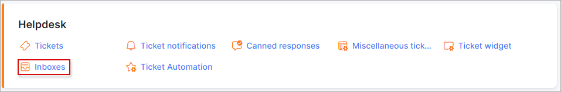

Inboxes
=============

In this section, settings of inboxes (incoming email) can be configured. When a customer  sends a message to the email address of one of the inboxes - a ticket will be created in Splynx.

This feature was developed for faster communication with the Splynx support by sending email messages to the support email address instead of logging into the Splynx Customer portal to create a ticket.

## COMMON

**Regex used to identify ticket** - value which should be default, if changed it is better to contact the Splynx support for assistance;

**Save format** - for now only one option is available "Purify HTML";

**Pair only by subject** - pair incoming messages with tickets only by its subject; sender in this case will not be checked;

**Process forwarded emails from admins** - create tickets from administrators' emails;

**Enabled** - this is the global enable/disabled option. Even if there are 5 inboxes with an "Enabled" status; if this option is set to disabled, tickets will not be created.

## INCOMING MAILBOXES

New inboxes can be added, removed or changed here.
Let's create a new one, simply click on the `"+"` icon on the top left of the table:

We are going to create a new inbox using a gmail email address. IMAP details for gmail can be found on the following page:
 https://support.google.com/mail/answer/7126229?hl=en

When all the credentials have been added, click on `Test connection` to run a test to ensure that the inbox is connected to the gmail account.

[IMAP - Troubleshooting SSL/TLS Errors](configuration/support/inboxes/imap_troubleshooting/imap_troubleshooting.md)

### The following parameters can be configured for IMAP settings:

  * **Which messages to process:** "All" or "Unread";

  * **Process from date/time** - here you should specify the date to start email processing. For example, if you select the date as 2020-01-01 00:00:00, Splynx will try to process all emails from this date and create tickets from all these emails;

  * **Mark as read** - mark email that was successfully processed as read in the inbox;

  * **Use address from header** - "From", "Reply-to" or "Sender" - means use the address from one of these available fields as the header.

### The following parameters can be configured for the Ticket creating:

  * **Receive unregistered emails** - this means, if this option is enabled, tickets will be created from all emails, even if the email address isn't registered in Splynx. If disabled, only customer email addresses can create a ticket from the inbox;

  * **Priority** - select a default priority for ticket new tickets;

  * **Group** - select a default group to assign new tickets to;

  * **Type** - select a default type for new tickets;

And the last option under the **"Other"** config: "Enabled" - which enables or disables  creating tickets from this inbox.

We've added a few more inboxes for finance questions and for general support questions.
So if a customer will send a message to finance@myisp.com an "accounts" ticket type will be created and it will be assigned to the ticket group "Finance". Whereas, if a message will be sent to support@myisp.com a "Support" ticket type will be created and will be assigned to the group "IT". The Inbox with ID #1 is disabled and we are not using it on our system.

## DENY LIST

Here you can filter email addresses you wish to ignore. Tickets from such emails will not be created.

The filter can be configured by **Location** (Email, Subject or Message) and by **Filter type** (Exact entry, Contain, Starting with, Ending with, Regex). In the **Filter** field, you should enter the email (or a word from the subject or message) or its part (depending on the specified Filter type) you want to block. Then click the `Add` button.

## MS Office 365 OAuth

You can configure your incoming mailbox (tickets) to use OAuth login with MS Office 365.

<icon class="image-icon"></icon> This option is available for Splynx versions **v4.1** or **v4.0 + OAuth**

Navigate to *Config → Helpdesk → Inboxes* to begin reconfiguring your incoming mailbox for OAuth login.

<icon class="image-icon"></icon> Only the Office365 Administrator can configure the mailbox with MS Office 365.

1. First, log on to the office profile with the  Office365 administrator login using the following link: https://outlook.office.com/mail/

When you click the `Office365` button, a pop-up window will appear. Click on `Domain is correct` in the pop-up window. You will be redirected to a Microsoft URL and asked to authorize Splynx; select `Yes`.

2. Now that Microsoft is authorized, please open the following URL and log out of the admin account: https://outlook.office.com/mail/. **It's essential to log out; this step is very important.**

3. On the same Inbox on Splynx, the one that is currently showing as connected, will need to be disconnected, as it's linked to the incorrect mailbox used in the previous step.

This time, it will ask for the username and password for the correct mailbox, if step 2 was not performed to log out of the Microsoft profile. If that's the case, then step 2 needs to be repeated.

-----------------

If additional mailboxes need to be set up, repeat steps 1 - 3.

Each time after linking a mailbox, you have to log out of the mailbox on the Office365 instance; otherwise, it will use the incorrect profile for the mailbox and not work.