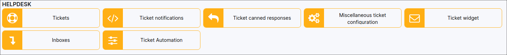

Helpdesk
=============

In this section we can modify the configuration for tickets, ticket notifications, incoming emails configurations and also automation for tickets.

* [Tickets](configuration/support/tickets/tickets.md)

* [Ticket notifications](configuration/support/ticket_notifications/ticket_notifications.md)

* [Canned responses](configuration/support/ticket_canned_responses/ticket_canned_responses.md)

* [Miscellaneous ticket configuration](configuration/support/general_ticket_configuration/general_ticket_configuration.md)

* [Ticket widget](configuration/support/feedback_widget/feedback_widget.md)

* [Inboxes](configuration/support/inboxes/inboxes.md)

* [Ticket automation](configuration/support/ticket_automation/ticket_automation.md)
