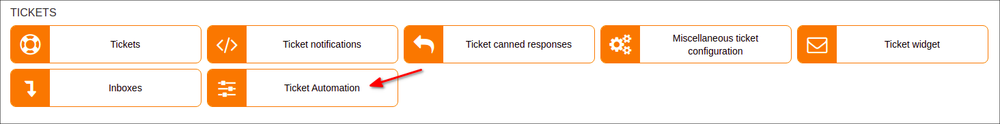
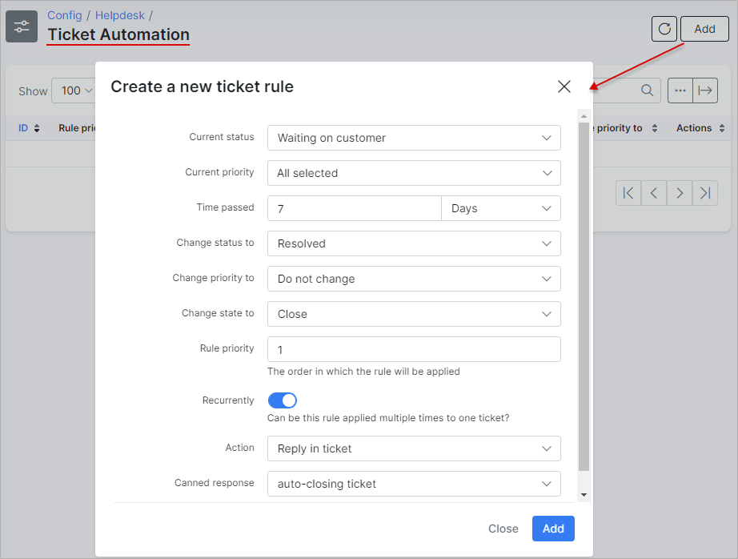

Ticket automation
=============
We've developed this feature to for the convenience of administrators who deals with tickets. With automation, the admin can breath easier and achieve more.

In this section, rules can be created to automate operations with tickets.

**Example:** We want to close tickets automatically, and reply with a [canned response](../ticket_canned_responses/responses.md) to a customer if ticket has a status of "Waiting on customer" for more than 7 days.

We can achieve this goal by adding the following rule:

If this rule is created, all tickets with a "Waiting on customer" status with a period of the last update being more than 7 days ago, the ticket will be closed automatically and the customer will receive an email with the text that this ticket was closed due to lack of activity for more than 7 days(a canned response with this text must be created first).

##### Be attentive with the "Recurrently" option because if the logic of the rule is incorrect, it can reply to all tickets, even if it is "Closed".
