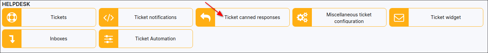
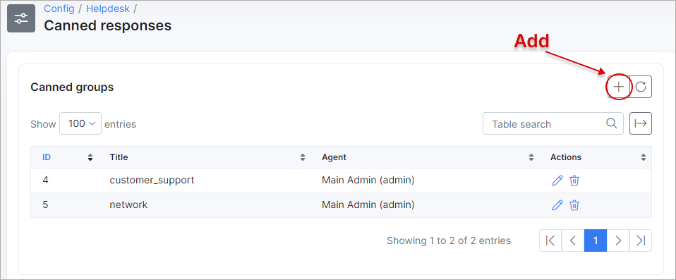
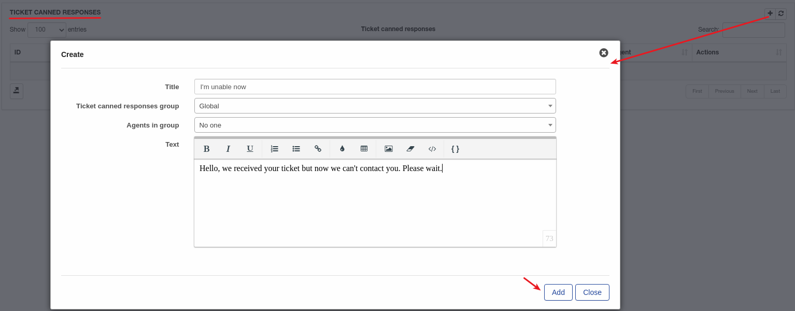
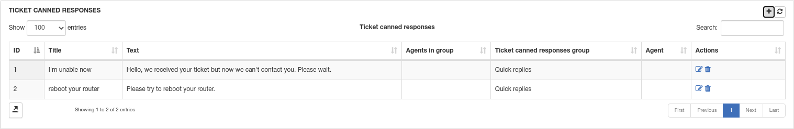
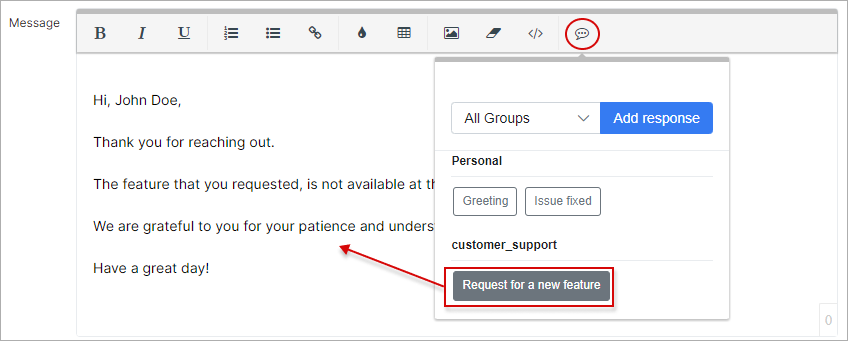

Ticket canned responses
=============
**_Config -> Support -> Ticket canned responses_**

Quick replies for tickets can be added here. Specific text which you use frequently can be added to canned responses and by clicking on just 2 buttons, this text will be loaded to the ticket message.

Using groups can help you, sort responses by topics for faster and easier locating.

Simply click on the `"+"` icon on the canned responses tab to add a new response.

After adding a response, you will see it in your of list responses.

Thereafter these canned responses can be used in ticket replies:

By clicking on a canned response, it will load the content of the canned response which will save you valuable time.
