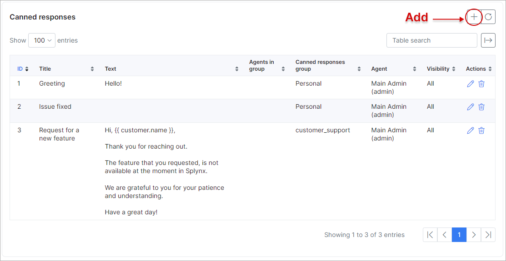

Canned responses
=============

**Canned responses** are the pre-formatted responses used to avoid spending time on commonly asked questions. The technicians can spend hours replying to customers' requests, often times writing out the same response for different customers with the same issue. You can save time and improve support team work by adding *Canned Responses* to the tickets and messages in Splynx.

In order to create canned responses, you need to identify the requests faced frequently by the support or sales teams. It gives you clarity about the issues and you can develop the best canned messages.

Through the following tutorial, we will learn how to use *Canned responses* and get to know its features.

Navigate to `Config → Helpdesk → Canned responses`:

On this page the two sections are available:

**Canned groups**

Using groups can help you sort responses by topics for faster and easier locating.

By default, `Global` group is used but it's not visible in the table. You can create the additional group (-s), just click on **Add** button at the top-right corner of the table and specify the group name e.g. *Support*, *Sales*, *Marketing*, *Returns and Refunds* etc.

**Canned responses**

To add the new canned response (-s), click on the `Add` button at the top-right corner of the table. In a new opened window the following fields are present:

* **Title** - the title name of the response. Make sure to choose an appropriate response title that you (and your agents) can understand;
* **Canned responses group** - choose the group you'd like to place this new canned response into. By default, `Global` group is used, it allows the administrator to access to all tickets on the system. The additional groups can be created in **Canned groups** section above;
* **Agents in group** - for which group of tickets and associated agents the response will be available. The next values can be chosen: `No one` (default), `IT`, `Finance`, `Sales`. For example, a canned response for *Request for features* can be made visible just to your `Finance` group, as other teams will have no use for it.
The ticket groups can be edited in `Config → Helpdesk → Miscellaneous ticket configuration`. To know more about how to manage the ticket groups agents, you can refer the article
[Admins and permissions](administration/main/admins_and_permissions/admins_and_permissions.md) (see *Helpdesk* chapter);
* **Visibility** - choose where the created response can be inserted: `All`, `Tickets` or `Messages`. By default `Tickets` value is used;
* **Text** - the canned response text body. The pre-formatted replies can be customized by the customer name, agent signature, links etc. using the dynamic [placeholders](configuration/system/templates/templates_variables/templates_variables.md).

Click **Add** to save your canned response. If you'd like to edit a previously-saved response, just click on <icon class="image-icon"></icon> (*Edit*) icon.

<icon class="image-icon"></icon> **NOTE:**

- The canned responses which are created in relation to a specific group can be viewed and used in tickets/messages by any technician with the appropriate permissions;

- The canned responses can be created by a specific admin for personal use only, the replies can be divided into groups as well. Such responses are unique to each user and cannot be used by other administrators in Splynx (except the super administrator). For more information, see [My profile](my_profile/profile/profile.md).

Now your agents can choose the canned response you created in a ticket or message by clicking on <icon class="image-icon"></icon> (*Canned Response*) icon. When clicked, it will display the list of available canned responses. Click on the response you'd like to add to your reply, it will load and insert the pre-formatted message, along with dynamic content ready to be sent to the customer.

