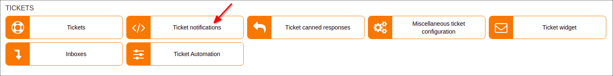
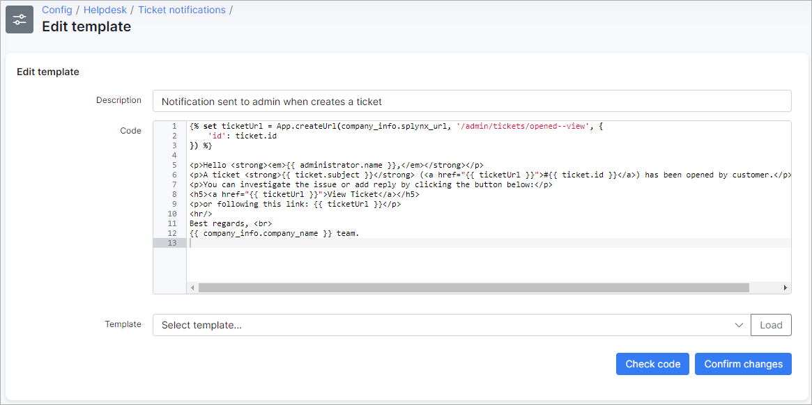

Ticket notifications
=============
**_Config -> Support -> Ticket notifications_**

You can enable/disable sending of certain notifications to admins/customers here. Email templates can also be updated here and subject of the notification.

**These notifications can only be sent via Email.**

**Sender must be configured under [Config->Support->Tickets->Tickets](configuration/tickets/tickets.md)**

**Ticket received (message to customer)** - sends an email to the customer when we've receive a ticket;

**New ticket (message to admin)** - sends an email to the admin when a new ticket is created;

**New ticket (message to customer)** - sends an email to the customer when a new ticket is created;

**New message (message to admin)** - sends an email to the admin when a new message is added in the ticket;

**New message (message to customer)** - sends an email to the customer when a new message is added in the ticket;

**New note (message to admin)** - sends an email to the admin when another admin adds a note to the ticket;

**Ticket assigned (message to admin)** - sends an email to the admin when a ticket is assigned to them;

**Ticket assigned (message to group)** -sends an email to the group when ticket assigned to the group. Groups can be added/removed under [Config -> Support -> General ticket configuration -> Ticket groups](configuration/general_ticket_configuration/ticket_config.md);

**Ticket closed (message to admin)** - sends an email to the admin when a ticket is closed;

**Ticket closed (message to customer)** - sends an email to the customer when a ticket is closed;

**Ticket opened (message to admin)** - sends an email to the admin when a customer opened a ticket;

**Ticket opened (message to customer)** - sends an email to the customer when an admin opened a ticket;

## Edit templates

Template bodies can be edited using TWIG and [variables for templates](configuration/system/templates/templates_variables/templates_variables.md).

Template bodies can be loaded from another template using the drop-down list to select a template and clicking on "Load" to populate the body with the selected template's content, then click on "Check code" to verify that all is correct, thereafter, simply "Confirm changes".
