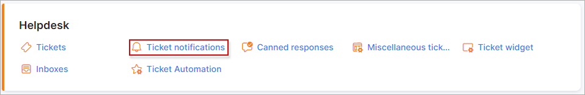

Ticket notifications
=============

You can enable/disable sending of certain notifications to admins/customers here. Email templates can also be updated here and the notification subject.

<icon class="image-icon"></icon> These notifications can only be sent via Email. Sender should be configured under [Config → Helpdesk → Tickets](configuration/support/tickets/tickets.md)

- **Ticket received (message to customer)** - sends an email to the customer when we've received a ticket;

- **New ticket (message to admin)** - sends an email to the admin when a new ticket is created;

- **Ticket changes (message to admins)** - sends an email to the admins when there are some changes, e.g. Priority was changed

- **New ticket (message to customer)** - sends an email to the customer when a new ticket is created;

- **New message (message to admin)** - sends an email to the admin when a new message is added in the ticket;

- **New message (message to customer)** - sends an email to the customer when a new message is added in the ticket;

- **Ticket assigned (message to admin)** - sends an email to the admin when a ticket is assigned to them;

- **New note (message to admin)** - sends an email to the admin when another admin adds a note to the ticket;

- **Ticket closed (message to admin)** - sends an email to the admin when a ticket is closed;

- **Ticket assigned (message to group)** -sends an email to the group when a ticket assigned to the group. Groups can be added/removed under [Config → Helpdesk → Miscellaneous ticket configuration → Ticket groups](configuration/support/general_ticket_configuration/general_ticket_configuration.md);

- **Ticket closed (message to customer)** - sends an email to the customer when a ticket is closed;

- **Ticket opened (message to admin)** - sends an email to the admin when a customer opened a ticket;

- **Ticket opened (message to customer)** - sends an email to the customer when an admin opened a ticket;

- **Ticket watchers notification (message to watchers)** - sends an email to watchers of the ticket, e.g. the note was added;

## Edit templates

Template bodies can be edited using TWIG and [variables for templates](configuration/system/templates/templates_variables/templates_variables.md).

Template bodies can be loaded from another template using the drop-down list to select a template and clicking on `Load` to populate the body with the selected template content, then click on `Check code` to verify that all is correct, thereafter, simply `Confirm changes`.
