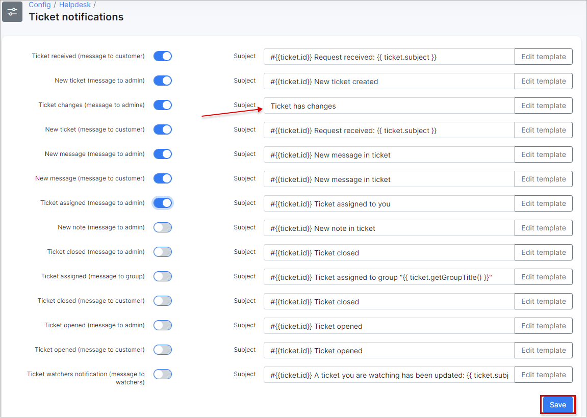

Ticket notifications
=============
**_Config -> Support -> Ticket notifications_**

Here you can enable/disable sending of some notifications to admin/customer. Also email template can be updated here and subject of a notification.

**These notifications can be send ONLY via Email.**

**Sender must be configured under [Config -> Support -> Tickets -> Tickets](../tickets/tickets.md)**

**Ticket received (message to customer)** - send email to customer when we receive a ticket;

**New ticket (message to admin)** - email to admin when new ticket created;

**New ticket (message to customer)** - email to customer when new ticket created;

**New message (message to admin)** - email to admin when new message in ticket;

**New message (message to customer)** - email to customer when new message in ticket;

**New note (message to admin)** - email to admin when another admin add a note to this ticket;

**Ticket assigned (message to admin)** - email to admin when ticket assigned to him;

**Ticket assigned (message to group)** - email to group when ticket assigned to group. Groups can be added/removed under [Config -> Support -> General ticket configuration -> Ticket groups](../general_ticket_configuration/ticket_config.md);

**Ticket closed (message to admin)** - email to admin when ticket closed;

**Ticket closed (message to customer)** - email to customer when ticket closed;

**Ticket opened (message to admin)** - email to admin when customer opened ticket;

**Ticket opened (message to customer)** - email to customer when admin opened ticket;

## Edit template

Here template body can be edited using TWIG and [variables for templates](../../system/templates_variables/templates_variables.md).

Template body can be loaded from another template using drop-down list select some template and click on "Load", then "Check code" and if all is correct - "Confirm changes".
