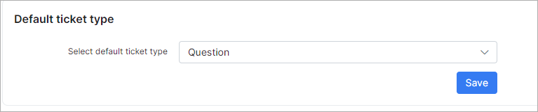
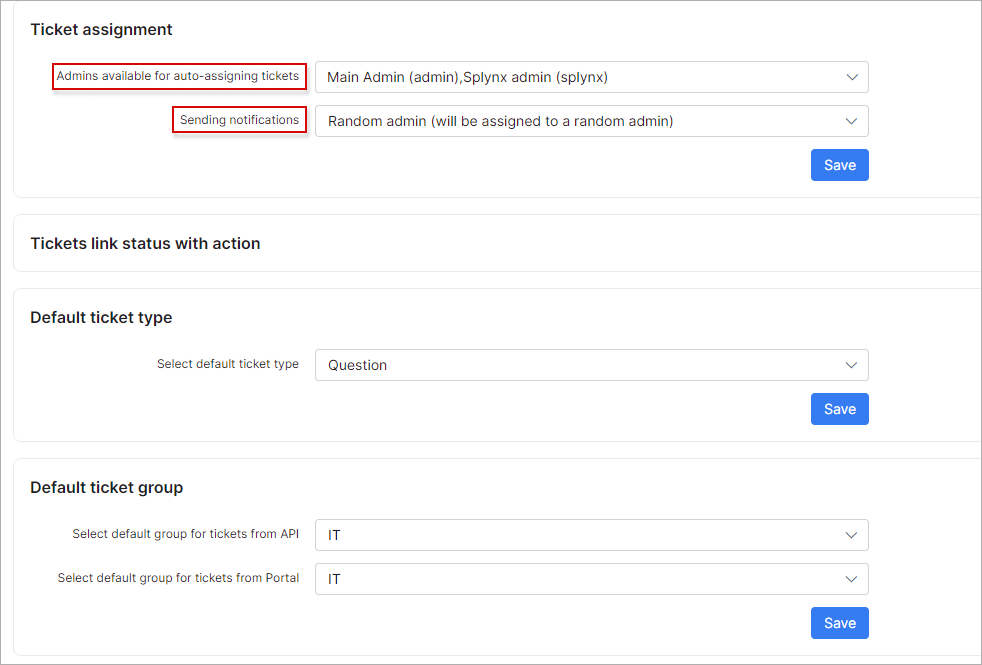
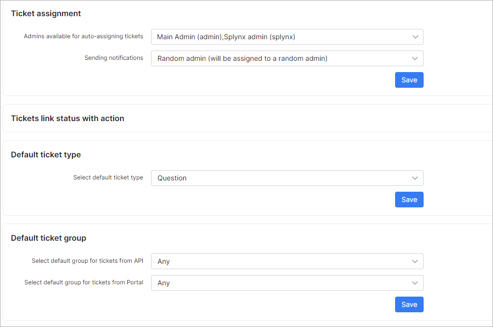
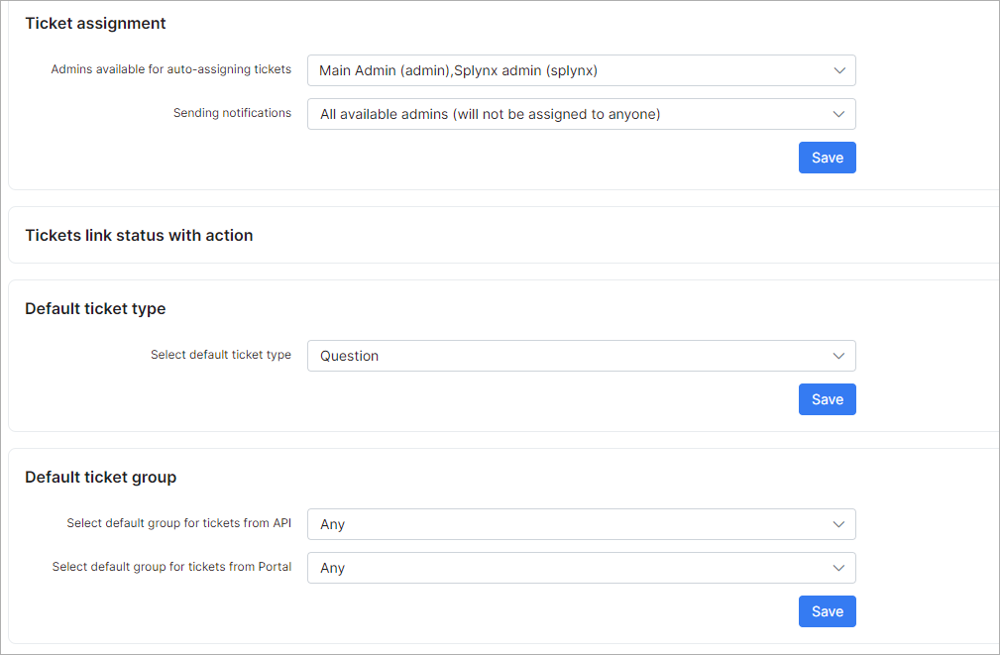
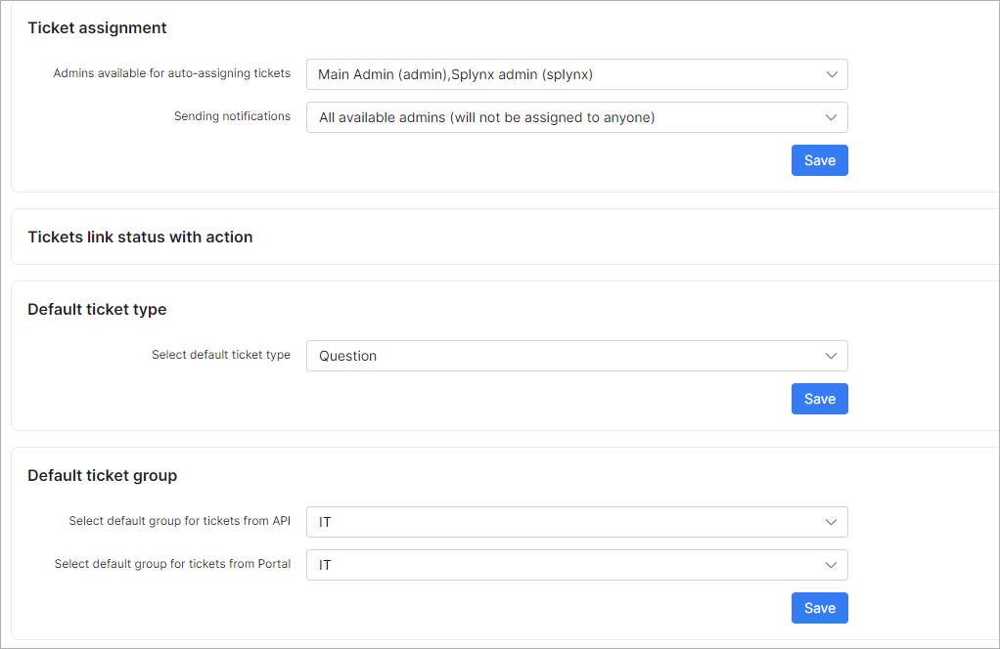

Tickets
=============

In this section you can configure the sender details for [ticket notifications](configuration/support/ticket_notifications/tickets_notifications.md).

**Please note that email sending must be configured under [Config ➝ Main ➝ Email](configuration/main_configuration/email_config/email_config.md) first.**

- **Send emails** - if this option enabled, Splynx will send notifications when tickets are updated;
- **Send attachments to emails** - if this option enabled, attachments in ticket messages  will also be sent in the notifications;
- **Sender name** - name of the sender;
- **Sender email** - email address of sender. Email sending for this address must be configured under [Config ➝ Main ➝ Email](configuration/main_configuration/email_config/email_config.md);
- **Copy email** - send copies (a “carbon copy”) of all emails to this address;
- **Send notifications to the admin panel (if online)** - if this option enabled, admins will receive a notification when they are online on the admin page of Splynx;
- **Limit of additional fields** - how many visible additional fields will be counted;
- **Enabled scheduled auto-assigning** - enable scheduled auto-assigning for tickets;
- **Select project from scheduling** - the option to select the project from which scheduled tasks will be used for auto-assigning admins to tickets. **Note:** *The task(-s) should be created and scheduled or admin/group in order to select this admin/group to auto-assignment by scheduled time*.
- **Default admins for auto-assigning tickets via the schedule** - admin user account(-s) selection for auto-assigning tickets outside the scheduled task time.

**Scheduled auto-assigning example:**

Let's imagine a situation where you (administrator "splynx") are the lead-support engineer. You have another support engineer (administrator "admin") and you've started to use shifts. The administrator "splynx" will work from 09:00 to 14:00 and all tickets will be assigned to him, and the administrator "admin" will work from 14:00 to 23:00 and "splynx" admin doesn't want to re-assign all tickets to "admin" while he is not working. For this purpose, we have a feature of the scheduled auto-assigning of tickets for a time period, and it can be configured to auto-assign all tickets to the administrator "admin" from 14:00 to 23:00.

First of all, a project should be created under [Scheduling ➝ Projects](scheduling/projects/projects.md)
and an admin has to be selected as the project lead (all tickets will be assigned to him).

Then to make all tickets assigned to the administrator "admin" you have to create a task [Scheduling ➝ Tasks](scheduling/tasks/tasks.md) under your project which you are using.

Select the correct project, create descriptions, assign it to the admin which will receive all tickets and the most important - enable the option "Schedule". In this example, it's scheduled from 14:00, for 9 hours so from 14:00 to 23:00, all tickets will be assigned to "admin" and after 23:00 "splynx" will receive all tickets again.

## Ticket assignment

Admins for auto-assigning tickets can be configured here.

- **Admins available for auto-assigning tickets** - select an admin(-s) available for auto-assigning;
- **Sending notifications** - there are 2 options available:
  * **Random admin (will be assigned to a random admin)** - notification will only be sent to the admin who receives the ticket (admin from available list) and the ticket will be assigned to this admin;
  * **All available admins (will not be assigned to anyone)** - all admins will receive a notification but the ticket will not be assigned to anyone.

**Example:**
* If you select the admin account (-s) in the field `Admins available for auto-assigning tickets`, choose the option *All available admins (will not be assigned to anyone)* in the field `Sending notifications` and select *Any* groups in **Default ticket group** section, and after that, the customer creates a ticket from the Customer portal - the notifications will be sent to all admin account (-s) from the field `Admins available for auto-assigning tickets` and to the customer as well.
* If the specific group is selected in **Default ticket group** section and a ticket from the Customer portal is created - the notification will be sent only to the admins in that group (**Ticket assigned (message to group)** [notification](configuration/support/ticket_notifications/tickets_notifications.md) is enabled) and to the customer who created the ticket.

More examples are at the bottom of this page.

## Tickets link status with action

The configuration of ticket statuses. Custom statuses can be added/removed under [Config ➝ Helpdesk ➝ Miscellaneous ticket configuration ➝ Ticket statuses](configuration/support/general_ticket_configuration/general_ticket_configuration.md).

- **On creating** - sets the status to "New" when a ticket is created;
- **On opening** - when the ticket was closed, and re-opened, it sets the status to "Work in progress";
- **On closing** - when a ticket is closed, it sets the status to "Resolved";
- **On customer reply** - when a customer replied to a ticket, it sets the status to "Waiting on agent";
- **On agent reply** - when an admin replied to a ticket, it sets the status to "Waiting on customer".

## Default ticket type

The configuration of default ticket types after creation. Custom ticket types can be added/removed under [Config ➝ Helpdesk ➝ Miscellaneous ticket configuration ➝ Ticket types](configuration/support/general_ticket_configuration/general_ticket_configuration.md)

## Default ticket group

- **Select default group for tickets from API** - the option to choose the default [group](configuration/support/general_ticket_configuration/general_ticket_configuration.md) when [API](administration/information/api_documentation/api_documentation.md) is used for tickets

- **Select default group for tickets from Portal** - the option to choose the default [group](configuration/support/general_ticket_configuration/general_ticket_configuration.md) for tickets created from Portal

## Use cases

#### Assign the ticket to a group of administrators

or

In this case, the ticket will be assigned to the IT group, notifications will be sent to all admins from the IT group. No matter if some admins are selected in the "Admins available for auto-assigning tickets" field. A group has to be specified.

#### Assign the ticket to some administrator

With this setup, the ticket will be assigned to one of the selected admins in the "Admins available for auto-assigning tickets" field; a notification will be also sent to this admin.

The most popular setup is when only 1 admin is selected in the "Admins available for auto-assigning tickets" field and all tickets will be assigned to this admin, then this administrator can decide to whom assign the specific ticket.

#### Do not assign ticket to administrator but notify

In this example, the ticket won't be assigned to the administrator but admins selected in the "Admins available for auto-assigning tickets" field will be notified.

Below you can find an example when a ticket will be assigned to the IT group and only an administrator from the IT group will get a notification. In this case, administrators selected in the "Admins available for auto-assigning tickets" field won't get a notification because they are not in the IT group:

To find out more about ticket groups please visit [this page](configuration/support/general_ticket_configuration/general_ticket_configuration.md).

In ticket notifications configuration, you should pay attention to the "Scope" that each admin has. You can find these settings under [Administration ➝ Administrators](administration/main/admins_and_permissions/admins_and_permissions.md). You may face issues when some administrator has scope = "Global" and you assign ticket to a group; in this case, this admin won't receive a notification because of the global scope.
