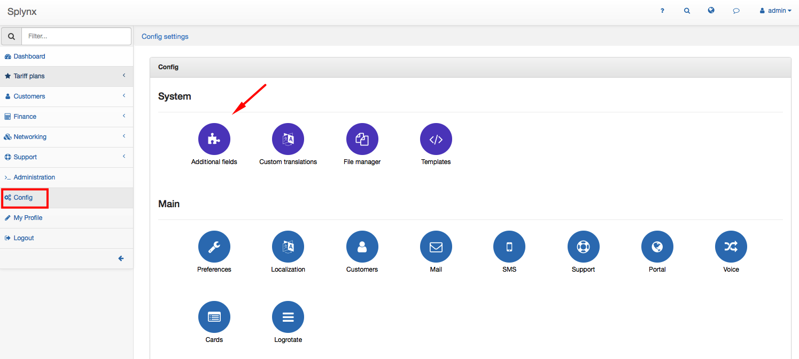
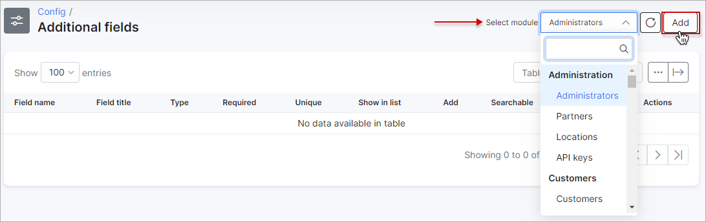
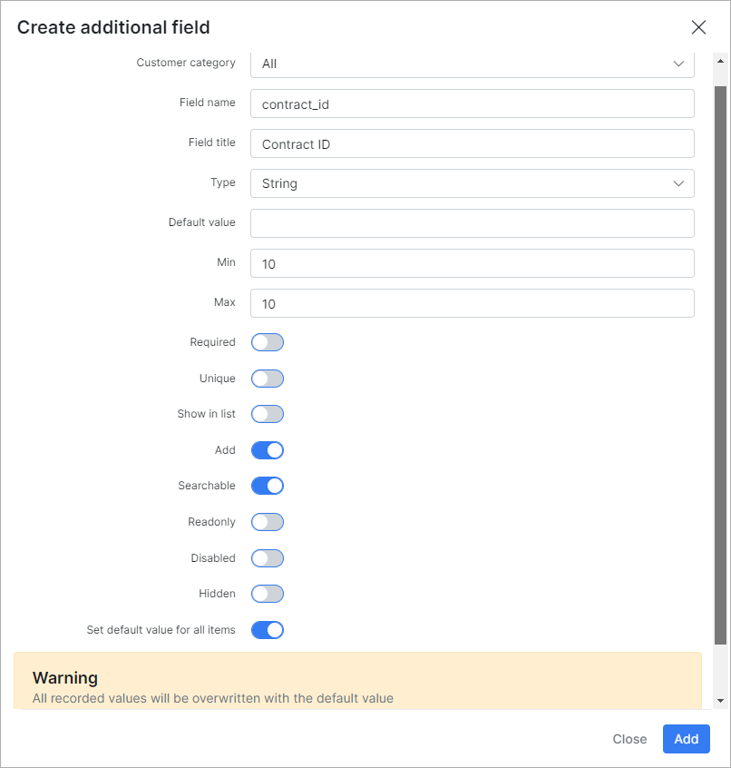
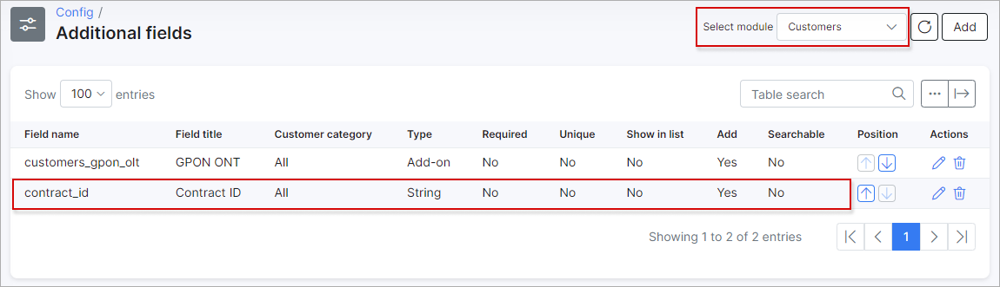
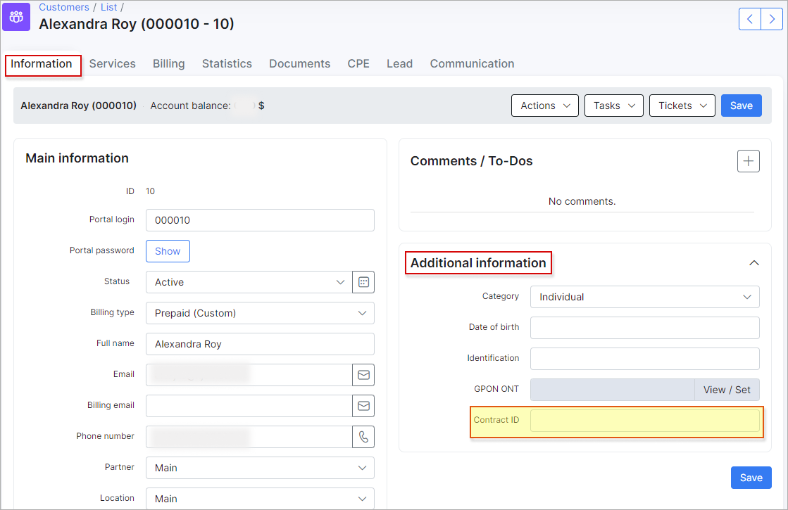
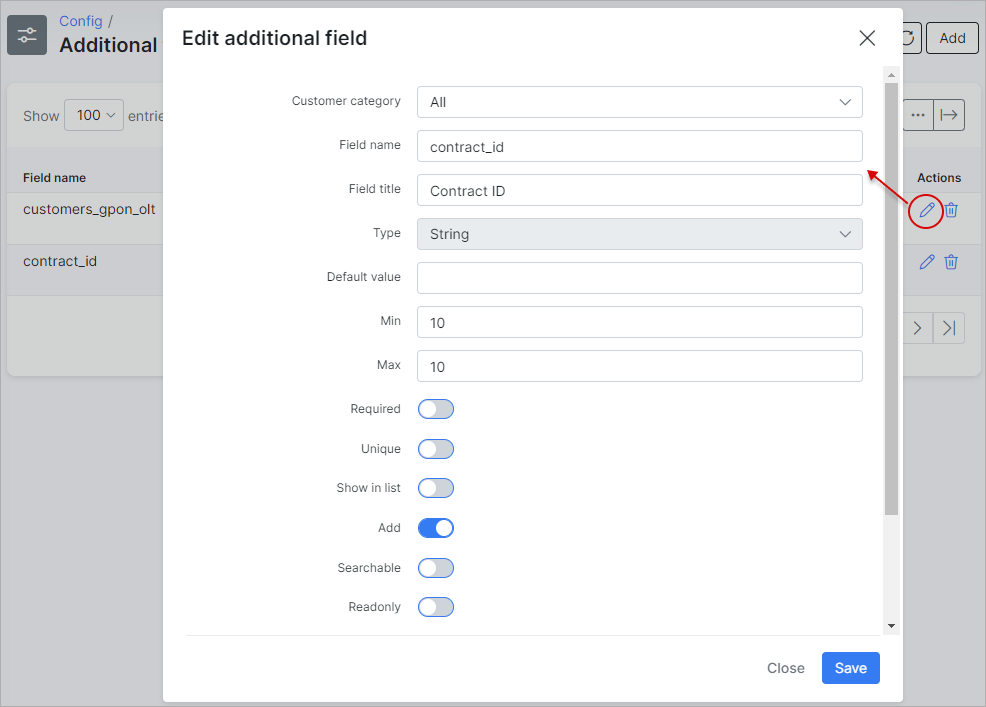
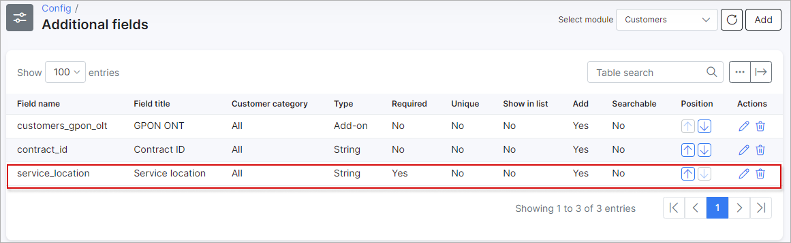
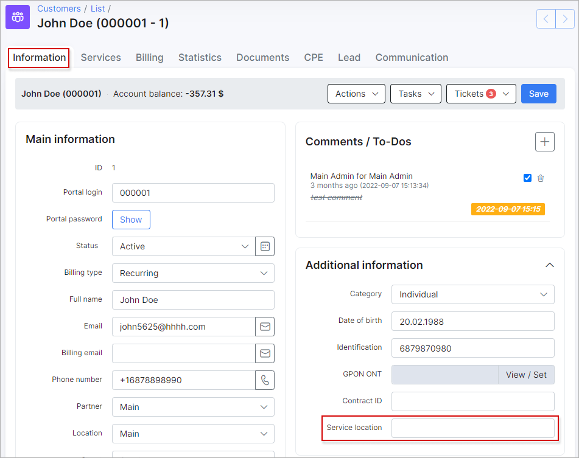

Additional fields
================

To add additional field click on `Config menu →System→ Additional fields` . Select the module where you'd like to add an additional field and click on  ***Add*** at the top-right corner of the screen.

You can add an additional custom fields to all modules in Splynx:

* Administrators
* Partners
* Location
* Customers
* API keys
* Internet plans
* Voice plans
* Custom plans
* Routers
* Voice devices
* Monitoring
* IPv4 and IPv6 Networks
* Services (Internet, Voice, Custom)
* Invoices
* Tickets
* Messages
* News
* Customer documents  etc.

To add a new custom field:

First of all, you should select the Module where you will add the field (at the top-right corner of the screen) and then click on ***Add***:

A window will pop up and it will be possible to create an additional field. In this example a Contract ID is shown - an additional field for the Customers module.

* **Required** - impossible to save without filling in this field.
* **Unique** -  unique value for this field.
Show in the list - shows in the list of the selected module as a column.
* **Add** - add to the entry of every module.
* **Searchable** - searchable.
* **Set default value for** - set as a default value for every field.  

The new created field will be possible to see it in the Additional Field table and in Customer Information view:

You can edit or delete a new additional field by clicking on Edit icon   or Delete icon   in "Action" section of the table.

In next example a "Service Location" is shown - an additional field for the Customers module.

