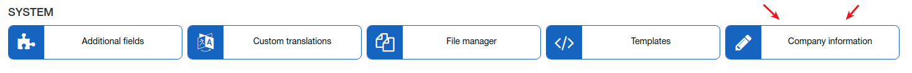
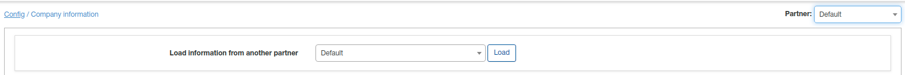

Company information
=======================
Here should be specified company information what will be used in templates. Also here can be configured template for finance documents(invoice, proforma invoice, quote, payment receipt etc).

At the right top corner select partner. Company information values can be different for each partner.
* **Load information from another partner** - if current partner will have the same values as some another partner in Splynx, you can load it without manual specifying - just select from what partner values will be loaded and click on "Load".

 

 Fill these lines with your data and select templates for financial documents. All templates you can find under [Config - System - Templates](../templates/templates.md) 
