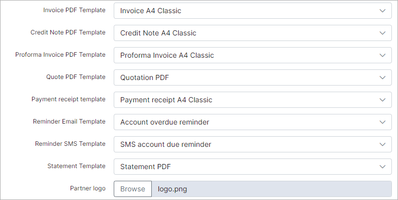

Company information
=======================
In this section the details of your company information as well as for each partner on the system can be configured here, this information will be used in the templates on the system. Templates for finance documents(invoice, proforma invoice, quote, payment receipt etc) can also be selected here. Partner percentages/commission and VAT (Tax) can be configured here. The logo of your company can be added to the system  here as well

On the top right corner of the page, select the partner you would like to make changes to then you can edit the desired details to change of the partner. Company information values can be different for each partner on the system.

* **Load information from another partner** - if the current/selected partner will use the same values as another partner on the system, you can load the information automatically by selecting the partner you wish to load/duplicate the data from and simply click on the "Load" button.

 

 After specifying or loading the company information in all the fields, please remember to select the templates to be used for each financial document. All templates used by the system can be configured and customized to your preferences in *Config / System /Templates*

 
