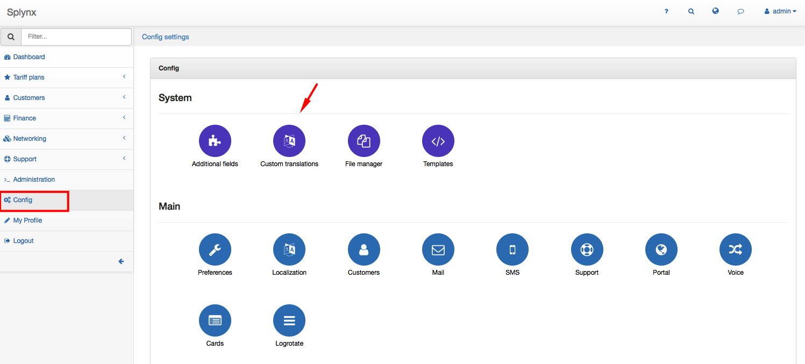
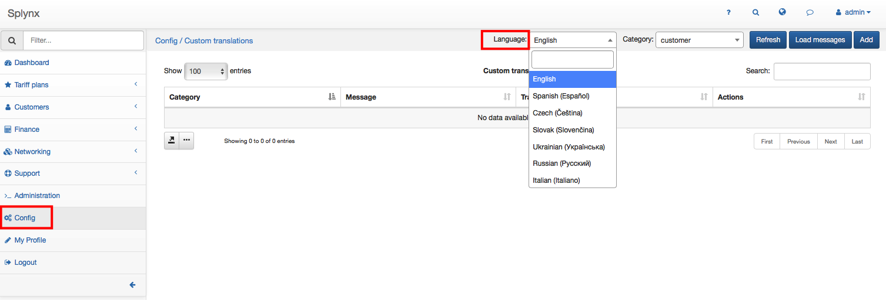
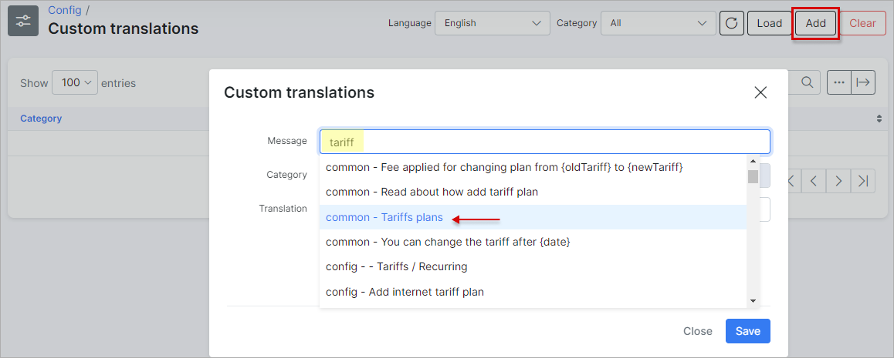
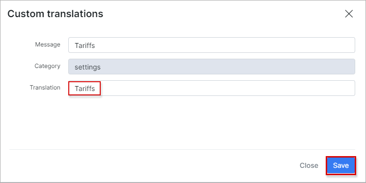
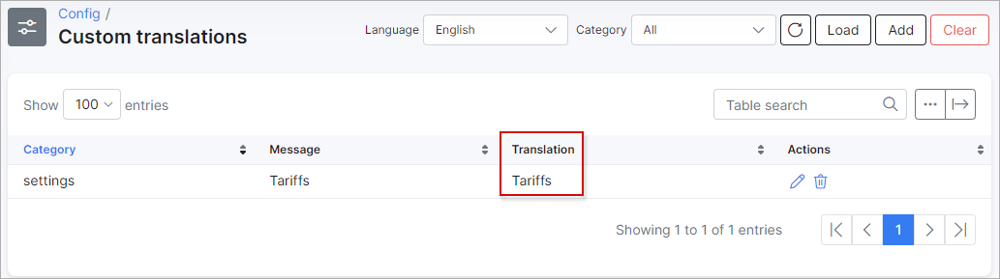
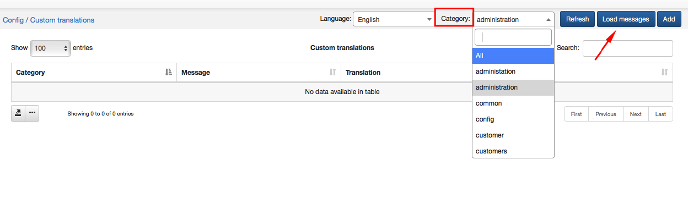
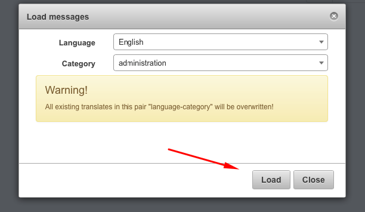
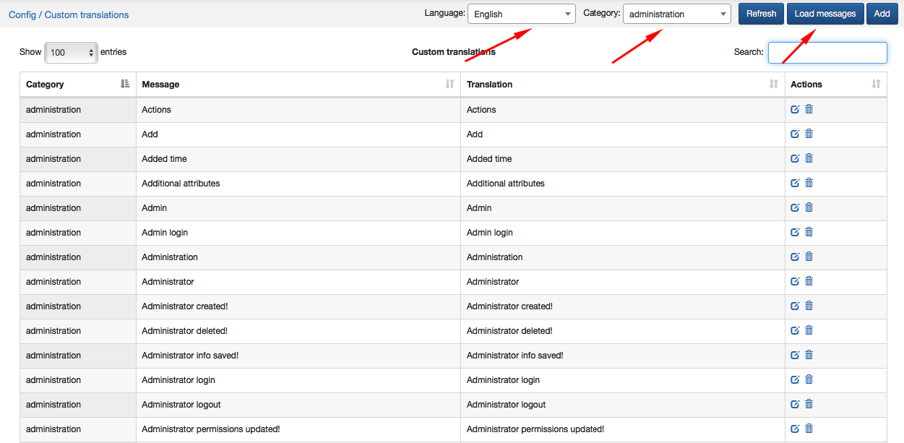
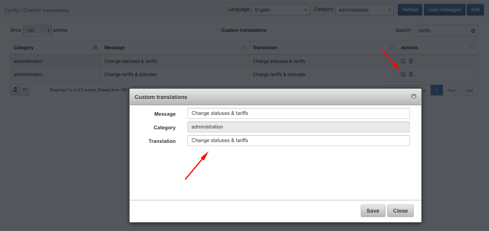
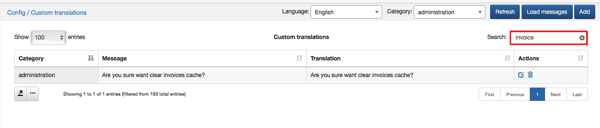

Custom translations
===================

Custom translations enable you to make your own translation of Splynx system available for you and your customers in Customer Portal. Custom translation can be done in any language. To start translation click on `Config →System→Custom translations`.

Choose a language for translation.

There are two ways of translation: by key words and by categories.

### Translation by key words.

To start a translation choose a language first and click on Add icon at the top-right corner of the screen. The window will pop up where you will type a key word for searching in the "Message" field. This word will appear in all categories it's been used.

Choose a word from particular category to translate, write its new meaning in the "Translation" field and save it.

After saving the new translated word will appear in the "Custom translations" table.

### Translation by categories.

To start a translation choose a language first and a category you'd like to change word in and then click on "Load messages" option at the top-right corner of the screen.

The window will appear with warning that all existing translates in that category will be overwritten.

Click on "Load" to see a list of all translations in that particular category.

To change or edit translation click on Edit icon  in Actions section of the table and write correct meaning into Translation field.

Here you can also use a Search option to find a particular word in that category. For example, if we will look for a word "Invoice" in Administration category, the system will give us a following result:

 
