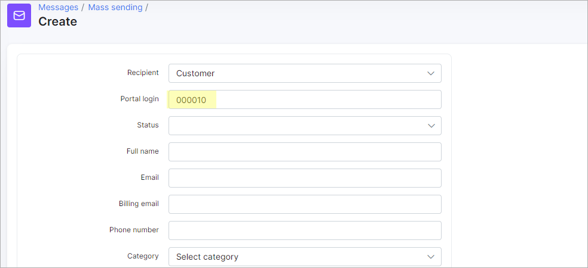

File manager
===========

File manager in `Config → System` can be used mainly for adding an image file in templates and also for adding/changing a logo in Admin page or Customer portal in Splynx.

### How to create/change logo in your Splynx installation.

First of all upload your Logo (image file) in Splynx admin panel in section: `Config → System → File Manager`.

Uploaded file will appear in the list of files in File manager table.

You can edit a file or delete it by clicking on icons  and  in Actions section of the table.

Second step is to copy a Public link by clicking on Info icon .

Then go to `Config → Main → Preferences` and insert a link to the Administration portal logo field or Customers portal logo field.

Save changes, refresh the page and new logo will appear.

### How to add an image file to templates.

You can add an image to your templates.

Please note, that for adding image file to internal templates you will have to copy a Link for templates and for external templates (e.g. Customer portal template) the public link will be copied.

* First of all upload your Logo (image file) in Splynx admin panel in section: `Config → System → File Manager`.
* Copy a Public link by clicking on Info icon  in Action section of the table.

Then, go to `Config → System → Templates` and select the template you'd like to add an image.

Click on Edit icon  and insert a link in a code message field.

Click on `Support → Messages` to send message to the customer: choose the customer and option Sent to Customer portal or Email,  load "Customer portal example" from templates and send it.

In Customer portal customer will see the following message:

