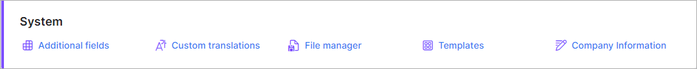

System
======

Please follow the links below for tutorial pages on each of the sub-sections of the system section of your Splynx configuration:

* [ Additional fields](configuration/system/additional_fields/additional_fields.md)
Additional fields can be added here for each of our modules; the customer module, tariff plan module etc.

* [ Custom translations](configuration/system/custom_translations/custom_translations.md)
The Splynx interface phrases can be translated into another of your choice language here.

* [ File manager](configuration/system/file_manager/file_manager.md)
Quick and easy way to upload files onto Splynx.

* [ Templates](configuration/system/templates/templates.md)
In this section, we store templates which are used by the system for all different kinds elements, like invoices, notifications, payment receipts etc.

  * [ Variables for templates](configuration/system/templates/templates_variables/templates_variables.md)
 Examples of variables that can be used in templates are displayed here.

* [ Company information](configuration/system/company_information/company_information.md)
In this section, you can specify the details of your ISP/Company and all the comapny information of your partners on the system as well, info like the URL, address, phone number, tax percent etc. Templates used for finance documents are also selected here.
