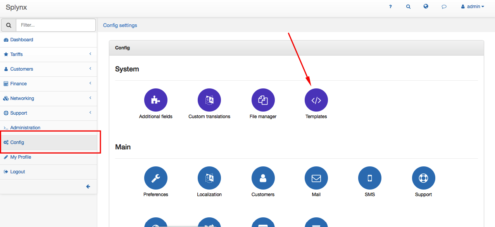
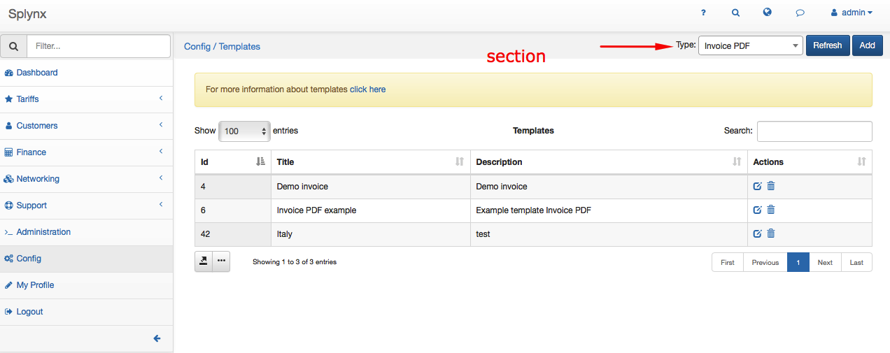
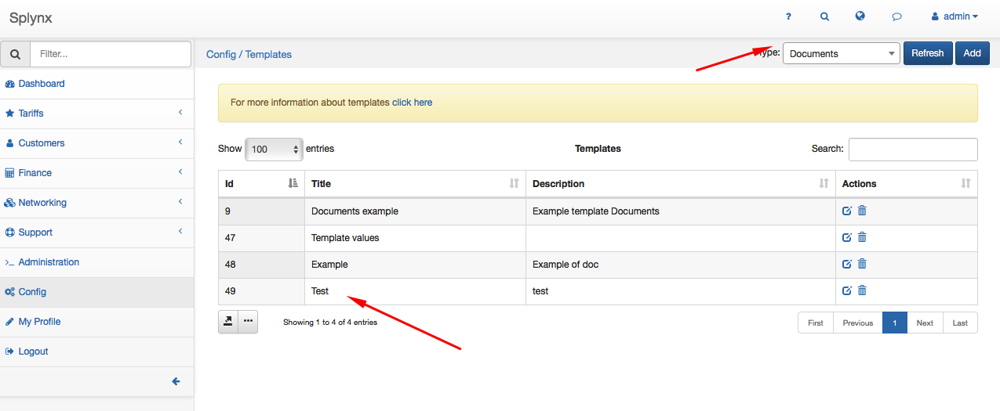
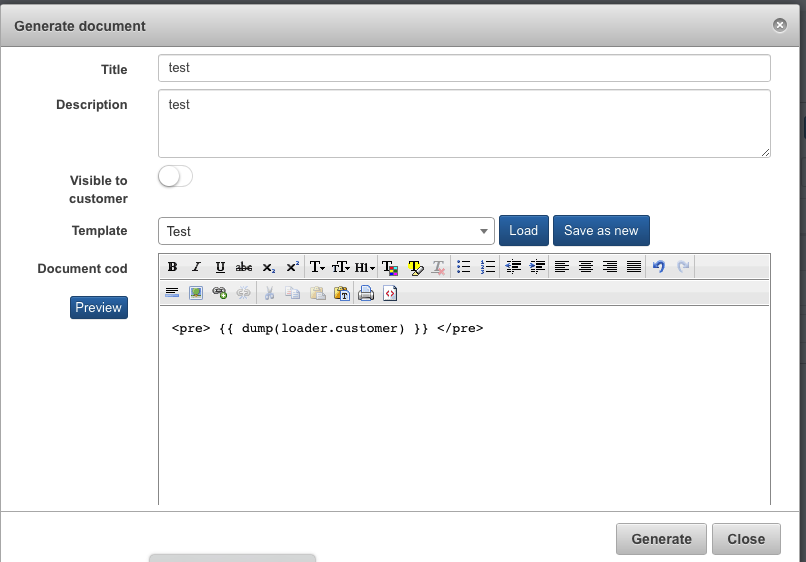

Templates
=========

Splynx has set of templates that are used in different parts of the system. Email messages, Invoice PDFs, SMS messages, Document templates etc.

### Categories of templates

* **Customer portal** – messages sent to customer portal
* **Invoice PDF** – Invoices (customer billing)
* **Mail** – messages sent to email
* **SMS** – messages sent to SMS
* **Documents** – Documents (located on customer)
* **Cards** – Generation cards (prepaid, refill)
* **Payment calendars** – payment calendars (customer billing)
* **Payment receipts** – receipts for payments (customer billing)
* **Request PDF** – proforma invoices – requests (customer billing)
* **Reminder mail** – reminder mail notification (customer billing)
* **Reminder SMS** – reminder sms notification (customer billing)
* **Finance exports** – Export invoices, requests, payments on Finance part


### Add a new template
How to add a new template:



### Edit
When you edit or change the template, Splynx displays you HTML editor:


### Delete
You can always delete the template:


### Values for templates

We recommend to create one test template in customer documents and enter the following values to get list of variables for section of Splynx that you need to use.

For example, let's create a test template and dump all variables of customer:





And then we can get the list of variables:
```php
["id"]=> string(2) "50"
["billing_type"]=> string(7) "prepaid"
["partner_id"]=> string(1) "4"
["location_id"]=> string(1) "1"
["added_by"]=> string(5) "admin"
["added_by_id"]=> string(1) "1"
["login"]=> string(6) "000050"
["category"]=> string(6) "person"
```

For example, If we need to use the value login of customer inside invoice PDF, just type:

some HTML code {{ login }} continues HTML code

Please find the list of most used variables here - [Variables for templates](configuration/system/templates_variables/templates_variables.md).

There are dump commands for different Splynx sections below:


##### Basic system values:
```twig
{{ dump(loader.values) }}
```
##### Customer's information:
```twig
{{ dump(loader.customer) }}
```

##### General information:
```twig
{{ dump(loader.info) }}
```

##### Customer's services:
```twig
{{ dump(loader.services) }}
```

##### Get all Internet services that are Active:
```twig
{{ dump(loader.getServicesByTypeAndStatus('internet', 'active')) }}
```

##### Billing information:
  ```twig
{{ dump(loader.billing) }}

##### Partner:
```twig
{{ dump(loader.partner) }}
```

##### Transactions:
```twig
{{ dump(loader.transactions) }}
```

##### Invoices variables:
```twig
{{ dump(loader.invoices) }}
```

##### Invoice items:
```twig

Invoice {{ invoice.number}} items:
{{ dump(invoice.items) }}

{{ dump(loader.invoices) }}
```

##### Pro-formas:
```twig
{{ dump(loader.requests) }}
```

##### Payments:
```twig
{{ dump(loader.payments) }}
```

##### Attached documents:
```twig
Invoices:
{{ dump(loader.getAttachedInvoices) }}
Pro-formas:
{{ dump(loader.getAttachedRequests) }}
Payment receipts:
{{ dump(loader.getAttachedReceipts) }}
```

##### Example of usage:
```twig


Invoice number: {{ current.number }} - sum: {{ current.total }} <br>

```


### Twig (engine)

In all templates we use twig engine, please find the [documentation](http://twig.sensiolabs.org/doc/templates.html).
