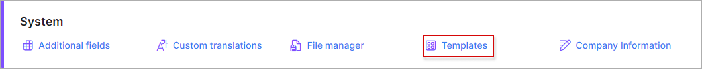
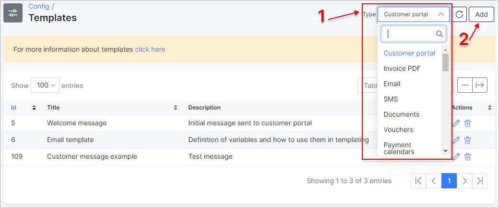
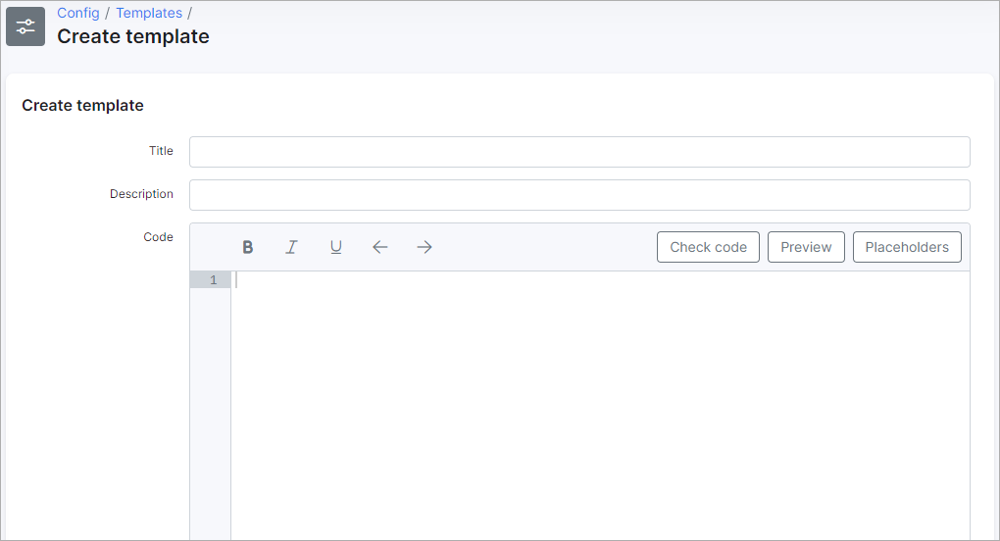
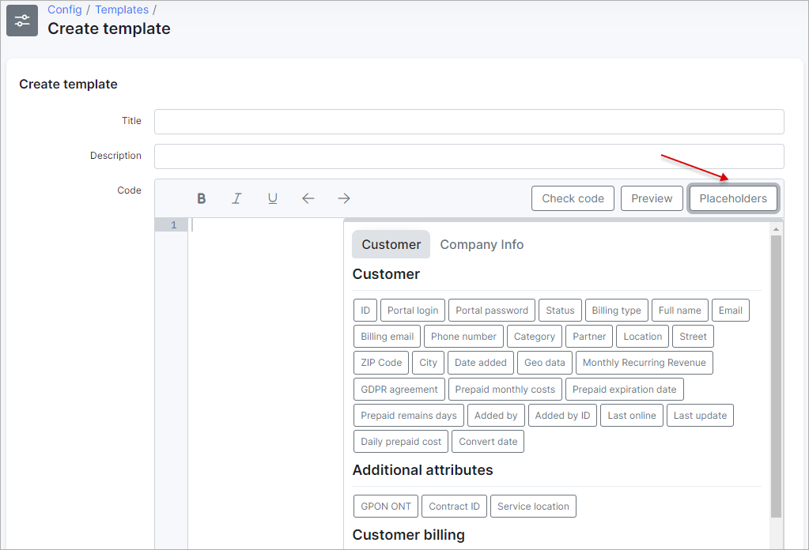
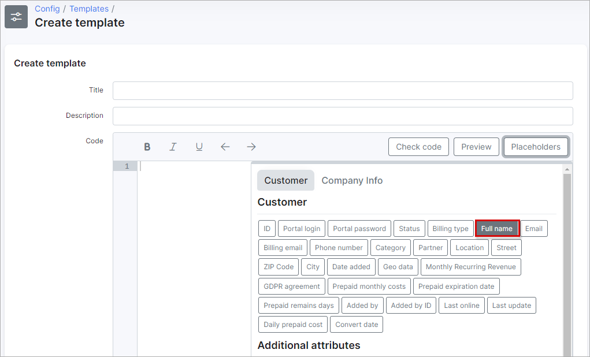
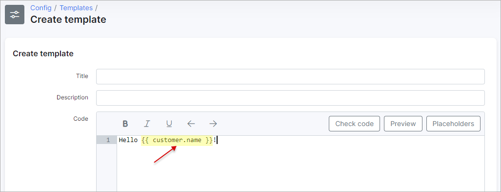
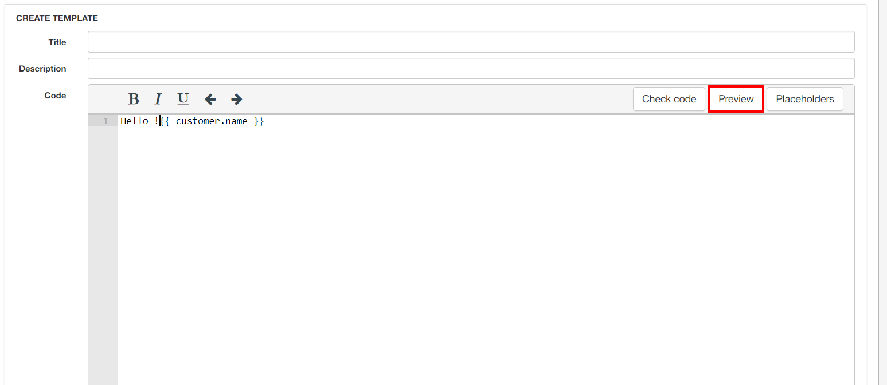
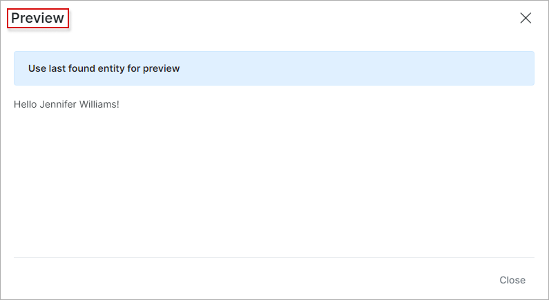
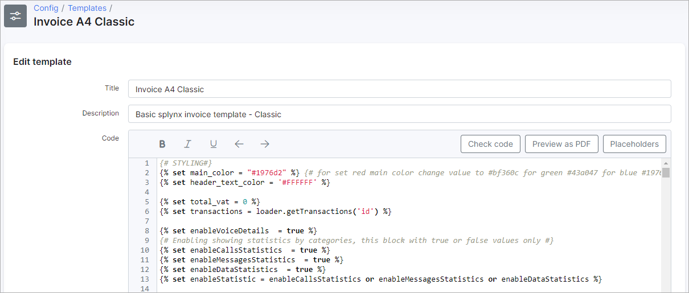
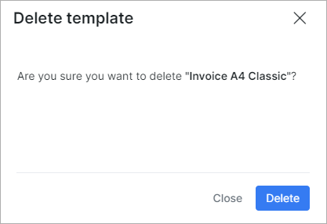

Templates
=========

Splynx has a set of templates that are used in different parts of the system. Email messages, Invoice PDFs, SMS messages, Document templates etc.

### Categories of templates

* **Customer portal** – messages formats used to send messages to the customer portal
* **Invoice PDF** – Formats and layout used for Invoices
* **Email** – messages which can be used to send customers email messages
* **SMS** – messages which can be used to send customers SMS messages
* **Documents** – messages/formats which can be used to send Documents to customers (located in customer profiles)
* **Vouchers** – Content of generated vouchers (prepaid, refill)
* **Payment calendars** – messages/formats sent for notifications of payment calendars (customer billing)
* **Payment receipts** – messages/formats used to send receipts for payments (customer billing)
* **Proforma invoice PDF** – messages/formats and layouts used when sending proforma invoices (customer billing)
* **Reminder email** – messages used to send customers email reminder notifications (customer billing)
* **Reminder SMS** – messages used to send customers SMS reminder notifications (customer billing)
* **Monitoring notification email** - messages sent for monitoring via email
* **Monitoring notification SMS** - messages sent for monitoring via sms
* **Finance exports** – formats and layouts use when exporting invoices, quote and payments (Finance)
* **Tickets** - messages sent for ticket notifications
* **Ticket automation** - messages sent for automated ticket responses
* **Email CAP** - messages sent for CAP notifications via email
* **SMS CAP** - messages sent for CAP notifications via SMS
* **Internal** - messages sent for internal system notifications
* **Email FUP** - messages sent for FUP (fair usage policy) notifications via email
* **SMS FUP** - messages sent for FUP (fair usage policy) notifications via SMS
* **Report Statements** - messagest sent for statement reports
* **Quote PDF** - messages sent for quote notifications (CRM)
* **Scheduling email notifications** - messages sent for scheduling notifications via email (Scheduling)
 **Scheduling SMS notifications** - messages sent for scheduling notifications via SMS (Scheduling)
* **GDPR notifications** - messages sent for GDPR notifications(Preferences)
* **Mention notifications** - messages sent for mention and group mention notifications (Preferences)

### Adding a new template

How to add a new template:

Navigate to `Config / System / Templates`

Select the section to add the new template to by clicking on the *Type* drop-down list located at the top right of the page and select the desired section:

Then simply click on the *Add* button located at the top right of the page and the following window will appear to add a new template to the section you've selected:

**Parameter descriptions**

* **Title** - type a relevant name for the template
* **Description** - type a brief description of the template
* **Code** - populate this field with all the contents you would like the template to contain. Variables, links and places holders can be used in templates.

When creating templates, you can conveniently make use of "Placeholders", which are code values to populate details existing on the system of a customer or company:

For example, we will use the customers "full name" placeholder:

We can check the validity of the code by clicking on the *Check Code* button or simply check the result of the code by clicking on preview:

When using the preview option to check the result of the code the system will always use the last customer you've interacted with. "Use last found entity for preview"

Additionally, you can view variables that can be used in templates in [Template Variables](configuration/system/templates/templates_variables/templates_variables.md)

### Edit

You can edit or change existing templates in Splynx by clicking on the  edit icon, upon clicking the edit icon the following window will appear:

### Delete

All templates in Splynx can be removed from the system by clicking on the delete icon  :

