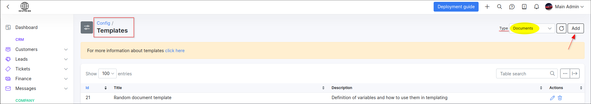
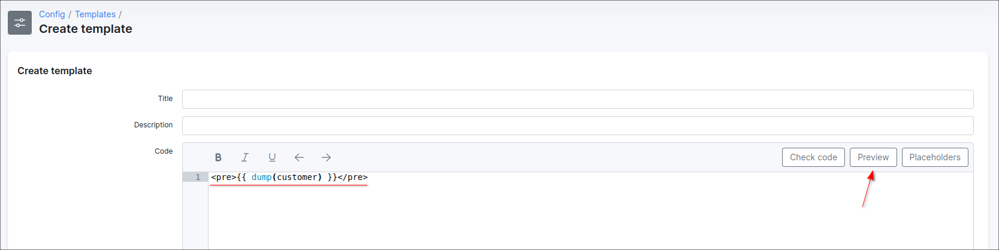
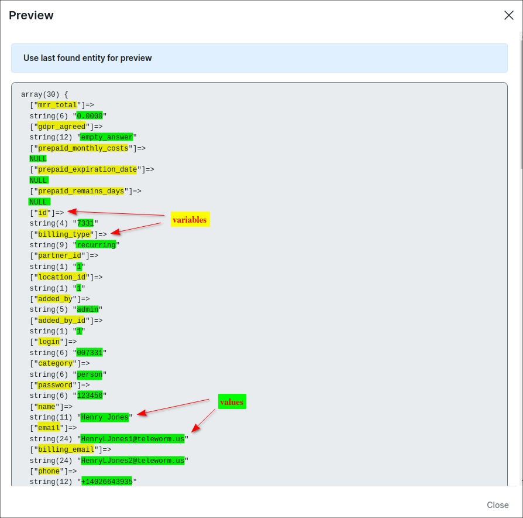

Variables for templates
=======================

Here you can find variables that can be used in custom templates.


<details style="font-size: 15px; margin-bottom: 5px;">
<summary><b>How to generate the list of variables by your own?</b></summary>
<div markdown="1">

Use the specific value from some category listed below when creating a template, then press *Preview* button to show the output result.

**Example**

Let's generate the variables of customer information, we are going to use them in *Document* template.

1. Navigate to `Config → Templates`, in **Type** select the `Documents` item;

2. Press **Add** to open the **Create template** window;



3. Insert the code shown below into the **Code** area and press **Preview** button

```
<pre>{{ dump(customer) }}</pre>

```


4. Check the output result.



</div>
</details>

------------

Below are all the available variables in relation to the different categories:

<details style="font-size: 15px; margin-bottom: 5px;">
<summary><b>Company information</b></summary>
<div markdown="1">

```
<pre>{{ dump(loader.values) }}</pre>
```

<details style="font-size: 12px; margin-bottom: 5px;">
<summary>Output result:</summary>
<div markdown="1">

```
object(models\common\finance\CompanyInfo)#1334 (48) {
  ["id"]=>
  string(1) "1"
  ["invoice_template_id"]=>
  string(3) "154"
  ["credit_note_template_id"]=>
  string(3) "155"
  ["request_template_id"]=>
  string(3) "141"
  ["receipt_template_id"]=>
  string(2) "25"
  ["quote_template_id"]=>
  string(2) "56"
  ["reminder_mail_template_id"]=>
  string(2) "29"
  ["reminder_sms_template_id"]=>
  string(2) "30"
  ["report_statements_template_id"]=>
  string(2) "55"
  ["company_name"]=>
  string(7) "DEV ISP"
  ["street_1"]=>
  string(10) "13th Street "
  ["street_2"]=>
  string(10) "13th Street "
  ["zip"]=>
  string(5) "10011"
  ["city"]=>
  string(5) "New York"
  ["country"]=>
  string(1) "0"
  ["iso_country"]=>
  string(7) "USA"
  ["email"]=>
  string(14) "admin@test.com"
  ["phone"]=>
  string(10) "1111111111"
  ["company_id"]=>
  string(0) ""
  ["company_vat"]=>
  string(13) "IT11111111111"
  ["vat_percent"]=>
  string(6) "0.0000"
  ["bank_account"]=>
  string(27) "IT0000000000000000000000000"
  ["bank_name"]=>
  string(7) "BANK_IT"
  ["bank_id"]=>
  string(0) ""
  ["bank_address"]=>
  string(0) ""
  ["splynx_url"]=>
  string(36) "https://privatecompany.com"
  ["partner_percent"]=>
  string(4) "0.00"
  ["logo"]=>
  NULL
  ["file_logo"]=>
  string(3) "287"
  ["logo_from_another_partner"]=>
  NULL
  ["_defaultModel":"models\common\finance\CompanyInfo":private]=>
  NULL
  ["_realOldAttributes":"models\common\finance\CompanyInfo":private]=>
  NULL
  ["deleted"]=>
  NULL
  ["_changedAttributes":"db\Record":private]=>
  NULL
  ["activeMysqlLocks":protected]=>
  array(0) {
  }
  ["_forceDelete":"db\Record":private]=>
  bool(false)
  ["_afterFirstSave":"db\Record":private]=>
  bool(false)
  ["_relations":"db\Record":private]=>
  array(0) {
  }
  ["_connected_models":"db\Record":private]=>
  NULL
  ["relatedItems":protected]=>
  array(0) {
  }
  ["_deleteWithRelations":"db\Record":private]=>
  bool(false)
  ["_oldAttributes":protected]=>
  array(30) {
    ...
  }
  ["_related":protected]=>
  array(0) {
  }
  ["_errors":"base\Model":private]=>
  array(0) {
  }
  ["_removalErrors":"base\Model":private]=>
  array(0) {
  }
  ["_ignoreFillables":"base\Model":private]=>
  bool(false)
  ["_additionalAttributes":protected]=>
  array(0) {
  }
  ["_isAdditionalAttributesLoaded":protected]=>
  bool(false)
}

```

</div>
</details>


</div>
</details>


<details style="font-size: 15px; margin-bottom: 5px;">
<summary><b>Customer's information</b></summary>
<div markdown="1">

```
<pre>{{ dump(customer) }}</pre>
```

<details style="font-size: 12px; margin-bottom: 5px;">
<summary>Output result:</summary>
<div markdown="1">

```

array(30) {
  ["mrr_total"]=>
  string(6) "0.0000"
  ["gdpr_agreed"]=>
  string(12) "empty_answer"
  ["prepaid_monthly_costs"]=>
  NULL
  ["prepaid_expiration_date"]=>
  NULL
  ["prepaid_remains_days"]=>
  NULL
  ["id"]=>
  string(4) "7331"
  ["billing_type"]=>
  string(9) "recurring"
  ["partner_id"]=>
  string(1) "1"
  ["location_id"]=>
  string(1) "1"
  ["added_by"]=>
  string(5) "admin"
  ["added_by_id"]=>
  string(1) "1"
  ["login"]=>
  string(6) "007331"
  ["category"]=>
  string(6) "person"
  ["password"]=>
  string(6) "123456"
  ["name"]=>
  string(11) "Henry Jones"
  ["email"]=>
  string(24) "HenryLJones1@teleworm.us"
  ["billing_email"]=>
  string(24) "HenryLJones2@teleworm.us"
  ["phone"]=>
  string(12) "+14026643935"
  ["street_1"]=>
  string(0) ""
  ["zip_code"]=>
  string(0) ""
  ["city"]=>
  string(0) ""
  ["status"]=>
  string(3) "new"
  ["date_add"]=>
  string(10) "2022-04-01"
  ["last_online"]=>
  string(19) "0000-00-00 00:00:00"
  ["last_update"]=>
  string(19) "2022-04-04 16:55:12"
  ["daily_prepaid_cost"]=>
  string(6) "0.0000"
  ["gps"]=>
  string(0) ""
  ["conversion_date"]=>
  string(0) ""
  ["street_2"]=>
  string(0) ""
  ["additionalAttributes"]=>
  array(36) {
    ["aade_branch"]=>
    string(0) ""
    ["aade_country"]=>
    string(0) ""
    ["account_holderid"]=>
    string(0) ""
    ["alternative_contactno"]=>
    string(0) ""
    ["alternative_contactperson"]=>
    string(0) ""
    ["card_type"]=>
    string(0) ""
    ["choose_wifirouter"]=>
    string(0) ""
    ["company_address"]=>
    string(0) ""
    ["company_name"]=>
    string(0) ""
    ["company_office_number"]=>
    string(0) ""
    ["company_office_number_alt"]=>
    string(0) ""
    ["coverage_notes"]=>
    string(0) ""
    ["ct_hosting_term"]=>
    string(0) ""
    ["ct_term"]=>
    string(0) ""
    ["ct_wireless_term"]=>
    string(0) ""
    ["customers_gpon_olt"]=>
    string(0) ""
    ["data_field"]=>
    string(0) ""
    ["debitorder_eft"]=>
    string(0) ""
    ["installation_details"]=>
    string(0) ""
    ["integra_payer_bpay_biller"]=>
    string(0) ""
    ["integra_payer_bpay_crn"]=>
    string(0) ""
    ["mobile_number"]=>
    string(0) ""
    ["mpesa_phone_number"]=>
    string(0) ""
    ["primo_additional_account"]=>
    string(0) ""
    ["primo_dob"]=>
    string(0) ""
    ["primo_home_phone"]=>
    string(0) ""
    ["primo_notes"]=>
    string(0) ""
    ["primo_outage_email"]=>
    string(0) ""
    ["primo_site_contract"]=>
    string(0) ""
    ["self_registration_comment"]=>
    string(0) ""
    ["smileaccountnumber"]=>
    string(0) ""
    ["social_id"]=>
    string(0) ""
    ["splynx_addon_agents_agent"]=>
    string(0) ""
    ["splynx_addon_resellers_reseller"]=>
    string(0) ""
    ["srvname"]=>
    string(0) ""
    ["wn_survey_send"]=>
    string(1) "0"
  }
}


```

</div>
</details>


</div>
</details>


<details style="font-size: 15px; margin-bottom: 5px;">
<summary><b>General information</b></summary>
<div markdown="1">

```
<pre>{{ dump(loader.info) }}</pre>

```

<details style="font-size: 12px; margin-bottom: 5px;">
<summary>Output result:</summary>
<div markdown="1">

```

object(models\common\customers\CustomerInfo)#1328 (23) {
  ["customer_id"]=>
  string(4) "7331"
  ["birthday"]=>
  string(0) ""
  ["passport"]=>
  string(0) ""
  ["company_id"]=>
  string(0) ""
  ["contact_person"]=>
  string(0) ""
  ["vat_id"]=>
  string(0) ""
  ["deleted"]=>
  NULL
  ["_changedAttributes":"db\Record":private]=>
  NULL
  ["activeMysqlLocks":protected]=>
  array(0) {
  }
  ["_forceDelete":"db\Record":private]=>
  bool(false)
  ["_afterFirstSave":"db\Record":private]=>
  bool(false)
  ["_relations":"db\Record":private]=>
  array(0) {
  }
  ["_connected_models":"db\Record":private]=>
  NULL
  ["relatedItems":protected]=>
  array(0) {
  }
  ["_deleteWithRelations":"db\Record":private]=>
  bool(false)
  ["_oldAttributes":protected]=>
  array(7) {
    ...

  }
  ["_related":protected]=>
  array(0) {
  }
  ["_errors":"base\Model":private]=>
  array(0) {
  }
  ["_removalErrors":"base\Model":private]=>
  array(0) {
  }
  ["_ignoreFillables":"base\Model":private]=>
  bool(false)
  ["_additionalAttributes":protected]=>
  array(0) {
  }
  ["_isAdditionalAttributesLoaded":protected]=>
  bool(false)
  ["updated_at"]=>
  string(19) "2022-04-04 16:55:12"
}


```

</div>
</details>


</div>
</details>


<details style="font-size: 15px; margin-bottom: 5px;">
<summary><b>Get all Internet services that are Active</b></summary>
<div markdown="1">

```
<pre>{{ dump(loader.getServicesByTypeAndStatus('internet', 'active')) }}</pre>

```

<details style="font-size: 12px; margin-bottom: 5px;">
<summary>Output result:</summary>
<div markdown="1">

```

array(1) {
  [0]=>
  object(models\common\customers\ServicesInternet)#1320 (69) {
    ["type"]=>
    string(8) "internet"
    ["top_up_tariff_id"]=>
    NULL
    ["router_id"]=>
    string(1) "1"
    ["login"]=>
    string(6) "007331"
    ["password"]=>
    string(6) "qwerty"
    ["sector_id"]=>
    string(1) "1"
    ["taking_ipv4"]=>
    string(1) "0"
    ["ipv4"]=>
    string(0) ""
    ["ipv4_pool_id"]=>
    string(1) "0"
    ["taking_ipv6"]=>
    string(1) "0"
    ["ipv6"]=>
    string(0) ""
    ["ipv6_pool_id"]=>
    string(1) "0"
    ["mac"]=>
    string(0) ""
    ["port_id"]=>
    string(0) ""
    ["ipv4_route"]=>
    string(0) ""
    ["ipv6_delegated"]=>
    string(0) ""
    ["_update_online_tariff":"models\common\customers\ServicesInternet":private]=>
    bool(false)
    ["_is_password_changed":"models\common\customers\ServicesInternet":private]=>
    bool(false)
    ["_attributesHiddenForShowHideColumns":protected]=>
    NULL
    ["_kill_from_online":"models\common\customers\ServicesInternet":private]=>
    bool(false)
    ["parent_id"]=>
    string(1) "0"
    ["customer_id"]=>
    string(4) "7331"
    ["tariff_id"]=>
    string(1) "2"
    ["bundle_service_id"]=>
    string(1) "0"
    ["description"]=>
    string(16) "Ethernet_100Mbps"
    ["quantity"]=>
    string(1) "1"
    ["unit"]=>
    string(0) ""
    ["unit_price"]=>
    string(8) "100.0000"
    ["start_date"]=>
    string(10) "2022-04-01"
    ["end_date"]=>
    string(10) "0000-00-00"
    ["discount"]=>
    string(1) "1"
    ["discount_value"]=>
    string(7) "50.0000"
    ["discount_type"]=>
    string(7) "percent"
    ["discount_start_date"]=>
    string(10) "2022-04-01"
    ["discount_end_date"]=>
    string(10) "2022-04-30"
    ["discount_text"]=>
    string(28) "Your discount is 50%. Enjoy!"
    ["status"]=>
    string(6) "active"
    ["status_new"]=>
    string(0) ""
    ["period"]=>
    string(2) "-1"
    ["old_tariff_id"]=>
    NULL
    ["planned_date"]=>
    NULL
    ["validate_login"]=>
    bool(true)
    ["_validate_required_af":"models\common\customers\ServicesBase":private]=>
    bool(true)
    ["_customer":"models\common\customers\ServicesBase":private]=>
    NULL
    ["_tariff":"models\common\customers\ServicesBase":private]=>
    NULL
    ["idForMultipleForm":protected]=>
    NULL
    ["_skip_some_validations":"models\common\customers\ServicesBase":private]=>
    bool(false)
    ["id"]=>
    string(3) "591"
    ["_ips_to_remove":"db\ActiveTable":private]=>
    array(0) {
    }
    ["_ipv6_to_remove":"db\ActiveTable":private]=>
    array(0) {
    }
    ["_disableRequiredRuleForAdditionalAttribute":"db\ActiveTable":private]=>
    bool(false)
    ["deleted"]=>
    string(1) "0"
    ["_changedAttributes":"db\Record":private]=>
    NULL
    ["activeMysqlLocks":protected]=>
    array(0) {
    }
    ["_forceDelete":"db\Record":private]=>
    bool(false)
    ["_afterFirstSave":"db\Record":private]=>
    bool(false)
    ["_relations":"db\Record":private]=>
    array(0) {
    }
    ["_connected_models":"db\Record":private]=>
    NULL
    ["relatedItems":protected]=>
    array(0) {
    }
    ["_deleteWithRelations":"db\Record":private]=>
    bool(false)
    ["_oldAttributes":protected]=>
    array(41) {
      ...
    }
    ["_related":protected]=>
    array(0) {
    }
    ["_errors":"base\Model":private]=>
    array(0) {
    }
    ["_removalErrors":"base\Model":private]=>
    array(0) {
    }
    ["_ignoreFillables":"base\Model":private]=>
    bool(false)
    ["_additionalAttributes":protected]=>
    array(3) {
      ["end_of_contract"]=>
      string(0) ""
      ["imsi"]=>
      string(0) ""
      ["type_of_connection"]=>
      string(0) ""
    }
    ["_isAdditionalAttributesLoaded":protected]=>
    bool(true)
    ["updated_at"]=>
    string(19) "2022-04-20 16:09:30"
    ["_isMigrateService":protected]=>
    bool(false)
  }
}


```

</div>
</details>


</div>
</details>


<details style="font-size: 15px; margin-bottom: 5px;">
<summary><b>Bundles</b></summary>
<div markdown="1">

```
<pre> {{ dump(bundles) }}</pre>

```

<details style="font-size: 12px; margin-bottom: 5px;">
<summary>Output result:</summary>
<div markdown="1">

```

 array(2) {
   [4]=>
  object(models\admin\tariffs\Bundle)#1265 (50) {
    ["id"]=>
    string(1) "4"
    ["title"]=>
    string(22) "GPON-Internet-and-IPTV"
    ["service_description"]=>
    string(22) "GPON-Internet-and-IPTV"
    ["price"]=>
    string(8) "320.0000"
    ["billing_days_count"]=>
    NULL
    ["customers"]=>
    NULL
    ["services"]=>
    NULL
    ["with_vat"]=>
    string(1) "1"
    ["vat_percent"]=>
    string(6) "0.0000"
    ["partner_ids"]=>
    array(7) {
      [0]=>
      int(1)
      [1]=>
      int(3)
      [2]=>
      int(4)
      [3]=>
      int(5)
      [4]=>
      int(6)
      [5]=>
      int(7)
      [6]=>
      int(8)
    }
    ["billing_types"]=>
    array(2) {
      [0]=>
      string(15) "prepaid_monthly"
      [1]=>
      string(9) "recurring"
    }
    ["activation_fee"]=>
    string(6) "0.0000"
    ["get_activation_fee_when"]=>
    string(21) "first_service_billing"
    ["issue_invoice_while_service_creation"]=>
    string(1) "0"
    ["contract_duration"]=>
    string(1) "0"
    ["automatic_renewal"]=>
    string(1) "0"
    ["auto_reactivate"]=>
    string(1) "0"
    ["cancellation_fee"]=>
    string(6) "0.0000"
    ["prior_cancellation_fee"]=>
    string(6) "0.0000"
    ["change_to_other_bundle_fee"]=>
    string(6) "0.0000"
    ["discount_period"]=>
    string(1) "0"
    ["discount_value"]=>
    string(6) "0.0000"
    ["discount_type"]=>
    string(7) "percent"
    ["available_for_services"]=>
    string(1) "1"
    ["internet_tariffs"]=>
    array(1) {
      [0]=>
      string(1) "1"
    }
    ["voice_tariffs"]=>
    array(0) {
    }
    ["custom_tariffs"]=>
    array(1) {
      [0]=>
      string(1) "3"
    }
    ["custom_period"]=>
    int(0)
    ["_recalculateBlockingDate":"models\admin\tariffs\Bundle":private]=>
    bool(false)
    ["transaction_category_id"]=>
    string(1) "0"
    ["_ips_to_remove":"db\ActiveTable":private]=>
    array(0) {
    }
    ["_ipv6_to_remove":"db\ActiveTable":private]=>
    array(0) {
    }
    ["_disableRequiredRuleForAdditionalAttribute":"db\ActiveTable":private]=>
    bool(false)
    ["deleted"]=>
    string(1) "0"
    ["_changedAttributes":"db\Record":private]=>
    NULL
    ["activeMysqlLocks":protected]=>
    array(0) {
    }
    ["_forceDelete":"db\Record":private]=>
    bool(false)
    ["_afterFirstSave":"db\Record":private]=>
    bool(false)
    ["_relations":"db\Record":private]=>
    array(0) {
    }
    ["_connected_models":"db\Record":private]=>
    NULL
    ["relatedItems":protected]=>
    array(0) {
    }
    ["_deleteWithRelations":"db\Record":private]=>
    bool(false)
    ["_oldAttributes":protected]=>
    array(31) {
      ...
    }
    ["_related":protected]=>
    array(3) {
      ["partners"]=>
      array(7) {
        [1]=>
        object(models\admin\administration\Partners)#1233 (25) {
          ["id"]=>
          int(1)
          ["name"]=>
          string(4) "Main"
          ["add_to_tariffs"]=>
          NULL
          ["add_to_routers"]=>
          NULL
          ["add_to_hardware"]=>
          NULL
          ["add_to_projects"]=>
          NULL
          ["_ips_to_remove":"db\ActiveTable":private]=>
          array(0) {
          }
          ["_ipv6_to_remove":"db\ActiveTable":private]=>
          array(0) {
          }
          ["_disableRequiredRuleForAdditionalAttribute":"db\ActiveTable":private]=>
          bool(false)
          ["deleted"]=>
          string(1) "0"
          ["_changedAttributes":"db\Record":private]=>
          NULL
          ["activeMysqlLocks":protected]=>
          array(0) {
          }
          ["_forceDelete":"db\Record":private]=>
          bool(false)
          ["_afterFirstSave":"db\Record":private]=>
          bool(false)
          ["_relations":"db\Record":private]=>
          array(0) {
          }
          ["_connected_models":"db\Record":private]=>
          NULL
          ["relatedItems":protected]=>
          array(0) {
          }
          ["_deleteWithRelations":"db\Record":private]=>
          bool(false)
          ["_oldAttributes":protected]=>
          array(7) {
          ...
          }
          ["_related":protected]=>
          array(0) {
          }
          ["_errors":"base\Model":private]=>
          array(0) {
          }
          ["_removalErrors":"base\Model":private]=>
          array(0) {
          }
          ["_ignoreFillables":"base\Model":private]=>
          bool(false)
          ["_additionalAttributes":protected]=>
          array(1) {
            ["available_in_self_registration"]=>
            string(0) ""
          }
          ["_isAdditionalAttributesLoaded":protected]=>
          bool(true)
        }
        [3]=>
        object(models\admin\administration\Partners)#1295 (25) {
          ["id"]=>
          int(3)
          ["name"]=>
          string(3) "RMS"
          ["add_to_tariffs"]=>
          NULL
          ["add_to_routers"]=>
          NULL
          ["add_to_hardware"]=>
          NULL
          ["add_to_projects"]=>
          NULL
          ["_ips_to_remove":"db\ActiveTable":private]=>
          array(0) {
          }
          ["_ipv6_to_remove":"db\ActiveTable":private]=>
          array(0) {
          }
          ["_disableRequiredRuleForAdditionalAttribute":"db\ActiveTable":private]=>
          bool(false)
          ["deleted"]=>
          string(1) "0"
          ["_changedAttributes":"db\Record":private]=>
          NULL
          ["activeMysqlLocks":protected]=>
          array(0) {
          }
          ["_forceDelete":"db\Record":private]=>
          bool(false)
          ["_afterFirstSave":"db\Record":private]=>
          bool(false)
          ["_relations":"db\Record":private]=>
          array(0) {
          }
          ["_connected_models":"db\Record":private]=>
          NULL
          ["relatedItems":protected]=>
          array(0) {
          }
          ["_deleteWithRelations":"db\Record":private]=>
          bool(false)
          ["_oldAttributes":protected]=>
          array(7) {
            ...
          }
          ["_related":protected]=>
          array(0) {
          }
          ["_errors":"base\Model":private]=>
          array(0) {
          }
          ["_removalErrors":"base\Model":private]=>
          array(0) {
          }
          ["_ignoreFillables":"base\Model":private]=>
          bool(false)
          ["_additionalAttributes":protected]=>
          array(1) {
            ["available_in_self_registration"]=>
            string(0) ""
          }
          ["_isAdditionalAttributesLoaded":protected]=>
          bool(true)
        }
        [4]=>
        object(models\admin\administration\Partners)#1207 (25) {
          ["id"]=>
          int(4)
          ["name"]=>
          string(6) "Second"
          ["add_to_tariffs"]=>
          NULL
          ["add_to_routers"]=>
          NULL
          ["add_to_hardware"]=>
          NULL
          ["add_to_projects"]=>
          NULL
          ["_ips_to_remove":"db\ActiveTable":private]=>
          array(0) {
          }
          ["_ipv6_to_remove":"db\ActiveTable":private]=>
          array(0) {
          }
          ["_disableRequiredRuleForAdditionalAttribute":"db\ActiveTable":private]=>
          bool(false)
          ["deleted"]=>
          string(1) "0"
          ["_changedAttributes":"db\Record":private]=>
          NULL
          ["activeMysqlLocks":protected]=>
          array(0) {
          }
          ["_forceDelete":"db\Record":private]=>
          bool(false)
          ["_afterFirstSave":"db\Record":private]=>
          bool(false)
          ["_relations":"db\Record":private]=>
          array(0) {
          }
          ["_connected_models":"db\Record":private]=>
          NULL
          ["relatedItems":protected]=>
          array(0) {
          }
          ["_deleteWithRelations":"db\Record":private]=>
          bool(false)
          ["_oldAttributes":protected]=>
          array(7) {
            ...
          }
          ["_related":protected]=>
          array(0) {
          }
          ["_errors":"base\Model":private]=>
          array(0) {
          }
          ["_removalErrors":"base\Model":private]=>
          array(0) {
          }
          ["_ignoreFillables":"base\Model":private]=>
          bool(false)
          ["_additionalAttributes":protected]=>
          array(1) {
            ["available_in_self_registration"]=>
            string(0) ""
          }
          ["_isAdditionalAttributesLoaded":protected]=>
          bool(true)
        }
        [5]=>
        object(models\admin\administration\Partners)#1220 (25) {
          ["id"]=>
          int(5)
          ["name"]=>
          string(5) "Third"
          ["add_to_tariffs"]=>
          NULL
          ["add_to_routers"]=>
          NULL
          ["add_to_hardware"]=>
          NULL
          ["add_to_projects"]=>
          NULL
          ["_ips_to_remove":"db\ActiveTable":private]=>
          array(0) {
          }
          ["_ipv6_to_remove":"db\ActiveTable":private]=>
          array(0) {
          }
          ["_disableRequiredRuleForAdditionalAttribute":"db\ActiveTable":private]=>
          bool(false)
          ["deleted"]=>
          string(1) "0"
          ["_changedAttributes":"db\Record":private]=>
          NULL
          ["activeMysqlLocks":protected]=>
          array(0) {
          }
          ["_forceDelete":"db\Record":private]=>
          bool(false)
          ["_afterFirstSave":"db\Record":private]=>
          bool(false)
          ["_relations":"db\Record":private]=>
          array(0) {
          }
          ["_connected_models":"db\Record":private]=>
          NULL
          ["relatedItems":protected]=>
          array(0) {
          }
          ["_deleteWithRelations":"db\Record":private]=>
          bool(false)
          ["_oldAttributes":protected]=>
          array(7) {
          ...
          }
          ["_related":protected]=>
          array(0) {
          }
          ["_errors":"base\Model":private]=>
          array(0) {
          }
          ["_removalErrors":"base\Model":private]=>
          array(0) {
          }
          ["_ignoreFillables":"base\Model":private]=>
          bool(false)
          ["_additionalAttributes":protected]=>
          array(1) {
            ["available_in_self_registration"]=>
            string(0) ""
          }
          ["_isAdditionalAttributesLoaded":protected]=>
          bool(true)
        }
        [6]=>
        object(models\admin\administration\Partners)#1221 (25) {
          ["id"]=>
          int(6)
          ["name"]=>
          string(4) "Four"
          ["add_to_tariffs"]=>
          NULL
          ["add_to_routers"]=>
          NULL
          ["add_to_hardware"]=>
          NULL
          ["add_to_projects"]=>
          NULL
          ["_ips_to_remove":"db\ActiveTable":private]=>
          array(0) {
          }
          ["_ipv6_to_remove":"db\ActiveTable":private]=>
          array(0) {
          }
          ["_disableRequiredRuleForAdditionalAttribute":"db\ActiveTable":private]=>
          bool(false)
          ["deleted"]=>
          string(1) "0"
          ["_changedAttributes":"db\Record":private]=>
          NULL
          ["activeMysqlLocks":protected]=>
          array(0) {
          }
          ["_forceDelete":"db\Record":private]=>
          bool(false)
          ["_afterFirstSave":"db\Record":private]=>
          bool(false)
          ["_relations":"db\Record":private]=>
          array(0) {
          }
          ["_connected_models":"db\Record":private]=>
          NULL
          ["relatedItems":protected]=>
          array(0) {
          }
          ["_deleteWithRelations":"db\Record":private]=>
          bool(false)
          ["_oldAttributes":protected]=>
          array(7) {
          ...
          }
          ["_related":protected]=>
          array(0) {
          }
          ["_errors":"base\Model":private]=>
          array(0) {
          }
          ["_removalErrors":"base\Model":private]=>
          array(0) {
          }
          ["_ignoreFillables":"base\Model":private]=>
          bool(false)
          ["_additionalAttributes":protected]=>
          array(1) {
            ["available_in_self_registration"]=>
            string(0) ""
          }
          ["_isAdditionalAttributesLoaded":protected]=>
          bool(true)
        }
        [7]=>
        object(models\admin\administration\Partners)#1341 (25) {
          ["id"]=>
          int(7)
          ["name"]=>
          string(4) "Five"
          ["add_to_tariffs"]=>
          NULL
          ["add_to_routers"]=>
          NULL
          ["add_to_hardware"]=>
          NULL
          ["add_to_projects"]=>
          NULL
          ["_ips_to_remove":"db\ActiveTable":private]=>
          array(0) {
          }
          ["_ipv6_to_remove":"db\ActiveTable":private]=>
          array(0) {
          }
          ["_disableRequiredRuleForAdditionalAttribute":"db\ActiveTable":private]=>
          bool(false)
          ["deleted"]=>
          string(1) "0"
          ["_changedAttributes":"db\Record":private]=>
          NULL
          ["activeMysqlLocks":protected]=>
          array(0) {
          }
          ["_forceDelete":"db\Record":private]=>
          bool(false)
          ["_afterFirstSave":"db\Record":private]=>
          bool(false)
          ["_relations":"db\Record":private]=>
          array(0) {
          }
          ["_connected_models":"db\Record":private]=>
          NULL
          ["relatedItems":protected]=>
          array(0) {
          }
          ["_deleteWithRelations":"db\Record":private]=>
          bool(false)
          ["_oldAttributes":protected]=>
          array(7) {
          ...
          }
          ["_related":protected]=>
          array(0) {
          }
          ["_errors":"base\Model":private]=>
          array(0) {
          }
          ["_removalErrors":"base\Model":private]=>
          array(0) {
          }
          ["_ignoreFillables":"base\Model":private]=>
          bool(false)
          ["_additionalAttributes":protected]=>
          array(1) {
            ["available_in_self_registration"]=>
            string(0) ""
          }
          ["_isAdditionalAttributesLoaded":protected]=>
          bool(true)
        }
        [8]=>
        object(models\admin\administration\Partners)#1310 (25) {
          ["id"]=>
          int(8)
          ["name"]=>
          string(13) "inter_partner"
          ["add_to_tariffs"]=>
          NULL
          ["add_to_routers"]=>
          NULL
          ["add_to_hardware"]=>
          NULL
          ["add_to_projects"]=>
          NULL
          ["_ips_to_remove":"db\ActiveTable":private]=>
          array(0) {
          }
          ["_ipv6_to_remove":"db\ActiveTable":private]=>
          array(0) {
          }
          ["_disableRequiredRuleForAdditionalAttribute":"db\ActiveTable":private]=>
          bool(false)
          ["deleted"]=>
          string(1) "0"
          ["_changedAttributes":"db\Record":private]=>
          NULL
          ["activeMysqlLocks":protected]=>
          array(0) {
          }
          ["_forceDelete":"db\Record":private]=>
          bool(false)
          ["_afterFirstSave":"db\Record":private]=>
          bool(false)
          ["_relations":"db\Record":private]=>
          array(0) {
          }
          ["_connected_models":"db\Record":private]=>
          NULL
          ["relatedItems":protected]=>
          array(0) {
          }
          ["_deleteWithRelations":"db\Record":private]=>
          bool(false)
          ["_oldAttributes":protected]=>
          array(7) {
            ...
          }
          ["_related":protected]=>
          array(0) {
          }
          ["_errors":"base\Model":private]=>
          array(0) {
          }
          ["_removalErrors":"base\Model":private]=>
          array(0) {
          }
          ["_ignoreFillables":"base\Model":private]=>
          bool(false)
          ["_additionalAttributes":protected]=>
          array(1) {
            ["available_in_self_registration"]=>
            string(0) ""
          }
          ["_isAdditionalAttributesLoaded":protected]=>
          bool(true)
        }
      }
      ["uniqueInternetTariffsRelation"]=>
      array(1) {
        [1]=>
        object(models\admin\tariffs\InternetTariffs)#1312 (62) {
          ["speed_download"]=>
          string(6) "500000"
          ["speed_upload"]=>
          string(6) "500000"
          ["speed_limit_type"]=>
          string(7) "percent"
          ["speed_limit_at"]=>
          string(2) "10"
          ["speed_limit_fixed_up"]=>
          string(1) "0"
          ["speed_limit_fixed_down"]=>
          string(1) "0"
          ["aggregation"]=>
          string(1) "1"
          ["burst_type"]=>
          string(4) "none"
          ["burst_limit"]=>
          NULL
          ["burst_limit_fixed_up"]=>
          string(1) "0"
          ["burst_limit_fixed_down"]=>
          string(1) "0"
          ["burst_threshold"]=>
          string(1) "0"
          ["burst_threshold_fixed_up"]=>
          string(1) "0"
          ["burst_threshold_fixed_down"]=>
          string(1) "0"
          ["burst_time"]=>
          string(1) "0"
          ["priority"]=>
          string(6) "normal"
          ["services"]=>
          NULL
          ["services_online"]=>
          NULL
          ["exclude_traffic_classes"]=>
          array(0) {
          }
          ["_privateIsNewRecord":"models\admin\tariffs\InternetTariffs":private]=>
          bool(false)
          ["_need_touch_router":"models\admin\tariffs\InternetTariffs":private]=>
          bool(false)
          ["id"]=>
          string(1) "1"
          ["title"]=>
          string(16) "Ethernet_500Mbps"
          ["service_name"]=>
          string(16) "Ethernet_500Mbps"
          ["price"]=>
          string(8) "200.0000"
          ["billing_days_count"]=>
          NULL
          ["with_vat"]=>
          string(1) "0"
          ["vat_percent"]=>
          string(6) "0.0000"
          ["available_for_services"]=>
          string(1) "1"
          ["update_service_price"]=>
          bool(false)
          ["old_price":protected]=>
          NULL
          ["update_service_name"]=>
          bool(false)
          ["old_service_name":protected]=>
          NULL
          ["force_update_service_price"]=>
          NULL
          ["force_update_service_name"]=>
          NULL
          ["partners_ids"]=>
          array(7) {
            [0]=>
            int(1)
            [1]=>
            int(3)
            [2]=>
            int(4)
            [3]=>
            int(5)
            [4]=>
            int(6)
            [5]=>
            int(7)
            [6]=>
            int(8)
          }
          ["billing_types"]=>
          array(3) {
            [0]=>
            string(7) "prepaid"
            [1]=>
            string(15) "prepaid_monthly"
            [2]=>
            string(9) "recurring"
          }
          ["tariffs_for_change"]=>
          array(0) {
          }
          ["custom_period"]=>
          int(0)
          ["_recalculateBlockingDate":"models\admin\tariffs\TariffsCommon":private]=>
          bool(false)
          ["transaction_category_id"]=>
          string(1) "0"
          ["_cant_delete_message":"models\admin\tariffs\TariffsCommon":private]=>
          NULL
          ["_ips_to_remove":"db\ActiveTable":private]=>
          array(0) {
          }
          ["_ipv6_to_remove":"db\ActiveTable":private]=>
          array(0) {
          }
          ["_disableRequiredRuleForAdditionalAttribute":"db\ActiveTable":private]=>
          bool(false)
          ["deleted"]=>
          string(1) "0"
          ["_changedAttributes":"db\Record":private]=>
          NULL
          ["activeMysqlLocks":protected]=>
          array(0) {
          }
          ["_forceDelete":"db\Record":private]=>
          bool(false)
          ["_afterFirstSave":"db\Record":private]=>
          bool(false)
          ["_relations":"db\Record":private]=>
          array(0) {
          }
          ["_connected_models":"db\Record":private]=>
          NULL
          ["relatedItems":protected]=>
          array(0) {
          }
          ["_deleteWithRelations":"db\Record":private]=>
          bool(false)
          ["_oldAttributes":protected]=>
          array(38) {
            ...
          }
          ["_related":protected]=>
          array(0) {
          }
          ["_errors":"base\Model":private]=>
          array(0) {
          }
          ["_removalErrors":"base\Model":private]=>
          array(0) {
          }
          ["_ignoreFillables":"base\Model":private]=>
          bool(false)
          ["_additionalAttributes":protected]=>
          array(3) {
            ["available_when_register_by_social_network"]=>
            string(0) ""
            ["enable_to_prepaid_portal"]=>
            string(0) ""
            ["primotype"]=>
            string(0) ""
          }
          ["_isAdditionalAttributesLoaded":protected]=>
          bool(true)
          ["updated_at"]=>
          string(19) "2021-12-13 13:29:47"
        }
      }
      ["uniqueCustomTariffsRelation"]=>
      array(1) {
        [3]=>
        object(models\admin\tariffs\RecurringTariffs)#1305 (42) {
          ["services"]=>
          NULL
          ["id"]=>
          string(1) "3"
          ["title"]=>
          string(4) "IPTV"
          ["service_name"]=>
          string(4) "IPTV"
          ["price"]=>
          string(8) "120.0000"
          ["billing_days_count"]=>
          NULL
          ["with_vat"]=>
          string(1) "1"
          ["vat_percent"]=>
          string(6) "0.0000"
          ["available_for_services"]=>
          string(1) "1"
          ["update_service_price"]=>
          bool(false)
          ["old_price":protected]=>
          NULL
          ["update_service_name"]=>
          bool(false)
          ["old_service_name":protected]=>
          NULL
          ["force_update_service_price"]=>
          NULL
          ["force_update_service_name"]=>
          NULL
          ["partners_ids"]=>
          array(7) {
            [0]=>
            int(1)
            [1]=>
            int(3)
            [2]=>
            int(4)
            [3]=>
            int(5)
            [4]=>
            int(6)
            [5]=>
            int(7)
            [6]=>
            int(8)
          }
          ["billing_types"]=>
          array(2) {
            [0]=>
            string(15) "prepaid_monthly"
            [1]=>
            string(9) "recurring"
          }
          ["tariffs_for_change"]=>
          array(2) {
            [0]=>
            string(1) "1"
            [1]=>
            string(1) "2"
          }
          ["custom_period"]=>
          int(0)
          ["_recalculateBlockingDate":"models\admin\tariffs\TariffsCommon":private]=>
          bool(false)
          ["transaction_category_id"]=>
          string(1) "0"
          ["_cant_delete_message":"models\admin\tariffs\TariffsCommon":private]=>
          NULL
          ["_ips_to_remove":"db\ActiveTable":private]=>
          array(0) {
          }
          ["_ipv6_to_remove":"db\ActiveTable":private]=>
          array(0) {
          }
          ["_disableRequiredRuleForAdditionalAttribute":"db\ActiveTable":private]=>
          bool(false)
          ["deleted"]=>
          string(1) "0"
          ["_changedAttributes":"db\Record":private]=>
          NULL
          ["activeMysqlLocks":protected]=>
          array(0) {
          }
          ["_forceDelete":"db\Record":private]=>
          bool(false)
          ["_afterFirstSave":"db\Record":private]=>
          bool(false)
          ["_relations":"db\Record":private]=>
          array(0) {
          }
          ["_connected_models":"db\Record":private]=>
          NULL
          ["relatedItems":protected]=>
          array(0) {
          }
          ["_deleteWithRelations":"db\Record":private]=>
          bool(false)
          ["_oldAttributes":protected]=>
          array(20) {
            ...
          }
          ["_related":protected]=>
          array(1) {
            ["relatedPartners"]=>
            array(7) {
              [1]=>
              object(models\admin\administration\Partners)#1296 (25) {
                ["id"]=>
                int(1)
                ["name"]=>
                string(4) "Main"
                ["add_to_tariffs"]=>
                NULL
                ["add_to_routers"]=>
                NULL
                ["add_to_hardware"]=>
                NULL
                ["add_to_projects"]=>
                NULL
                ["_ips_to_remove":"db\ActiveTable":private]=>
                array(0) {
                }
                ["_ipv6_to_remove":"db\ActiveTable":private]=>
                array(0) {
                }
                ["_disableRequiredRuleForAdditionalAttribute":"db\ActiveTable":private]=>
                bool(false)
                ["deleted"]=>
                string(1) "0"
                ["_changedAttributes":"db\Record":private]=>
                NULL
                ["activeMysqlLocks":protected]=>
                array(0) {
                }
                ["_forceDelete":"db\Record":private]=>
                bool(false)
                ["_afterFirstSave":"db\Record":private]=>
                bool(false)
                ["_relations":"db\Record":private]=>
                array(0) {
                }
                ["_connected_models":"db\Record":private]=>
                NULL
                ["relatedItems":protected]=>
                array(0) {
                }
                ["_deleteWithRelations":"db\Record":private]=>
                bool(false)
                ["_oldAttributes":protected]=>
                array(7) {
                ...
                }
                ["_related":protected]=>
                array(0) {
                }
                ["_errors":"base\Model":private]=>
                array(0) {
                }
                ["_removalErrors":"base\Model":private]=>
                array(0) {
                }
                ["_ignoreFillables":"base\Model":private]=>
                bool(false)
                ["_additionalAttributes":protected]=>
                array(1) {
                  ["available_in_self_registration"]=>
                  string(0) ""
                }
                ["_isAdditionalAttributesLoaded":protected]=>
                bool(true)
              }
              [3]=>
              object(models\admin\administration\Partners)#1297 (25) {
                ["id"]=>
                int(3)
                ["name"]=>
                string(3) "RMS"
                ["add_to_tariffs"]=>
                NULL
                ["add_to_routers"]=>
                NULL
                ["add_to_hardware"]=>
                NULL
                ["add_to_projects"]=>
                NULL
                ["_ips_to_remove":"db\ActiveTable":private]=>
                array(0) {
                }
                ["_ipv6_to_remove":"db\ActiveTable":private]=>
                array(0) {
                }
                ["_disableRequiredRuleForAdditionalAttribute":"db\ActiveTable":private]=>
                bool(false)
                ["deleted"]=>
                string(1) "0"
                ["_changedAttributes":"db\Record":private]=>
                NULL
                ["activeMysqlLocks":protected]=>
                array(0) {
                }
                ["_forceDelete":"db\Record":private]=>
                bool(false)
                ["_afterFirstSave":"db\Record":private]=>
                bool(false)
                ["_relations":"db\Record":private]=>
                array(0) {
                }
                ["_connected_models":"db\Record":private]=>
                NULL
                ["relatedItems":protected]=>
                array(0) {
                }
                ["_deleteWithRelations":"db\Record":private]=>
                bool(false)
                ["_oldAttributes":protected]=>
                array(7) {
                ...
                }
                ["_related":protected]=>
                array(0) {
                }
                ["_errors":"base\Model":private]=>
                array(0) {
                }
                ["_removalErrors":"base\Model":private]=>
                array(0) {
                }
                ["_ignoreFillables":"base\Model":private]=>
                bool(false)
                ["_additionalAttributes":protected]=>
                array(1) {
                  ["available_in_self_registration"]=>
                  string(0) ""
                }
                ["_isAdditionalAttributesLoaded":protected]=>
                bool(true)
              }
              [4]=>
              object(models\admin\administration\Partners)#1292 (25) {
                ["id"]=>
                int(4)
                ["name"]=>
                string(6) "Second"
                ["add_to_tariffs"]=>
                NULL
                ["add_to_routers"]=>
                NULL
                ["add_to_hardware"]=>
                NULL
                ["add_to_projects"]=>
                NULL
                ["_ips_to_remove":"db\ActiveTable":private]=>
                array(0) {
                }
                ["_ipv6_to_remove":"db\ActiveTable":private]=>
                array(0) {
                }
                ["_disableRequiredRuleForAdditionalAttribute":"db\ActiveTable":private]=>
                bool(false)
                ["deleted"]=>
                string(1) "0"
                ["_changedAttributes":"db\Record":private]=>
                NULL
                ["activeMysqlLocks":protected]=>
                array(0) {
                }
                ["_forceDelete":"db\Record":private]=>
                bool(false)
                ["_afterFirstSave":"db\Record":private]=>
                bool(false)
                ["_relations":"db\Record":private]=>
                array(0) {
                }
                ["_connected_models":"db\Record":private]=>
                NULL
                ["relatedItems":protected]=>
                array(0) {
                }
                ["_deleteWithRelations":"db\Record":private]=>
                bool(false)
                ["_oldAttributes":protected]=>
                array(7) {
                ...
                }
                ["_related":protected]=>
                array(0) {
                }
                ["_errors":"base\Model":private]=>
                array(0) {
                }
                ["_removalErrors":"base\Model":private]=>
                array(0) {
                }
                ["_ignoreFillables":"base\Model":private]=>
                bool(false)
                ["_additionalAttributes":protected]=>
                array(1) {
                  ["available_in_self_registration"]=>
                  string(0) ""
                }
                ["_isAdditionalAttributesLoaded":protected]=>
                bool(true)
              }
              [5]=>
              object(models\admin\administration\Partners)#1201 (25) {
                ["id"]=>
                int(5)
                ["name"]=>
                string(5) "Third"
                ["add_to_tariffs"]=>
                NULL
                ["add_to_routers"]=>
                NULL
                ["add_to_hardware"]=>
                NULL
                ["add_to_projects"]=>
                NULL
                ["_ips_to_remove":"db\ActiveTable":private]=>
                array(0) {
                }
                ["_ipv6_to_remove":"db\ActiveTable":private]=>
                array(0) {
                }
                ["_disableRequiredRuleForAdditionalAttribute":"db\ActiveTable":private]=>
                bool(false)
                ["deleted"]=>
                string(1) "0"
                ["_changedAttributes":"db\Record":private]=>
                NULL
                ["activeMysqlLocks":protected]=>
                array(0) {
                }
                ["_forceDelete":"db\Record":private]=>
                bool(false)
                ["_afterFirstSave":"db\Record":private]=>
                bool(false)
                ["_relations":"db\Record":private]=>
                array(0) {
                }
                ["_connected_models":"db\Record":private]=>
                NULL
                ["relatedItems":protected]=>
                array(0) {
                }
                ["_deleteWithRelations":"db\Record":private]=>
                bool(false)
                ["_oldAttributes":protected]=>
                array(7) {
                  ...
                }
                ["_related":protected]=>
                array(0) {
                }
                ["_errors":"base\Model":private]=>
                array(0) {
                }
                ["_removalErrors":"base\Model":private]=>
                array(0) {
                }
                ["_ignoreFillables":"base\Model":private]=>
                bool(false)
                ["_additionalAttributes":protected]=>
                array(1) {
                  ["available_in_self_registration"]=>
                  string(0) ""
                }
                ["_isAdditionalAttributesLoaded":protected]=>
                bool(true)
              }
              [6]=>
              object(models\admin\administration\Partners)#1204 (25) {
                ["id"]=>
                int(6)
                ["name"]=>
                string(4) "Four"
                ["add_to_tariffs"]=>
                NULL
                ["add_to_routers"]=>
                NULL
                ["add_to_hardware"]=>
                NULL
                ["add_to_projects"]=>
                NULL
                ["_ips_to_remove":"db\ActiveTable":private]=>
                array(0) {
                }
                ["_ipv6_to_remove":"db\ActiveTable":private]=>
                array(0) {
                }
                ["_disableRequiredRuleForAdditionalAttribute":"db\ActiveTable":private]=>
                bool(false)
                ["deleted"]=>
                string(1) "0"
                ["_changedAttributes":"db\Record":private]=>
                NULL
                ["activeMysqlLocks":protected]=>
                array(0) {
                }
                ["_forceDelete":"db\Record":private]=>
                bool(false)
                ["_afterFirstSave":"db\Record":private]=>
                bool(false)
                ["_relations":"db\Record":private]=>
                array(0) {
                }
                ["_connected_models":"db\Record":private]=>
                NULL
                ["relatedItems":protected]=>
                array(0) {
                }
                ["_deleteWithRelations":"db\Record":private]=>
                bool(false)
                ["_oldAttributes":protected]=>
                array(7) {
                ...
                }
                ["_related":protected]=>
                array(0) {
                }
                ["_errors":"base\Model":private]=>
                array(0) {
                }
                ["_removalErrors":"base\Model":private]=>
                array(0) {
                }
                ["_ignoreFillables":"base\Model":private]=>
                bool(false)
                ["_additionalAttributes":protected]=>
                array(1) {
                  ["available_in_self_registration"]=>
                  string(0) ""
                }
                ["_isAdditionalAttributesLoaded":protected]=>
                bool(true)
              }
              [7]=>
              object(models\admin\administration\Partners)#1203 (25) {
                ["id"]=>
                int(7)
                ["name"]=>
                string(4) "Five"
                ["add_to_tariffs"]=>
                NULL
                ["add_to_routers"]=>
                NULL
                ["add_to_hardware"]=>
                NULL
                ["add_to_projects"]=>
                NULL
                ["_ips_to_remove":"db\ActiveTable":private]=>
                array(0) {
                }
                ["_ipv6_to_remove":"db\ActiveTable":private]=>
                array(0) {
                }
                ["_disableRequiredRuleForAdditionalAttribute":"db\ActiveTable":private]=>
                bool(false)
                ["deleted"]=>
                string(1) "0"
                ["_changedAttributes":"db\Record":private]=>
                NULL
                ["activeMysqlLocks":protected]=>
                array(0) {
                }
                ["_forceDelete":"db\Record":private]=>
                bool(false)
                ["_afterFirstSave":"db\Record":private]=>
                bool(false)
                ["_relations":"db\Record":private]=>
                array(0) {
                }
                ["_connected_models":"db\Record":private]=>
                NULL
                ["relatedItems":protected]=>
                array(0) {
                }
                ["_deleteWithRelations":"db\Record":private]=>
                bool(false)
                ["_oldAttributes":protected]=>
                array(7) {
                ...
                }
                ["_related":protected]=>
                array(0) {
                }
                ["_errors":"base\Model":private]=>
                array(0) {
                }
                ["_removalErrors":"base\Model":private]=>
                array(0) {
                }
                ["_ignoreFillables":"base\Model":private]=>
                bool(false)
                ["_additionalAttributes":protected]=>
                array(1) {
                  ["available_in_self_registration"]=>
                  string(0) ""
                }
                ["_isAdditionalAttributesLoaded":protected]=>
                bool(true)
              }
              [8]=>
              object(models\admin\administration\Partners)#1202 (25) {
                ["id"]=>
                int(8)
                ["name"]=>
                string(13) "inter_partner"
                ["add_to_tariffs"]=>
                NULL
                ["add_to_routers"]=>
                NULL
                ["add_to_hardware"]=>
                NULL
                ["add_to_projects"]=>
                NULL
                ["_ips_to_remove":"db\ActiveTable":private]=>
                array(0) {
                }
                ["_ipv6_to_remove":"db\ActiveTable":private]=>
                array(0) {
                }
                ["_disableRequiredRuleForAdditionalAttribute":"db\ActiveTable":private]=>
                bool(false)
                ["deleted"]=>
                string(1) "0"
                ["_changedAttributes":"db\Record":private]=>
                NULL
                ["activeMysqlLocks":protected]=>
                array(0) {
                }
                ["_forceDelete":"db\Record":private]=>
                bool(false)
                ["_afterFirstSave":"db\Record":private]=>
                bool(false)
                ["_relations":"db\Record":private]=>
                array(0) {
                }
                ["_connected_models":"db\Record":private]=>
                NULL
                ["relatedItems":protected]=>
                array(0) {
                }
                ["_deleteWithRelations":"db\Record":private]=>
                bool(false)
                ["_oldAttributes":protected]=>
                array(7) {
                ...
                }
                ["_related":protected]=>
                array(0) {
                }
                ["_errors":"base\Model":private]=>
                array(0) {
                }
                ["_removalErrors":"base\Model":private]=>
                array(0) {
                }
                ["_ignoreFillables":"base\Model":private]=>
                bool(false)
                ["_additionalAttributes":protected]=>
                array(1) {
                  ["available_in_self_registration"]=>
                  string(0) ""
                }
                ["_isAdditionalAttributesLoaded":protected]=>
                bool(true)
              }
            }
          }
          ["_errors":"base\Model":private]=>
          array(0) {
          }
          ["_removalErrors":"base\Model":private]=>
          array(0) {
          }
          ["_ignoreFillables":"base\Model":private]=>
          bool(false)
          ["_additionalAttributes":protected]=>
          array(3) {
            ["available_in_self_registration"]=>
            string(0) ""
            ["huawei_tariffs_custom_bandwidth"]=>
            string(0) ""
            ["huawei_tariffs_custom_priority"]=>
            string(1) "1"
          }
          ["_isAdditionalAttributesLoaded":protected]=>
          bool(true)
          ["updated_at"]=>
          string(19) "2021-06-08 09:28:48"
        }
      }
    }
    ["_errors":"base\Model":private]=>
    array(0) {
    }
    ["_removalErrors":"base\Model":private]=>
    array(0) {
    }
    ["_ignoreFillables":"base\Model":private]=>
    bool(false)
    ["_additionalAttributes":protected]=>
    array(0) {
    }
    ["_isAdditionalAttributesLoaded":protected]=>
    bool(true)
    ["updated_at"]=>
    string(19) "2021-06-08 09:29:15"
  }
}


```

</div>
</details>


</div>
</details>


<details style="font-size: 15px; margin-bottom: 5px;">
<summary><b>Services from Bundles</b></summary>
<div markdown="1">

```
<pre> {{ dump(servisesBundle) }}</pre>

```

<details style="font-size: 12px; margin-bottom: 5px;">
<summary>Output result:</summary>
<div markdown="1">

```

array(1) {
  [20]=>
  object(models\common\customers\services\ServicesBundle)#1314 (53) {
    ["parent_id"]=>
    string(1) "0"
    ["customer_id"]=>
    string(4) "7331"
    ["bundle_id"]=>
    string(1) "4"
    ["description"]=>
    string(22) "GPON-Internet-and-IPTV"
    ["unit_price"]=>
    string(8) "320.0000"
    ["start_date"]=>
    string(10) "2022-04-20"
    ["end_date"]=>
    string(10) "0000-00-00"
    ["automatic_renewal"]=>
    string(1) "0"
    ["auto_reactivate"]=>
    bool(false)
    ["activation_fee"]=>
    float(0)
    ["get_activation_fee_when"]=>
    string(21) "first_service_billing"
    ["issue_invoice_while_service_creation"]=>
    bool(false)
    ["activation_fee_transaction_id"]=>
    string(1) "0"
    ["cancellation_fee"]=>
    float(0)
    ["cancellation_fee_transaction_id"]=>
    NULL
    ["prior_cancellation_fee"]=>
    float(0)
    ["prior_cancellation_fee_transaction_id"]=>
    string(1) "0"
    ["discount"]=>
    string(1) "0"
    ["discount_value"]=>
    string(6) "0.0000"
    ["discount_type"]=>
    string(7) "percent"
    ["discount_start_date"]=>
    string(10) "0000-00-00"
    ["discount_end_date"]=>
    string(10) "0000-00-00"
    ["discount_text"]=>
    string(0) ""
    ["status"]=>
    string(6) "active"
    ["period"]=>
    string(2) "-1"
    ["type"]=>
    string(6) "bundle"
    ["services_internet"]=>
    array(1) {
      [592]=>
      object(models\common\customers\ServicesInternet)#1283 (69) {
        ["type"]=>
        string(8) "internet"
        ["top_up_tariff_id"]=>
        NULL
        ["router_id"]=>
        string(1) "0"
        ["login"]=>
        string(6) "007331"
        ["password"]=>
        string(0) ""
        ["sector_id"]=>
        string(1) "0"
        ["taking_ipv4"]=>
        string(1) "0"
        ["ipv4"]=>
        string(0) ""
        ["ipv4_pool_id"]=>
        string(1) "0"
        ["taking_ipv6"]=>
        string(1) "0"
        ["ipv6"]=>
        string(0) ""
        ["ipv6_pool_id"]=>
        string(1) "0"
        ["mac"]=>
        string(0) ""
        ["port_id"]=>
        string(0) ""
        ["ipv4_route"]=>
        string(0) ""
        ["ipv6_delegated"]=>
        string(0) ""
        ["_update_online_tariff":"models\common\customers\ServicesInternet":private]=>
        bool(false)
        ["_is_password_changed":"models\common\customers\ServicesInternet":private]=>
        bool(false)
        ["_attributesHiddenForShowHideColumns":protected]=>
        NULL
        ["_kill_from_online":"models\common\customers\ServicesInternet":private]=>
        bool(false)
        ["parent_id"]=>
        string(1) "0"
        ["customer_id"]=>
        string(4) "7331"
        ["tariff_id"]=>
        string(1) "1"
        ["bundle_service_id"]=>
        string(2) "20"
        ["description"]=>
        string(16) "Ethernet_500Mbps"
        ["quantity"]=>
        string(1) "1"
        ["unit"]=>
        string(0) ""
        ["unit_price"]=>
        string(6) "0.0000"
        ["start_date"]=>
        string(10) "0000-00-00"
        ["end_date"]=>
        string(10) "0000-00-00"
        ["discount"]=>
        string(1) "0"
        ["discount_value"]=>
        string(6) "0.0000"
        ["discount_type"]=>
        string(7) "percent"
        ["discount_start_date"]=>
        string(10) "0000-00-00"
        ["discount_end_date"]=>
        string(10) "0000-00-00"
        ["discount_text"]=>
        string(0) ""
        ["status"]=>
        string(6) "active"
        ["status_new"]=>
        string(0) ""
        ["period"]=>
        string(2) "-1"
        ["old_tariff_id"]=>
        NULL
        ["planned_date"]=>
        NULL
        ["validate_login"]=>
        bool(true)
        ["_validate_required_af":"models\common\customers\ServicesBase":private]=>
        bool(true)
        ["_customer":"models\common\customers\ServicesBase":private]=>
        NULL
        ["_tariff":"models\common\customers\ServicesBase":private]=>
        NULL
        ["idForMultipleForm":protected]=>
        NULL
        ["_skip_some_validations":"models\common\customers\ServicesBase":private]=>
        bool(false)
        ["id"]=>
        string(3) "592"
        ["_ips_to_remove":"db\ActiveTable":private]=>
        array(0) {
        }
        ["_ipv6_to_remove":"db\ActiveTable":private]=>
        array(0) {
        }
        ["_disableRequiredRuleForAdditionalAttribute":"db\ActiveTable":private]=>
        bool(false)
        ["deleted"]=>
        string(1) "0"
        ["_changedAttributes":"db\Record":private]=>
        NULL
        ["activeMysqlLocks":protected]=>
        array(0) {
        }
        ["_forceDelete":"db\Record":private]=>
        bool(false)
        ["_afterFirstSave":"db\Record":private]=>
        bool(false)
        ["_relations":"db\Record":private]=>
        array(0) {
        }
        ["_connected_models":"db\Record":private]=>
        NULL
        ["relatedItems":protected]=>
        array(0) {
        }
        ["_deleteWithRelations":"db\Record":private]=>
        bool(false)
        ["_oldAttributes":protected]=>
        array(41) {
        ...
        }
        ["_related":protected]=>
        array(0) {
        }
        ["_errors":"base\Model":private]=>
        array(0) {
        }
        ["_removalErrors":"base\Model":private]=>
        array(0) {
        }
        ["_ignoreFillables":"base\Model":private]=>
        bool(false)
        ["_additionalAttributes":protected]=>
        array(3) {
          ["end_of_contract"]=>
          string(0) ""
          ["imsi"]=>
          string(0) ""
          ["type_of_connection"]=>
          string(0) ""
        }
        ["_isAdditionalAttributesLoaded":protected]=>
        bool(true)
        ["updated_at"]=>
        string(19) "2022-04-20 16:10:53"
        ["_isMigrateService":protected]=>
        bool(false)
      }
    }
    ["services_voice"]=>
    NULL
    ["services_custom"]=>
    array(1) {
      [93]=>
      object(models\common\customers\ServicesCustom)#1197 (50) {
        ["type"]=>
        string(6) "custom"
        ["parent_id"]=>
        string(1) "0"
        ["customer_id"]=>
        string(4) "7331"
        ["tariff_id"]=>
        string(1) "3"
        ["bundle_service_id"]=>
        string(2) "20"
        ["description"]=>
        string(4) "IPTV"
        ["quantity"]=>
        string(1) "1"
        ["unit"]=>
        string(0) ""
        ["unit_price"]=>
        string(6) "0.0000"
        ["start_date"]=>
        string(10) "0000-00-00"
        ["end_date"]=>
        string(10) "0000-00-00"
        ["discount"]=>
        string(1) "0"
        ["discount_value"]=>
        string(6) "0.0000"
        ["discount_type"]=>
        string(7) "percent"
        ["discount_start_date"]=>
        string(10) "0000-00-00"
        ["discount_end_date"]=>
        string(10) "0000-00-00"
        ["discount_text"]=>
        string(0) ""
        ["status"]=>
        string(6) "active"
        ["status_new"]=>
        string(0) ""
        ["period"]=>
        string(2) "-1"
        ["old_tariff_id"]=>
        NULL
        ["planned_date"]=>
        NULL
        ["validate_login"]=>
        bool(true)
        ["_validate_required_af":"models\common\customers\ServicesBase":private]=>
        bool(true)
        ["_customer":"models\common\customers\ServicesBase":private]=>
        NULL
        ["_tariff":"models\common\customers\ServicesBase":private]=>
        NULL
        ["idForMultipleForm":protected]=>
        NULL
        ["_skip_some_validations":"models\common\customers\ServicesBase":private]=>
        bool(false)
        ["id"]=>
        string(2) "93"
        ["_ips_to_remove":"db\ActiveTable":private]=>
        array(0) {
        }
        ["_ipv6_to_remove":"db\ActiveTable":private]=>
        array(0) {
        }
        ["_disableRequiredRuleForAdditionalAttribute":"db\ActiveTable":private]=>
        bool(false)
        ["deleted"]=>
        string(1) "0"
        ["_changedAttributes":"db\Record":private]=>
        NULL
        ["activeMysqlLocks":protected]=>
        array(0) {
        }
        ["_forceDelete":"db\Record":private]=>
        bool(false)
        ["_afterFirstSave":"db\Record":private]=>
        bool(false)
        ["_relations":"db\Record":private]=>
        array(0) {
        }
        ["_connected_models":"db\Record":private]=>
        NULL
        ["relatedItems":protected]=>
        array(0) {
        }
        ["_deleteWithRelations":"db\Record":private]=>
        bool(false)
        ["_oldAttributes":protected]=>
        array(26) {
          ...
        }
        ["_related":protected]=>
        array(0) {
        }
        ["_errors":"base\Model":private]=>
        array(0) {
        }
        ["_removalErrors":"base\Model":private]=>
        array(0) {
        }
        ["_ignoreFillables":"base\Model":private]=>
        bool(false)
        ["_additionalAttributes":protected]=>
        array(0) {
        }
        ["_isAdditionalAttributesLoaded":protected]=>
        bool(true)
        ["updated_at"]=>
        string(19) "2022-04-20 16:10:53"
        ["_isMigrateService":protected]=>
        bool(false)
      }
    }
    ["_skip_some_validations":"models\common\customers\services\ServicesBundle":private]=>
    bool(false)
    ["_servicesLogs":"models\common\customers\services\ServicesBundle":private]=>
    array(3) {
      ["services_internet"]=>
      array(1) {
        [592]=>
        object(log\AdminLogger)#1249 (5) {
          ["action"]=>
          string(4) "edit"
          ["model"]=>
          object(models\common\customers\ServicesInternet)#1283 (69) {
            ["type"]=>
            string(8) "internet"
            ["top_up_tariff_id"]=>
            NULL
            ["router_id"]=>
            string(1) "0"
            ["login"]=>
            string(6) "007331"
            ["password"]=>
            string(0) ""
            ["sector_id"]=>
            string(1) "0"
            ["taking_ipv4"]=>
            string(1) "0"
            ["ipv4"]=>
            string(0) ""
            ["ipv4_pool_id"]=>
            string(1) "0"
            ["taking_ipv6"]=>
            string(1) "0"
            ["ipv6"]=>
            string(0) ""
            ["ipv6_pool_id"]=>
            string(1) "0"
            ["mac"]=>
            string(0) ""
            ["port_id"]=>
            string(0) ""
            ["ipv4_route"]=>
            string(0) ""
            ["ipv6_delegated"]=>
            string(0) ""
            ["_update_online_tariff":"models\common\customers\ServicesInternet":private]=>
            bool(false)
            ["_is_password_changed":"models\common\customers\ServicesInternet":private]=>
            bool(false)
            ["_attributesHiddenForShowHideColumns":protected]=>
            NULL
            ["_kill_from_online":"models\common\customers\ServicesInternet":private]=>
            bool(false)
            ["parent_id"]=>
            string(1) "0"
            ["customer_id"]=>
            string(4) "7331"
            ["tariff_id"]=>
            string(1) "1"
            ["bundle_service_id"]=>
            string(2) "20"
            ["description"]=>
            string(16) "Ethernet_500Mbps"
            ["quantity"]=>
            string(1) "1"
            ["unit"]=>
            string(0) ""
            ["unit_price"]=>
            string(6) "0.0000"
            ["start_date"]=>
            string(10) "0000-00-00"
            ["end_date"]=>
            string(10) "0000-00-00"
            ["discount"]=>
            string(1) "0"
            ["discount_value"]=>
            string(6) "0.0000"
            ["discount_type"]=>
            string(7) "percent"
            ["discount_start_date"]=>
            string(10) "0000-00-00"
            ["discount_end_date"]=>
            string(10) "0000-00-00"
            ["discount_text"]=>
            string(0) ""
            ["status"]=>
            string(6) "active"
            ["status_new"]=>
            string(0) ""
            ["period"]=>
            string(2) "-1"
            ["old_tariff_id"]=>
            NULL
            ["planned_date"]=>
            NULL
            ["validate_login"]=>
            bool(true)
            ["_validate_required_af":"models\common\customers\ServicesBase":private]=>
            bool(true)
            ["_customer":"models\common\customers\ServicesBase":private]=>
            NULL
            ["_tariff":"models\common\customers\ServicesBase":private]=>
            NULL
            ["idForMultipleForm":protected]=>
            NULL
            ["_skip_some_validations":"models\common\customers\ServicesBase":private]=>
            bool(false)
            ["id"]=>
            string(3) "592"
            ["_ips_to_remove":"db\ActiveTable":private]=>
            array(0) {
            }
            ["_ipv6_to_remove":"db\ActiveTable":private]=>
            array(0) {
            }
            ["_disableRequiredRuleForAdditionalAttribute":"db\ActiveTable":private]=>
            bool(false)
            ["deleted"]=>
            string(1) "0"
            ["_changedAttributes":"db\Record":private]=>
            NULL
            ["activeMysqlLocks":protected]=>
            array(0) {
            }
            ["_forceDelete":"db\Record":private]=>
            bool(false)
            ["_afterFirstSave":"db\Record":private]=>
            bool(false)
            ["_relations":"db\Record":private]=>
            array(0) {
            }
            ["_connected_models":"db\Record":private]=>
            NULL
            ["relatedItems":protected]=>
            array(0) {
            }
            ["_deleteWithRelations":"db\Record":private]=>
            bool(false)
            ["_oldAttributes":protected]=>
            array(41) {
              ...
            }
            ["_related":protected]=>
            array(0) {
            }
            ["_errors":"base\Model":private]=>
            array(0) {
            }
            ["_removalErrors":"base\Model":private]=>
            array(0) {
            }
            ["_ignoreFillables":"base\Model":private]=>
            bool(false)
            ["_additionalAttributes":protected]=>
            array(3) {
              ["end_of_contract"]=>
              string(0) ""
              ["imsi"]=>
              string(0) ""
              ["type_of_connection"]=>
              string(0) ""
            }
            ["_isAdditionalAttributesLoaded":protected]=>
            bool(true)
            ["updated_at"]=>
            string(19) "2022-04-20 16:10:53"
            ["_isMigrateService":protected]=>
            bool(false)
          }
          ["_log":protected]=>
          object(log\models\LogsAdmins)#1273 (36) {
            ["administrator_id"]=>
            NULL
            ["ip"]=>
            NULL
            ["administrator"]=>
            NULL
            ["entry_id"]=>
            NULL
            ["customer_id"]=>
            NULL
            ["date"]=>
            NULL
            ["time"]=>
            NULL
            ["action"]=>
            string(4) "edit"
            ["model"]=>
            string(40) "models\common\customers\ServicesInternet"
            ["result"]=>
            NULL
            ["extra"]=>
            NULL
            ["attributes"]=>
            array(40) {
              ["type"]=>
              string(8) "internet"
              ["top_up_tariff_id"]=>
              NULL
              ["router_id"]=>
              string(1) "0"
              ["login"]=>
              string(6) "007331"
              ["password"]=>
              string(0) ""
              ["sector_id"]=>
              string(1) "0"
              ["taking_ipv4"]=>
              string(1) "0"
              ["ipv4"]=>
              string(0) ""
              ["ipv4_pool_id"]=>
              string(1) "0"
              ["taking_ipv6"]=>
              string(1) "0"
              ["ipv6"]=>
              string(0) ""
              ["ipv6_pool_id"]=>
              string(1) "0"
              ["mac"]=>
              string(0) ""
              ["port_id"]=>
              string(0) ""
              ["ipv4_route"]=>
              string(0) ""
              ["ipv6_delegated"]=>
              string(0) ""
              ["parent_id"]=>
              string(1) "0"
              ["customer_id"]=>
              string(4) "7331"
              ["tariff_id"]=>
              string(1) "1"
              ["bundle_service_id"]=>
              string(2) "20"
              ["description"]=>
              string(16) "Ethernet_500Mbps"
              ["quantity"]=>
              string(1) "1"
              ["unit"]=>
              string(0) ""
              ["unit_price"]=>
              string(6) "0.0000"
              ["start_date"]=>
              string(10) "0000-00-00"
              ["end_date"]=>
              string(10) "0000-00-00"
              ["discount"]=>
              string(1) "0"
              ["discount_value"]=>
              string(6) "0.0000"
              ["discount_type"]=>
              string(7) "percent"
              ["discount_start_date"]=>
              string(10) "0000-00-00"
              ["discount_end_date"]=>
              string(10) "0000-00-00"
              ["discount_text"]=>
              string(0) ""
              ["status"]=>
              string(6) "active"
              ["status_new"]=>
              string(0) ""
              ["period"]=>
              string(2) "-1"
              ["old_tariff_id"]=>
              NULL
              ["planned_date"]=>
              NULL
              ["validate_login"]=>
              bool(true)
              ["id"]=>
              string(3) "592"
              ["updated_at"]=>
              string(19) "2022-04-20 16:10:53"
            }
            ["attributes_additional"]=>
            array(3) {
              ["end_of_contract"]=>
              string(0) ""
              ["imsi"]=>
              string(0) ""
              ["type_of_connection"]=>
              string(0) ""
            }
            ["changed_attributes"]=>
            array(0) {
            }
            ["attributesToHide":protected]=>
            array(1) {
              [0]=>
              array(3) {
                ["name"]=>
                string(8) "password"
                ["is_additional"]=>
                bool(false)
                ["attributes"]=>
                array(0) {
                }
              }
            }
            ["labels"]=>
            NULL
            ["errors"]=>
            NULL
            ["date_from"]=>
            NULL
            ["date_to"]=>
            NULL
            ["operation"]=>
            NULL
            ["deleted"]=>
            NULL
            ["_changedAttributes":"db\Record":private]=>
            NULL
            ["activeMysqlLocks":protected]=>
            array(0) {
            }
            ["_forceDelete":"db\Record":private]=>
            bool(false)
            ["_afterFirstSave":"db\Record":private]=>
            bool(false)
            ["_relations":"db\Record":private]=>
            array(0) {
            }
            ["_connected_models":"db\Record":private]=>
            NULL
            ["relatedItems":protected]=>
            array(0) {
            }
            ["_deleteWithRelations":"db\Record":private]=>
            bool(false)
            ["_oldAttributes":protected]=>
            NULL
            ["_related":protected]=>
            array(0) {
            }
            ["_errors":"base\Model":private]=>
            array(0) {
            }
            ["_removalErrors":"base\Model":private]=>
            array(0) {
            }
            ["_ignoreFillables":"base\Model":private]=>
            bool(false)
            ["_additionalAttributes":protected]=>
            array(0) {
            }
            ["_isAdditionalAttributesLoaded":protected]=>
            bool(false)
          }
          ["_oldAttributes":protected]=>
          array(40) {
            ...
          }
          ["_oldAdditionalAttributes":protected]=>
          array(3) {
            ["end_of_contract"]=>
            string(0) ""
            ["imsi"]=>
            string(0) ""
            ["type_of_connection"]=>
            string(0) ""
          }
        }
      }
      ["services_voice"]=>
      array(0) {
      }
      ["services_custom"]=>
      array(1) {
        [93]=>
        object(log\AdminLogger)#1199 (5) {
          ["action"]=>
          string(4) "edit"
          ["model"]=>
          object(models\common\customers\ServicesCustom)#1197 (50) {
            ["type"]=>
            string(6) "custom"
            ["parent_id"]=>
            string(1) "0"
            ["customer_id"]=>
            string(4) "7331"
            ["tariff_id"]=>
            string(1) "3"
            ["bundle_service_id"]=>
            string(2) "20"
            ["description"]=>
            string(4) "IPTV"
            ["quantity"]=>
            string(1) "1"
            ["unit"]=>
            string(0) ""
            ["unit_price"]=>
            string(6) "0.0000"
            ["start_date"]=>
            string(10) "0000-00-00"
            ["end_date"]=>
            string(10) "0000-00-00"
            ["discount"]=>
            string(1) "0"
            ["discount_value"]=>
            string(6) "0.0000"
            ["discount_type"]=>
            string(7) "percent"
            ["discount_start_date"]=>
            string(10) "0000-00-00"
            ["discount_end_date"]=>
            string(10) "0000-00-00"
            ["discount_text"]=>
            string(0) ""
            ["status"]=>
            string(6) "active"
            ["status_new"]=>
            string(0) ""
            ["period"]=>
            string(2) "-1"
            ["old_tariff_id"]=>
            NULL
            ["planned_date"]=>
            NULL
            ["validate_login"]=>
            bool(true)
            ["_validate_required_af":"models\common\customers\ServicesBase":private]=>
            bool(true)
            ["_customer":"models\common\customers\ServicesBase":private]=>
            NULL
            ["_tariff":"models\common\customers\ServicesBase":private]=>
            NULL
            ["idForMultipleForm":protected]=>
            NULL
            ["_skip_some_validations":"models\common\customers\ServicesBase":private]=>
            bool(false)
            ["id"]=>
            string(2) "93"
            ["_ips_to_remove":"db\ActiveTable":private]=>
            array(0) {
            }
            ["_ipv6_to_remove":"db\ActiveTable":private]=>
            array(0) {
            }
            ["_disableRequiredRuleForAdditionalAttribute":"db\ActiveTable":private]=>
            bool(false)
            ["deleted"]=>
            string(1) "0"
            ["_changedAttributes":"db\Record":private]=>
            NULL
            ["activeMysqlLocks":protected]=>
            array(0) {
            }
            ["_forceDelete":"db\Record":private]=>
            bool(false)
            ["_afterFirstSave":"db\Record":private]=>
            bool(false)
            ["_relations":"db\Record":private]=>
            array(0) {
            }
            ["_connected_models":"db\Record":private]=>
            NULL
            ["relatedItems":protected]=>
            array(0) {
            }
            ["_deleteWithRelations":"db\Record":private]=>
            bool(false)
            ["_oldAttributes":protected]=>
            array(26) {
              ...
            }
            ["_related":protected]=>
            array(0) {
            }
            ["_errors":"base\Model":private]=>
            array(0) {
            }
            ["_removalErrors":"base\Model":private]=>
            array(0) {
            }
            ["_ignoreFillables":"base\Model":private]=>
            bool(false)
            ["_additionalAttributes":protected]=>
            array(0) {
            }
            ["_isAdditionalAttributesLoaded":protected]=>
            bool(true)
            ["updated_at"]=>
            string(19) "2022-04-20 16:10:53"
            ["_isMigrateService":protected]=>
            bool(false)
          }
          ["_log":protected]=>
          object(log\models\LogsAdmins)#1198 (36) {
            ["administrator_id"]=>
            NULL
            ["ip"]=>
            NULL
            ["administrator"]=>
            NULL
            ["entry_id"]=>
            NULL
            ["customer_id"]=>
            NULL
            ["date"]=>
            NULL
            ["time"]=>
            NULL
            ["action"]=>
            string(4) "edit"
            ["model"]=>
            string(38) "models\common\customers\ServicesCustom"
            ["result"]=>
            NULL
            ["extra"]=>
            NULL
            ["attributes"]=>
            array(25) {
              ["type"]=>
              string(6) "custom"
              ["parent_id"]=>
              string(1) "0"
              ["customer_id"]=>
              string(4) "7331"
              ["tariff_id"]=>
              string(1) "3"
              ["bundle_service_id"]=>
              string(2) "20"
              ["description"]=>
              string(4) "IPTV"
              ["quantity"]=>
              string(1) "1"
              ["unit"]=>
              string(0) ""
              ["unit_price"]=>
              string(6) "0.0000"
              ["start_date"]=>
              string(10) "0000-00-00"
              ["end_date"]=>
              string(10) "0000-00-00"
              ["discount"]=>
              string(1) "0"
              ["discount_value"]=>
              string(6) "0.0000"
              ["discount_type"]=>
              string(7) "percent"
              ["discount_start_date"]=>
              string(10) "0000-00-00"
              ["discount_end_date"]=>
              string(10) "0000-00-00"
              ["discount_text"]=>
              string(0) ""
              ["status"]=>
              string(6) "active"
              ["status_new"]=>
              string(0) ""
              ["period"]=>
              string(2) "-1"
              ["old_tariff_id"]=>
              NULL
              ["planned_date"]=>
              NULL
              ["validate_login"]=>
              bool(true)
              ["id"]=>
              string(2) "93"
              ["updated_at"]=>
              string(19) "2022-04-20 16:10:53"
            }
            ["attributes_additional"]=>
            array(0) {
            }
            ["changed_attributes"]=>
            array(0) {
            }
            ["attributesToHide":protected]=>
            array(0) {
            }
            ["labels"]=>
            NULL
            ["errors"]=>
            NULL
            ["date_from"]=>
            NULL
            ["date_to"]=>
            NULL
            ["operation"]=>
            NULL
            ["deleted"]=>
            NULL
            ["_changedAttributes":"db\Record":private]=>
            NULL
            ["activeMysqlLocks":protected]=>
            array(0) {
            }
            ["_forceDelete":"db\Record":private]=>
            bool(false)
            ["_afterFirstSave":"db\Record":private]=>
            bool(false)
            ["_relations":"db\Record":private]=>
            array(0) {
            }
            ["_connected_models":"db\Record":private]=>
            NULL
            ["relatedItems":protected]=>
            array(0) {
            }
            ["_deleteWithRelations":"db\Record":private]=>
            bool(false)
            ["_oldAttributes":protected]=>
            NULL
            ["_related":protected]=>
            array(0) {
            }
            ["_errors":"base\Model":private]=>
            array(0) {
            }
            ["_removalErrors":"base\Model":private]=>
            array(0) {
            }
            ["_ignoreFillables":"base\Model":private]=>
            bool(false)
            ["_additionalAttributes":protected]=>
            array(0) {
            }
            ["_isAdditionalAttributesLoaded":protected]=>
            bool(false)
          }
          ["_oldAttributes":protected]=>
          array(25) {
            ...
          }
          ["_oldAdditionalAttributes":protected]=>
          array(0) {
          }
        }
      }
    }
    ["_charge_cancellation_fee":"models\common\customers\services\ServicesBundle":private]=>
    bool(true)
    ["id"]=>
    string(2) "20"
    ["_ips_to_remove":"db\ActiveTable":private]=>
    array(0) {
    }
    ["_ipv6_to_remove":"db\ActiveTable":private]=>
    array(0) {
    }
    ["_disableRequiredRuleForAdditionalAttribute":"db\ActiveTable":private]=>
    bool(false)
    ["deleted"]=>
    string(1) "0"
    ["_changedAttributes":"db\Record":private]=>
    NULL
    ["activeMysqlLocks":protected]=>
    array(0) {
    }
    ["_forceDelete":"db\Record":private]=>
    bool(false)
    ["_afterFirstSave":"db\Record":private]=>
    bool(false)
    ["_relations":"db\Record":private]=>
    array(0) {
    }
    ["_connected_models":"db\Record":private]=>
    NULL
    ["relatedItems":protected]=>
    array(0) {
    }
    ["_deleteWithRelations":"db\Record":private]=>
    bool(false)
    ["_oldAttributes":protected]=>
    array(31) {
      ...
    }
    ["_related":protected]=>
    array(0) {
    }
    ["_errors":"base\Model":private]=>
    array(0) {
    }
    ["_removalErrors":"base\Model":private]=>
    array(0) {
    }
    ["_ignoreFillables":"base\Model":private]=>
    bool(false)
    ["_additionalAttributes":protected]=>
    array(0) {
    }
    ["_isAdditionalAttributesLoaded":protected]=>
    bool(true)
    ["_isMigrateService":protected]=>
    bool(false)
  }
}


```

</div>
</details>


</div>
</details>


<details style="font-size: 15px; margin-bottom: 5px;">
<summary><b>Billing information</b></summary>
<div markdown="1">

```
<pre>{{ dump(loader.billing) }}</pre>

```

<details style="font-size: 12px; margin-bottom: 5px;">
<summary>Output result:</summary>
<div markdown="1">

```

object(models\common\customers\CustomerBilling)#1328 (53) {
  ["customer_id"]=>
  string(4) "7331"
  ["enabled"]=>
  string(1) "1"
  ["type"]=>
  string(1) "1"
  ["deposit"]=>
  string(8) "363.0000"
  ["billing_date"]=>
  string(1) "1"
  ["billing_due"]=>
  string(2) "15"
  ["blocking_period"]=>
  int(0)
  ["grace_period"]=>
  string(2) "10"
  ["make_invoices"]=>
  string(1) "1"
  ["payment_method"]=>
  string(1) "1"
  ["min_balance"]=>
  string(6) "0.0000"
  ["request_auto_enable"]=>
  string(0) ""
  ["request_auto_day"]=>
  string(1) "1"
  ["request_auto_period"]=>
  string(1) "0"
  ["reminder_enable"]=>
  string(0) ""
  ["reminder_day_1"]=>
  string(2) "10"
  ["reminder_day_2"]=>
  string(1) "5"
  ["reminder_day_3"]=>
  string(1) "5"
  ["reminder_payment"]=>
  string(0) ""
  ["reminder_payment_value"]=>
  string(6) "0.0000"
  ["reminder_payment_comment"]=>
  string(0) ""
  ["reminder_type"]=>
  string(1) "0"
  ["billing_person"]=>
  string(0) ""
  ["billing_street_1"]=>
  string(0) ""
  ["billing_zip_code"]=>
  string(0) ""
  ["billing_city"]=>
  string(0) ""
  ["request_auto_type"]=>
  string(1) "1"
  ["request_auto_next"]=>
  string(10) "0000-00-00"
  ["partner_id"]=>
  NULL
  ["send_finance_notification"]=>
  string(1) "1"
  ["partner_percent"]=>
  NULL
  ["blocking_date"]=>
  string(10) "0000-00-00"
  ["month_price"]=>
  string(6) "0.0000"
  ["billing_street_2"]=>
  string(0) ""
  ["_needRecalculateBlockingDate":"models\common\customers\CustomerBilling":private]=>
  bool(true)
  ["_updatedBalance":"models\common\customers\CustomerBilling":private]=>
  bool(false)
  ["_lastCancelledCharge":"models\common\customers\CustomerBilling":private]=>
  NULL
  ["deleted"]=>
  string(1) "0"
  ["_changedAttributes":"db\Record":private]=>
  NULL
  ["activeMysqlLocks":protected]=>
  array(0) {
  }
  ["_forceDelete":"db\Record":private]=>
  bool(false)
  ["_afterFirstSave":"db\Record":private]=>
  bool(false)
  ["_relations":"db\Record":private]=>
  array(0) {
  }
  ["_connected_models":"db\Record":private]=>
  NULL
  ["relatedItems":protected]=>
  array(0) {
  }
  ["_deleteWithRelations":"db\Record":private]=>
  bool(false)
  ["_oldAttributes":protected]=>
  array(35) {
  ...
  }
  ["_related":protected]=>
  array(0) {
  }
  ["_errors":"base\Model":private]=>
  array(0) {
  }
  ["_removalErrors":"base\Model":private]=>
  array(0) {
  }
  ["_ignoreFillables":"base\Model":private]=>
  bool(false)
  ["_additionalAttributes":protected]=>
  array(0) {
  }
  ["_isAdditionalAttributesLoaded":protected]=>
  bool(false)
}


```

</div>
</details>


</div>
</details>


<details style="font-size: 15px; margin-bottom: 5px;">
<summary><b>Partner</b></summary>
<div markdown="1">

```
<pre>{{ dump(loader.partner) }}</pre>

```

<details style="font-size: 12px; margin-bottom: 5px;">
<summary>Output result:</summary>
<div markdown="1">

```

object(models\admin\administration\Partners)#1328 (25) {
  ["id"]=>
  int(1)
  ["name"]=>
  string(4) "Main"
  ["add_to_tariffs"]=>
  NULL
  ["add_to_routers"]=>
  NULL
  ["add_to_hardware"]=>
  NULL
  ["add_to_projects"]=>
  NULL
  ["_ips_to_remove":"db\ActiveTable":private]=>
  array(0) {
  }
  ["_ipv6_to_remove":"db\ActiveTable":private]=>
  array(0) {
  }
  ["_disableRequiredRuleForAdditionalAttribute":"db\ActiveTable":private]=>
  bool(false)
  ["deleted"]=>
  string(1) "0"
  ["_changedAttributes":"db\Record":private]=>
  NULL
  ["activeMysqlLocks":protected]=>
  array(0) {
  }
  ["_forceDelete":"db\Record":private]=>
  bool(false)
  ["_afterFirstSave":"db\Record":private]=>
  bool(false)
  ["_relations":"db\Record":private]=>
  array(0) {
  }
  ["_connected_models":"db\Record":private]=>
  NULL
  ["relatedItems":protected]=>
  array(0) {
  }
  ["_deleteWithRelations":"db\Record":private]=>
  bool(false)
  ["_oldAttributes":protected]=>
  array(7) {
    ...
  }
  ["_related":protected]=>
  array(0) {
  }
  ["_errors":"base\Model":private]=>
  array(0) {
  }
  ["_removalErrors":"base\Model":private]=>
  array(0) {
  }
  ["_ignoreFillables":"base\Model":private]=>
  bool(false)
  ["_additionalAttributes":protected]=>
  array(1) {
    ["available_in_self_registration"]=>
    string(1) "0"
  }
  ["_isAdditionalAttributesLoaded":protected]=>
  bool(true)
}


```

</div>
</details>


</div>
</details>


<details style="font-size: 15px; margin-bottom: 5px;">
<summary><b>Transactions</b></summary>
<div markdown="1">

```
<pre>{{ dump(loader.transactions) }}</pre>

```

<details style="font-size: 12px; margin-bottom: 5px;">
<summary>Output result:</summary>
<div markdown="1">

```

array(2) {
  [6974]=>
  object(models\common\finance\Transactions)#1328 (48) {
    ["id"]=>
    int(6974)
    ["customer_id"]=>
    string(4) "7332"
    ["type"]=>
    string(5) "debit"
    ["quantity"]=>
    int(1)
    ["unit"]=>
    string(0) ""
    ["price"]=>
    float(120)
    ["tax_percent"]=>
    string(6) "0.0000"
    ["total"]=>
    string(8) "120.0000"
    ["remind_amount"]=>
    string(6) "0.0000"
    ["date"]=>
    string(10) "2022-04-20"
    ["category"]=>
    string(2) "10"
    ["description"]=>
    string(22) "Server set-up_one-time"
    ["period_from"]=>
    string(10) "0000-00-00"
    ["period_to"]=>
    string(10) "0000-00-00"
    ["service_id"]=>
    string(1) "1"
    ["payment_id"]=>
    NULL
    ["credit_note_id"]=>
    int(0)
    ["invoice_id"]=>
    string(4) "2614"
    ["invoiced_by_id"]=>
    string(4) "2614"
    ["comment"]=>
    string(0) ""
    ["to_invoice"]=>
    bool(true)
    ["service_type"]=>
    string(8) "one_time"
    ["source"]=>
    string(6) "manual"
    ["balance"]=>
    NULL
    ["movement"]=>
    NULL
    ["service_name"]=>
    NULL
    ["total_with_tax"]=>
    NULL
    ["_oldTotal":"models\common\finance\Transactions":private]=>
    NULL
    ["_ips_to_remove":"db\ActiveTable":private]=>
    array(0) {
    }
    ["_ipv6_to_remove":"db\ActiveTable":private]=>
    array(0) {
    }
    ["_disableRequiredRuleForAdditionalAttribute":"db\ActiveTable":private]=>
    bool(false)
    ["deleted"]=>
    string(1) "0"
    ["_changedAttributes":"db\Record":private]=>
    NULL
    ["activeMysqlLocks":protected]=>
    array(0) {
    }
    ["_forceDelete":"db\Record":private]=>
    bool(false)
    ["_afterFirstSave":"db\Record":private]=>
    bool(false)
    ["_relations":"db\Record":private]=>
    array(0) {
    }
    ["_connected_models":"db\Record":private]=>
    NULL
    ["relatedItems":protected]=>
    array(0) {
    }
    ["_deleteWithRelations":"db\Record":private]=>
    bool(false)
    ["_oldAttributes":protected]=>
    array(29) {
    ...
    }
    ["_related":protected]=>
    array(0) {
    }
    ["_errors":"base\Model":private]=>
    array(0) {
    }
    ["_removalErrors":"base\Model":private]=>
    array(0) {
    }
    ["_ignoreFillables":"base\Model":private]=>
    bool(false)
    ["_additionalAttributes":protected]=>
    array(0) {
    }
    ["_isAdditionalAttributesLoaded":protected]=>
    bool(true)
    ["updated_at"]=>
    string(19) "2022-04-20 16:33:46"
  }
  [6975]=>
  object(models\common\finance\Transactions)#1288 (48) {
    ["id"]=>
    int(6975)
    ["customer_id"]=>
    string(4) "7332"
    ["type"]=>
    string(6) "credit"
    ["quantity"]=>
    int(1)
    ["unit"]=>
    string(0) ""
    ["price"]=>
    float(120)
    ["tax_percent"]=>
    string(6) "0.0000"
    ["total"]=>
    string(8) "120.0000"
    ["remind_amount"]=>
    string(6) "0.0000"
    ["date"]=>
    string(10) "2022-04-20"
    ["category"]=>
    string(1) "3"
    ["description"]=>
    string(4) "Cash"
    ["period_from"]=>
    string(10) "0000-00-00"
    ["period_to"]=>
    string(10) "0000-00-00"
    ["service_id"]=>
    NULL
    ["payment_id"]=>
    string(4) "1821"
    ["credit_note_id"]=>
    int(0)
    ["invoice_id"]=>
    NULL
    ["invoiced_by_id"]=>
    NULL
    ["comment"]=>
    string(0) ""
    ["to_invoice"]=>
    bool(false)
    ["service_type"]=>
    string(8) "internet"
    ["source"]=>
    string(6) "manual"
    ["balance"]=>
    NULL
    ["movement"]=>
    NULL
    ["service_name"]=>
    NULL
    ["total_with_tax"]=>
    NULL
    ["_oldTotal":"models\common\finance\Transactions":private]=>
    NULL
    ["_ips_to_remove":"db\ActiveTable":private]=>
    array(0) {
    }
    ["_ipv6_to_remove":"db\ActiveTable":private]=>
    array(0) {
    }
    ["_disableRequiredRuleForAdditionalAttribute":"db\ActiveTable":private]=>
    bool(false)
    ["deleted"]=>
    string(1) "0"
    ["_changedAttributes":"db\Record":private]=>
    NULL
    ["activeMysqlLocks":protected]=>
    array(0) {
    }
    ["_forceDelete":"db\Record":private]=>
    bool(false)
    ["_afterFirstSave":"db\Record":private]=>
    bool(false)
    ["_relations":"db\Record":private]=>
    array(0) {
    }
    ["_connected_models":"db\Record":private]=>
    NULL
    ["relatedItems":protected]=>
    array(0) {
    }
    ["_deleteWithRelations":"db\Record":private]=>
    bool(false)
    ["_oldAttributes":protected]=>
    array(29) {
    ...
    }
    ["_related":protected]=>
    array(0) {
    }
    ["_errors":"base\Model":private]=>
    array(0) {
    }
    ["_removalErrors":"base\Model":private]=>
    array(0) {
    }
    ["_ignoreFillables":"base\Model":private]=>
    bool(false)
    ["_additionalAttributes":protected]=>
    array(0) {
    }
    ["_isAdditionalAttributesLoaded":protected]=>
    bool(true)
    ["updated_at"]=>
    string(19) "2022-04-20 16:33:52"
  }
}


```

</div>
</details>


</div>
</details>


<details style="font-size: 15px; margin-bottom: 5px;">
<summary><b>Invoices variables</b></summary>
<div markdown="1">

```
<pre>{{ dump(loader.invoices) }}</pre>

```

<details style="font-size: 12px; margin-bottom: 5px;">
<summary>Output result:</summary>
<div markdown="1">

```

array(1) {
  [2614]=>
  object(models\common\finance\Invoices)#1328 (52) {
    ["id"]=>
    string(4) "2614"
    ["customer_id"]=>
    string(4) "7332"
    ["date_created"]=>
    string(10) "2022-04-20"
    ["real_create_datetime"]=>
    string(19) "2022-04-20 16:33:46"
    ["date_updated"]=>
    string(10) "2022-04-20"
    ["date_payment"]=>
    string(10) "2022-04-20"
    ["date_till"]=>
    string(10) "2022-05-05"
    ["use_transactions"]=>
    string(1) "1"
    ["note"]=>
    string(0) ""
    ["memo"]=>
    string(0) ""
    ["number"]=>
    string(12) "202201000409"
    ["total"]=>
    float(120)
    ["due"]=>
    float(0)
    ["payment_id"]=>
    string(4) "1821"
    ["type"]=>
    string(8) "one_time"
    ["payd_from_deposit"]=>
    string(1) "0"
    ["status"]=>
    string(4) "paid"
    ["mark"]=>
    NULL
    ["recalculated"]=>
    bool(false)
    ["noCache"]=>
    bool(false)
    ["is_sent"]=>
    string(1) "0"
    ["delete_transactions"]=>
    bool(true)
    ["_oldDateCreated":"models\common\finance\Invoices":private]=>
    NULL
    ["_internalItemsForCalculations":protected]=>
    array(0) {
    }
    ["disable_cache"]=>
    NULL
    ["_toCache":"models\common\finance\Invoices":private]=>
    NULL
    ["_hasShowDeleteTransaction":protected]=>
    bool(true)
    ["_hasShowWarningMessage":protected]=>
    bool(false)
    ["_needRemoveToBillLog":"models\common\finance\Invoices":private]=>
    bool(true)
    ["_ips_to_remove":"db\ActiveTable":private]=>
    array(0) {
    }
    ["_ipv6_to_remove":"db\ActiveTable":private]=>
    array(0) {
    }
    ["_disableRequiredRuleForAdditionalAttribute":"db\ActiveTable":private]=>
    bool(false)
    ["deleted"]=>
    string(1) "0"
    ["_changedAttributes":"db\Record":private]=>
    NULL
    ["activeMysqlLocks":protected]=>
    array(0) {
    }
    ["_forceDelete":"db\Record":private]=>
    bool(false)
    ["_afterFirstSave":"db\Record":private]=>
    bool(false)
    ["_relations":"db\Record":private]=>
    array(0) {
    }
    ["_connected_models":"db\Record":private]=>
    NULL
    ["relatedItems":protected]=>
    array(0) {
    }
    ["_deleteWithRelations":"db\Record":private]=>
    bool(false)
    ["_oldAttributes":protected]=>
    array(26) {
      ...
    }
    ["_related":protected]=>
    array(0) {
    }
    ["_errors":"base\Model":private]=>
    array(0) {
    }
    ["_removalErrors":"base\Model":private]=>
    array(0) {
    }
    ["_ignoreFillables":"base\Model":private]=>
    bool(false)
    ["_additionalAttributes":protected]=>
    array(5) {
      ["codice_cig"]=>
      string(0) ""
      ["codice_cup"]=>
      string(0) ""
      ["id_documento"]=>
      string(0) ""
      ["integra_bpay_biller_code"]=>
      string(0) ""
      ["integra_bpay_crn"]=>
      string(0) ""
    }
    ["_isAdditionalAttributesLoaded":protected]=>
    bool(true)
    ["_calcModel":"models\common\finance\Invoices":private]=>
    *RECURSION*
    ["added_by"]=>
    string(5) "admin"
    ["added_by_id"]=>
    string(1) "1"
    ["_syncedToAccounting":protected]=>
    NULL
  }
}


```

</div>
</details>


</div>
</details>


<details style="font-size: 15px; margin-bottom: 5px;">
<summary><b>Invoice items</b></summary>
<div markdown="1">

```
Invoice {{ invoice.number}} items:
{{ dump(invoice.items) }}

{{ dump(loader.invoices) }}
```

<details style="font-size: 12px; margin-bottom: 5px;">
<summary>Output result:</summary>
<div markdown="1">

```

array(2) {
  [2614]=>
  object(models\common\finance\Invoices)#1312 (52) {
    ["id"]=>
    string(4) "2614"
    ["customer_id"]=>
    string(4) "7332"
    ["date_created"]=>
    string(10) "2022-04-20"
    ["real_create_datetime"]=>
    string(19) "2022-04-20 16:33:46"
    ["date_updated"]=>
    string(10) "2022-04-20"
    ["date_payment"]=>
    string(10) "2022-04-20"
    ["date_till"]=>
    string(10) "2022-05-05"
    ["use_transactions"]=>
    string(1) "1"
    ["note"]=>
    string(0) ""
    ["memo"]=>
    string(0) ""
    ["number"]=>
    string(12) "202201000409"
    ["total"]=>
    float(120)
    ["due"]=>
    float(0)
    ["payment_id"]=>
    string(4) "1821"
    ["type"]=>
    string(8) "one_time"
    ["payd_from_deposit"]=>
    string(1) "0"
    ["status"]=>
    string(4) "paid"
    ["mark"]=>
    NULL
    ["recalculated"]=>
    bool(false)
    ["noCache"]=>
    bool(false)
    ["is_sent"]=>
    string(1) "0"
    ["delete_transactions"]=>
    bool(true)
    ["_oldDateCreated":"models\common\finance\Invoices":private]=>
    NULL
    ["_internalItemsForCalculations":protected]=>
    array(0) {
    }
    ["disable_cache"]=>
    NULL
    ["_toCache":"models\common\finance\Invoices":private]=>
    NULL
    ["_hasShowDeleteTransaction":protected]=>
    bool(true)
    ["_hasShowWarningMessage":protected]=>
    bool(false)
    ["_needRemoveToBillLog":"models\common\finance\Invoices":private]=>
    bool(true)
    ["_ips_to_remove":"db\ActiveTable":private]=>
    array(0) {
    }
    ["_ipv6_to_remove":"db\ActiveTable":private]=>
    array(0) {
    }
    ["_disableRequiredRuleForAdditionalAttribute":"db\ActiveTable":private]=>
    bool(false)
    ["deleted"]=>
    string(1) "0"
    ["_changedAttributes":"db\Record":private]=>
    NULL
    ["activeMysqlLocks":protected]=>
    array(0) {
    }
    ["_forceDelete":"db\Record":private]=>
    bool(false)
    ["_afterFirstSave":"db\Record":private]=>
    bool(false)
    ["_relations":"db\Record":private]=>
    array(0) {
    }
    ["_connected_models":"db\Record":private]=>
    NULL
    ["relatedItems":protected]=>
    array(0) {
    }
    ["_deleteWithRelations":"db\Record":private]=>
    bool(false)
    ["_oldAttributes":protected]=>
    array(26) {
    ...
    }
    ["_related":protected]=>
    array(0) {
    }
    ["_errors":"base\Model":private]=>
    array(0) {
    }
    ["_removalErrors":"base\Model":private]=>
    array(0) {
    }
    ["_ignoreFillables":"base\Model":private]=>
    bool(false)
    ["_additionalAttributes":protected]=>
    array(5) {
      ["codice_cig"]=>
      string(0) ""
      ["codice_cup"]=>
      string(0) ""
      ["id_documento"]=>
      string(0) ""
      ["integra_bpay_biller_code"]=>
      string(0) ""
      ["integra_bpay_crn"]=>
      string(0) ""
    }
    ["_isAdditionalAttributesLoaded":protected]=>
    bool(true)
    ["_calcModel":"models\common\finance\Invoices":private]=>
    *RECURSION*
    ["added_by"]=>
    string(5) "admin"
    ["added_by_id"]=>
    string(1) "1"
    ["_syncedToAccounting":protected]=>
    NULL
  }
  [2615]=>
  object(models\common\finance\Invoices)#1269 (52) {
    ["id"]=>
    string(4) "2615"
    ["customer_id"]=>
    string(4) "7332"
    ["date_created"]=>
    string(10) "2022-04-20"
    ["real_create_datetime"]=>
    string(19) "2022-04-20 16:44:09"
    ["date_updated"]=>
    string(10) "2022-04-20"
    ["date_payment"]=>
    string(10) "0000-00-00"
    ["date_till"]=>
    string(10) "2022-05-05"
    ["use_transactions"]=>
    string(1) "1"
    ["note"]=>
    string(0) ""
    ["memo"]=>
    string(0) ""
    ["number"]=>
    string(12) "202201000410"
    ["total"]=>
    float(220)
    ["due"]=>
    float(220)
    ["payment_id"]=>
    string(1) "0"
    ["type"]=>
    string(8) "one_time"
    ["payd_from_deposit"]=>
    string(1) "0"
    ["status"]=>
    string(8) "not_paid"
    ["mark"]=>
    NULL
    ["recalculated"]=>
    bool(false)
    ["noCache"]=>
    bool(false)
    ["is_sent"]=>
    string(1) "0"
    ["delete_transactions"]=>
    bool(true)
    ["_oldDateCreated":"models\common\finance\Invoices":private]=>
    NULL
    ["_internalItemsForCalculations":protected]=>
    array(0) {
    }
    ["disable_cache"]=>
    NULL
    ["_toCache":"models\common\finance\Invoices":private]=>
    NULL
    ["_hasShowDeleteTransaction":protected]=>
    bool(true)
    ["_hasShowWarningMessage":protected]=>
    bool(false)
    ["_needRemoveToBillLog":"models\common\finance\Invoices":private]=>
    bool(true)
    ["_ips_to_remove":"db\ActiveTable":private]=>
    array(0) {
    }
    ["_ipv6_to_remove":"db\ActiveTable":private]=>
    array(0) {
    }
    ["_disableRequiredRuleForAdditionalAttribute":"db\ActiveTable":private]=>
    bool(false)
    ["deleted"]=>
    string(1) "0"
    ["_changedAttributes":"db\Record":private]=>
    NULL
    ["activeMysqlLocks":protected]=>
    array(0) {
    }
    ["_forceDelete":"db\Record":private]=>
    bool(false)
    ["_afterFirstSave":"db\Record":private]=>
    bool(false)
    ["_relations":"db\Record":private]=>
    array(0) {
    }
    ["_connected_models":"db\Record":private]=>
    NULL
    ["relatedItems":protected]=>
    array(0) {
    }
    ["_deleteWithRelations":"db\Record":private]=>
    bool(false)
    ["_oldAttributes":protected]=>
    array(26) {
    ...
    }
    ["_related":protected]=>
    array(0) {
    }
    ["_errors":"base\Model":private]=>
    array(0) {
    }
    ["_removalErrors":"base\Model":private]=>
    array(0) {
    }
    ["_ignoreFillables":"base\Model":private]=>
    bool(false)
    ["_additionalAttributes":protected]=>
    array(5) {
      ["codice_cig"]=>
      string(0) ""
      ["codice_cup"]=>
      string(0) ""
      ["id_documento"]=>
      string(0) ""
      ["integra_bpay_biller_code"]=>
      string(0) ""
      ["integra_bpay_crn"]=>
      string(0) ""
    }
    ["_isAdditionalAttributesLoaded":protected]=>
    bool(true)
    ["_calcModel":"models\common\finance\Invoices":private]=>
    *RECURSION*
    ["added_by"]=>
    string(5) "admin"
    ["added_by_id"]=>
    string(1) "1"
    ["_syncedToAccounting":protected]=>
    NULL
  }
}


```

</div>
</details>


</div>
</details>


<details style="font-size: 15px; margin-bottom: 5px;">
<summary><b>Proforma invoices</b></summary>
<div markdown="1">

```
<pre>{{ dump(loader.requests) }}</pre>
```

<details style="font-size: 12px; margin-bottom: 5px;">
<summary>Output result:</summary>
<div markdown="1">

```
array(1) {
  [226]=>
  object(models\common\finance\ProformaInvoices)#1328 (38) {
    ["id"]=>
    string(3) "226"
    ["customer_id"]=>
    string(4) "7332"
    ["date_created"]=>
    string(10) "2022-04-20"
    ["real_create_datetime"]=>
    string(19) "2022-04-20 16:50:09"
    ["date_updated"]=>
    string(10) "2022-04-20"
    ["date_payment"]=>
    string(10) "0000-00-00"
    ["date_till"]=>
    string(10) "2022-05-05"
    ["number"]=>
    string(10) "2022000006"
    ["total"]=>
    float(100)
    ["payment_id"]=>
    string(1) "0"
    ["status"]=>
    string(8) "not_paid"
    ["is_sent"]=>
    string(1) "0"
    ["note"]=>
    string(0) ""
    ["memo"]=>
    string(0) ""
    ["is_crm_request"]=>
    string(1) "0"
    ["_needRemoveToBillLog":"models\common\finance\ProformaInvoices":private]=>
    bool(true)
    ["_ips_to_remove":"db\ActiveTable":private]=>
    array(0) {
    }
    ["_ipv6_to_remove":"db\ActiveTable":private]=>
    array(0) {
    }
    ["_disableRequiredRuleForAdditionalAttribute":"db\ActiveTable":private]=>
    bool(false)
    ["deleted"]=>
    string(1) "0"
    ["_changedAttributes":"db\Record":private]=>
    NULL
    ["activeMysqlLocks":protected]=>
    array(0) {
    }
    ["_forceDelete":"db\Record":private]=>
    bool(false)
    ["_afterFirstSave":"db\Record":private]=>
    bool(false)
    ["_relations":"db\Record":private]=>
    array(0) {
    }
    ["_connected_models":"db\Record":private]=>
    NULL
    ["relatedItems":protected]=>
    array(0) {
    }
    ["_deleteWithRelations":"db\Record":private]=>
    bool(false)
    ["_oldAttributes":protected]=>
    array(18) {
      ...
    }
    ["_related":protected]=>
    array(0) {
    }
    ["_errors":"base\Model":private]=>
    array(0) {
    }
    ["_removalErrors":"base\Model":private]=>
    array(0) {
    }
    ["_ignoreFillables":"base\Model":private]=>
    bool(false)
    ["_additionalAttributes":protected]=>
    array(2) {
      ["integra_bpay_biller_code"]=>
      string(0) ""
      ["integra_bpay_crn"]=>
      string(0) ""
    }
    ["_isAdditionalAttributesLoaded":protected]=>
    bool(true)
    ["_calcModel":"models\common\finance\ProformaInvoices":private]=>
    *RECURSION*
    ["added_by"]=>
    string(5) "admin"
    ["added_by_id"]=>
    string(1) "1"
  }
}


```

</div>
</details>


</div>
</details>


<details style="font-size: 15px; margin-bottom: 5px;">
<summary><b>Payments</b></summary>
<div markdown="1">

```
<pre>{{ dump(loader.payments) }}</pre>

```

<details style="font-size: 12px; margin-bottom: 5px;">
<summary>Output result:</summary>
<div markdown="1">

```

array(1) {
  [1822]=>
  object(models\common\finance\Payments)#1328 (44) {
    ["id"]=>
    string(4) "1822"
    ["customer_id"]=>
    string(4) "7332"
    ["invoice_id"]=>
    NULL
    ["credit_note_id"]=>
    NULL
    ["request_id"]=>
    string(3) "226"
    ["transaction_id"]=>
    string(4) "6978"
    ["payment_type"]=>
    string(1) "1"
    ["receipt_number"]=>
    string(13) "2022-01-00215"
    ["date"]=>
    string(10) "2022-04-20"
    ["real_create_datetime"]=>
    string(19) "2022-04-20 16:50:49"
    ["amount"]=>
    float(100)
    ["remind_amount"]=>
    string(8) "100.0000"
    ["comment"]=>
    string(0) ""
    ["is_sent"]=>
    string(1) "0"
    ["field_1"]=>
    string(0) ""
    ["field_2"]=>
    string(0) ""
    ["field_3"]=>
    string(0) ""
    ["field_4"]=>
    string(0) ""
    ["field_5"]=>
    string(0) ""
    ["note"]=>
    string(0) ""
    ["memo"]=>
    string(0) ""
    ["_oldAmount":"models\common\finance\Payments":private]=>
    NULL
    ["_ips_to_remove":"db\ActiveTable":private]=>
    array(0) {
    }
    ["_ipv6_to_remove":"db\ActiveTable":private]=>
    array(0) {
    }
    ["_disableRequiredRuleForAdditionalAttribute":"db\ActiveTable":private]=>
    bool(false)
    ["deleted"]=>
    string(1) "0"
    ["_changedAttributes":"db\Record":private]=>
    NULL
    ["activeMysqlLocks":protected]=>
    array(0) {
    }
    ["_forceDelete":"db\Record":private]=>
    bool(false)
    ["_afterFirstSave":"db\Record":private]=>
    bool(false)
    ["_relations":"db\Record":private]=>
    array(0) {
    }
    ["_connected_models":"db\Record":private]=>
    NULL
    ["relatedItems":protected]=>
    array(0) {
    }
    ["_deleteWithRelations":"db\Record":private]=>
    bool(false)
    ["_oldAttributes":protected]=>
    array(25) {
    ...
    }
    ["_related":protected]=>
    array(0) {
    }
    ["_errors":"base\Model":private]=>
    array(0) {
    }
    ["_removalErrors":"base\Model":private]=>
    array(0) {
    }
    ["_ignoreFillables":"base\Model":private]=>
    bool(false)
    ["_additionalAttributes":protected]=>
    array(1) {
      ["mpesa_payment_msisdn"]=>
      string(0) ""
    }
    ["_isAdditionalAttributesLoaded":protected]=>
    bool(true)
    ["added_by"]=>
    string(5) "admin"
    ["added_by_id"]=>
    string(1) "1"
    ["updated_at"]=>
    string(19) "2022-04-20 16:50:49"
  }
}


```

</div>
</details>


</div>
</details>


<details style="font-size: 15px; margin-bottom: 5px;">
<summary><b>Attached financial documents</b></summary>
<div markdown="1">

**Invoices:**

`{{ dump(loader.getAttachedInvoices) }}`

**Proforma Invoices:**

`{{ dump(loader.getAttachedRequests) }}`

**Payment receipts:**

`{{ dump(loader.getAttachedReceipts) }}`

**Credit notes:**

`{{ dump(loader.getAttachedCreditNotes) }}`


</div>
</details>


<details style="font-size: 15px; margin-bottom: 5px;">
<summary><b>Additional service fields related to the schedule task</b></summary>
<div markdown="1">

<br>

**NOTE:** This only works in the `Scheduling notification email` template, which you can customize in `Config → Templates`.

```
<pre>{{ dump(related_service) }} </pre>

```

<details style="font-size: 12px; margin-bottom: 5px;">
<summary>Output result:</summary>
<div markdown="1">

```

array(33) {
  ["type"]=>
  string(8) "internet"
  ["top_up_tariff_id"]=>
  NULL
  ["router_id"]=>
  string(1) "3"
  ["login"]=>
  string(6) "000018"
  ["sector_id"]=>
  string(1) "2"
  ["taking_ipv4"]=>
  string(1) "1"
  ["ipv4"]=>
  string(8) "10.0.0.8"
  ["ipv4_pool_id"]=>
  string(1) "0"
  ["ipv6"]=>
  string(0) ""
  ["mac"]=>
  string(12) "0800272C3D65"
  ["port_id"]=>
  string(0) ""
  ["ipv4_route"]=>
  string(0) ""
  ["ipv6_delegated"]=>
  string(0) ""
  ["parent_id"]=>
  string(1) "0"
  ["customer_id"]=>
  string(2) "18"
  ["tariff_id"]=>
  string(1) "1"
  ["bundle_service_id"]=>
  string(1) "0"
  ["description"]=>
  string(16) "Ethernet_500Mbps"
  ["quantity"]=>
  string(1) "1"
  ["unit"]=>
  string(0) ""
  ["unit_price"]=>
  string(8) "200.0000"
  ["start_date"]=>
  string(10) "2021-02-25"
  ["end_date"]=>
  string(10) "0000-00-00"
  ["discount"]=>
  string(1) "0"
  ["discount_value"]=>
  string(6) "0.0000"
  ["discount_type"]=>
  string(7) "percent"
  ["discount_start_date"]=>
  string(10) "0000-00-00"
  ["discount_end_date"]=>
  string(10) "0000-00-00"
  ["discount_text"]=>
  string(0) ""
  ["status"]=>
  string(6) "active"
  ["period"]=>
  string(2) "-1"
  ["id"]=>
  string(2) "29"
  ["additionalAttributes"]=>
  array(3) {
    ["end_of_contract"]=>
    string(0) ""
    ["imsi"]=>
    string(0) ""
    ["type_of_connection"]=>
    string(0) ""
  }
}


```

</div>
</details>

</div>
</details>

------------

**Tips and Examples**

<details style="font-size: 15px; margin-bottom: 5px;">
<summary>To show all variables</summary>
<div markdown="1">

```
<pre>{{ dump() }}</pre>
```

</div>
</details>


<details style="font-size: 15px; margin-bottom: 5px;">
<summary>To show the current month's name according to the localization settings</summary>
<div markdown="1">

```
{{ monthInWord(date_created| date("m"))}}
```
where ```{{ date_create }}``` - variable for the date value.

Output (EN): ``` April ```

```
{{ monthInWord(date_created| date("m"), "el") }}
```

Output (EL): ``` Απριλίου ```

```
{{ date_created| date("F Y") }}
```
Output: ``` April 2022 ```


</div>
</details>


<details style="font-size: 15px; margin-bottom: 5px;">
<summary>To write a number in words</summary>
<div markdown="1">

```
{{ numberToWords(date_created| date("m"))}}

```

```
{{ numberToWords(customer.login)}}
```

</div>
</details>


<details style="font-size: 15px; margin-bottom: 5px;">
<summary>To Ignore Notification</summary>
<div markdown="1">

```

 === IGNORE NOTIFICATION ===
 
 example  {{ customer.login }}
 
```

if the template result is `=== IGNORE NOTIFICATION ===` the notification will not be sent.


</div>
</details>


<details style="font-size: 15px; margin-bottom: 5px;">
<summary>Using variables in templates</summary>
<div markdown="1">

```
Hello!

This is example template. We use Twig as template engine!
You can use some variables in templates.
For example to get customer name use {{ customer.name }},
customer login - {{ customer.login }}.
```


```


Hello {{ customer.name}},
your deposit is {{ billing_custom.deposit }} EUR,
we strongly recommended to refill it.
```


```

{{ App.t('common', 'Hello') }} {{ customer.name }},
We would like to welcome you as a Super ISP!
Your Billing date will be {{ loader.billing.billing_date }} of every month.
There is no fixed length contract and you will be billed 1 month in advance.
Your customer reference number is {{ loader.customer.id }}
The e-mail address to where your invoices will be sent is : {{ loader.customer.email }}
Your Wifi password is: {{ loader.customer.additionalAttributes.wifi_pass }}


To download your invoices, view payments, create support tickets, see your usage statistics, use our customer self service portal my.splynx.com using username {{ loader.customer.login }} and {{ loader.customer.password }} as your password.

Our phone numbers in case you have not saved them yet,

1234567890
1234567890

office@superisp.com
```

</div>
</details>


<details style="font-size: 15px; margin-bottom: 5px;">
<summary>Contract: template example</summary>
<div markdown="1">


Suggested read: [Contract and its signing by customer](customer_management/customer_documents/customer_documents.md)


<details style="font-size: 12px; margin-bottom: 5px;">
<summary>Example:</summary>
<div markdown="1">


```


     <!DOCTYPE html>
     <html lang="en">
     <head>
     <meta charset="UTF-8">
     <title></title>
     <style>
     td, th, tr {
     border: 1px solid black;
     word-wrap: break-word;
     }

     table {
     border-collapse: collapse;
     table-layout: fixed;
     font-family: Arial, Verdana, sans-serif;
     font-size: 10px;
     }

     .fs {
     font-family: Arial, Verdana, sans-serif;
     font-size: 10px;
     }

     body {
     margin: 10px;
     padding: 10px;
     }
     </style>
     </head>
     <body>
     <div style="text-align: center" class="fs"><h4>SUBSCRIBER CONTRACT AGREEMENT No. {{ customer.id }} </h4>
     entered into between
     </div>
     <br>
     <div>
     <table style="width:100%">
     <tr>
     <td bgcolor="#e0e0e0" style="width: 15%"><b>Company Name:</b></td>
     <td colspan="3">BEST ISP</td>
     </tr>
     <tr>
     <td bgcolor="#e0e0e0"><b>VAT id:</b></td>
     <td colspan="3">123455667</td>
     </tr>
     <tr>
     <td bgcolor="#e0e0e0"><b>Address</b></td>
     <td colspan="3">5 Main Street, Gotham city, 12345</td>
     </tr>
     <tr>
     <td bgcolor="#e0e0e0"><b>Phone number:</b></td>
     <td colspan="3">123456788</td>
     </tr>
     <tr>
     <td bgcolor="#e0e0e0"><b>Email</b></td>
     <td colspan="3">office@bestisp.com</td>
     </tr>
     <tr>
     <td bgcolor="#e0e0e0"><b>Date</b></td>
     <td style="width: 30%">{{ "now"|date("m/d/Y") }}</td>
     <td bgcolor="#e0e0e0" style="width: 10%"><b>Place</b></td>
     <td>Gotham city</td>
     </tr>
     <tr>
     <td bgcolor="#e0e0e0"><b>Signature</b><br>Employee of BEST ISP</td>
     <td colspan="3"></td>
     </tr>
     </table>
     </div>
     <br>
     <div style="text-align: center">(<b>"SERVICE PROVIDER"</b>) and
     </div>
     <br>
     <div>
     <table style="width:100%">
     <tr>
     <td bgcolor="#e0e0e0" style="width: 15%"><b>Name and Surname /<br>Company name</b></td>
     <td colspan="3">{{ customer.name }}</td>
     </tr>
     <tr>
     <td bgcolor="#e0e0e0"><b>Connection Address</b></td>
     <td colspan="3"> {{ loader.customer.street_1 }}, {{ loader.customer.additionalAttributes.street_2 }}, {{ customer.city}}, {{ loader.customer.zip_code }}</td>
     </tr>

     <tr>
     <td bgcolor="#e0e0e0"><b>Email</b><br>Invoices and receipts will be sent to this address</td>
     <td colspan="3">{{ loader.customer.email }}</td>
     </tr>
     <tr>
     <td bgcolor="#e0e0e0"><b>Phone</b></td>
     <td colspan="3">{{ loader.customer.phone }}</td>
     </tr>
     
     <tr>
     <td bgcolor="#e0e0e0"><b>Authorized person:</b></td>
     <td colspan="3">{{ loader.customer.additionalAttributes.contact_2 }}</td>
     </tr>
     
     
     <tr>
     <td bgcolor="#e0e0e0"><b>Authorized person's phone</b></td>
     <td colspan="3">{{ loader.customer.additionalAttributes.phone_2 }}</td>
     </tr>
     
     
     <tr>
     <td bgcolor="#e0e0e0"><b>Second Authorized person:</b></td>
     <td colspan="3">{{ loader.customer.additionalAttributes.contact_3 }}</td>
     </tr>
     
     
     <tr>
     <td bgcolor="#e0e0e0"><b>Second uthorized person's phone:</b></td>
     <td colspan="3">{{ loader.customer.additionalAttributes.phone_3 }}</td>
     </tr>
     
     <tr>
     <td bgcolor="#e0e0e0"><b>Date</b></td>
     <td style="width: 30%">{{ "now"|date("m/d/Y") }}</td>
     <td bgcolor="#e0e0e0" style="width: 10%"><b>Place</b></td>
     <td>Gorey</td>
     </tr>
     <tr>
     <td bgcolor="#e0e0e0"><b>WiFi Password</b></td>
     <td colspan="3">{{ loader.customer.additionalAttributes.wifi_pass }}</td>
     </tr>
     <tr>
     <td bgcolor="#e0e0e0"><b>Login to my BEST ISP</b></td>
     <td style="width: 30%">{{loader.customer.login}}</td>
     <td bgcolor="#e0e0e0" style="width: 10%"><b>Password to my BEST ISP</b></td>
     <td> {{loader.customer.password}}</td>
     </tr>
     <tr>
     <td bgcolor="#e0e0e0"><b>Signature</b><br>Who warrants he/she is duly authorized hereto</td>
     <td colspan="3"></td>
     </tr>
     </table>
     </div>
     <br>
     <div style="text-align: center" class="fs">(<b>"SUBSCRIBER"</b>)<br>
     (together the <b>"Parties"</b>. A reference to <b>"Party"</b> shall be a reference to one of them as so determined
     by the context.)<br>For the period and services selected below
     </div>


     <div class="fs">
     <h4><b><br>
     
     
     Service: {{ active.type }}<br>
     Tarriff: {{ active.description }}<br>
     Monthly price: {{ active.unit_price }}<br>
     Service start date: {{ active.start_date }}<br>
     
     
     
     
     Service: {{ voice.type }}<br>
     Tarriff: {{ voice.description }}<br>
     Monthly price: {{ voice.unit_price }}<br>
     Service start date: {{ voice.start_date }}<br>
     
     
     Contract Term: {{ loader.customer.additionalAttributes.contract_term }}
     </h4></b>
     </div>
     <div style="position: fixed; bottom: 0; width: 100%;" class="fs">
     <div style="text-align: right"></div>
     <hr style="width: 100%"/>
     <div>BEST ISP BROADBAND SERVICE AGREEMENT</div>
     <div style="text-align: right">Page 1 of 8</div>
     </div>
     <div style="page-break-before: always;"></div>

     <div style="text-align: justify"><h4>TERMS AND CONDITIONS FOR ‘BEST FIBRE’ SERVICES</h4>
     This Subscriber Agreement (“Agreement”) is made by and between Subscriber and JS BEST ISP Limited. (“BEST ISP”), for the provision and use of ‘BRDY Fibre’ Internet access (the “Service”).
     Now therefore, in consideration of the mutual promises and covenants herein contained, the adequacy of which is hereby acknowledged, and intending to be legally bound, Subscriber and BEST ISP hereby agree as follows:
     <h4>1. AGREEMENT.</h4>Subscriber agrees to be bound by this Agreement and to use the Service in compliance with the terms of this Agreement and with BEST ISP’s Acceptable Usage Policy and any modifications made to same from time to time.
     <h4>2. THE SUBSCRIBER.</h4>The Subscriber is at least 18 years of age, is legally able to enter into contracts and is responsible for this Subscriber account. The Subscriber shall pay all fees, taxes, charges and other expenses incurred in connection with the account.
     <h4>3. SUBSCRIBER ACKNOWLEDGEMENTS REGARDING THE SERVICE.</h4>
     (a) The Service consists of a VDSL internet connection over a copper phone line. While BEST ISP will undertake all reasonable commercial efforts to deliver the stated service the Subscriber acknowledges that service speed can vary depending on distance, Internet traffic and other factors beyond the control of BEST ISP. The Service may contain material that is unsuitable for minors and The Subscriber acknowledges that BEST ISP does not and cannot filter the content.
     <br>
     (b) The Subscriber acknowledges that in order to provide the Service, BEST ISP has contracted with communications and network operators for internet access. The Subscriber further acknowledges that BEST ISP will only provide uninterruptible continuous Service to The Subscriber pursuant to this Agreement to the extent which BEST ISP receives such service from linked communications and network operators.
     <br>
     (c) The  Subscriber acknowledges and agrees that from time to time BEST ISP may be required to temporarily suspend the Service to subscriber to verify compliance with applicable licenses, authorizations, and compliance with the technical and operating parameters of the network. Under such circumstances BEST ISP will use all reasonable efforts to minimize disruption to the Service including making reasonable efforts that any such suspension take place out of normal business hours.
     <br>
     (d) The Subscriber accepts that BEST ISP may change or withdraw any element of the Service from time to time and will use all reasonable efforts to notify Subscriber of any necessary change in the Services.
     <br>
     (e) The Subscriber acknowledges that the Service is an “always open” connection to the internet while the equipment is powered on and that it is Subscriber’s SOLE RESPONSIBILITY to install, configure and maintain suitable security measures to protect The Subscriber’s computer and equipment from unauthorised or malicious access from the internet. Any advice or equipment provided by BEST ISP is provided ‘as is’ and BEST ISP accepts no responsibility or liability for the security of Subscriber’s systems.

     <div style="position: fixed; bottom: 0; width: 100%;" class="fs">
     <div style="text-align: right"></div>
     <hr style="width: 100%"/>
     <div>BEST ISP BROADBAND SERVICE AGREEMENT</div>
     <div style="text-align: right">Page 2 of 8</div>
     </div>
     <div style="page-break-before: always;"></div>
     <h4>4. EQUIPMENT.</h4>
     (a) From service activation BEST ISP will loan certain VDSL modem and associated equipment, hereafter termed “Equipment”, to The Subscriber to access the service. This Equipment at all times remains the sole property of BEST ISP and The Subscriber agrees to provide BEST ISP access and permission to recover said equipment on demand without delay, obstruction or interference.
     <br>
     (b) The  Subscriber agrees to use the Equipment in accordance with BEST ISP’s instructions and to restrict access to the Equipment to only those representatives and agents authorized by BEST ISP. The Subscriber agrees to take reasonable steps to protect the Equipment from damage, loss or theft.
     <br>
     (c) The Subscriber agrees to notify BEST ISP as soon as reasonably possible once he becomes aware of any damage to the equipment or defect in the operation of the equipment by telephoning or emailing BEST ISP at the numbers or addresses published from time to time, or office@bestisp.com
     <br>
     (d) On termination or cancellation of the Service Contract for any reason whatsoever, it is the responsibility of the Subscriber to return by recorded mail in good condition and suitably packaged, the VDSL Modem and any other related equipment provided by BEST ISP. Failure to return equipment within 14 days of the service termination/cancellation date will generate an automatic equipment fee of €99 including VAT which will be deducted from The Subscribers account and The Subscriber hereby agrees to same.
     <br>
     <h4>5. TERM.</h4>
     (a) This Agreement is for an initial term of 6, 12 or 18 months, as defined by your price plan rules, and shall automatically renew for subsequent month term, until terminated in accordance with this Agreement. After the Initial Term, The Subscriber may terminate this Agreement upon thirty (30) days written notice to BEST ISP.
     <br>
     (b) Should The Subscriber terminate this agreement for any reason during the initial term, a cancellation fee equal to the remainder of the contract term will become immediately due, and The Subscriber acknowledges and agrees to pay such fee and return any equipment provided.
     <br>
     (c) The Subscriber may upgrade the service at any time to a higher service and accepts that a new contract applies from the date the upgrade is applied.
     <br>
     (d) BEST ISP may in its sole discretion terminate this Agreement at any time. In the event that BEST ISP terminates this Agreement for reasons other than breach of this Agreement by Subscriber, then BEST ISP shall endeavour to the extent reasonably possible to provide 30 days notice to The Subscriber. The Subscriber is liable under this Agreement for all fees and charges until such time as the Agreement has been terminated. THE SUBSCRIBER UNDERSTANDS THAT UNLESS WRITTEN NOTIFICATION IS RECEIVED BY BEST ISP AFTER THE INITIAL TERM, THE SERVICE SHALL CONTINUE AND SUBSCRIBER WILL CONTINUE TO BE RESPONSIBLE FOR PAYMENT OF APPLICABLE SERVICE FEES.
     <br>
     <div style="position: fixed; bottom: 0; width: 100%;" class="fs">
     <div style="text-align: right"></div>
     <hr style="width: 100%"/>
     <div>BEST ISP BROADBAND SERVICE AGREEMENT</div>
     <div style="text-align: right">Page 3 of 8</div>
     </div>
     <div style="page-break-before: always;"></div>
     <h4>6. TERMINATION.</h4><br>
     (a) If Subscriber is dissatisfied with the Service or any related terms, conditions, rules, policies, guidelines, or practices, and if these issues cannot be resolved through BEST ISP’s Customer Complaints procedure, The Subscriber’s sole remedy is to discontinue using the Service, cancel the account, and pay any cancellation fees that apply. To cancel the Service The Subscriber must send a written request for termination by email to BEST ISP and same must be signed by an authorised representative of The Subscriber to arrive not less than 5 working days before the end of the current billing term. Should The Subscriber terminate this agreement during the initial term for any reason other than a failure by BEST ISP to provide Internet Access service for a period in excess of 5 days, a cancellation fee equal the remainder of the contract term will become immediately due, and The Subscriber acknowledges and agrees to pay such fee.
     <br>
     (b) Upon cancellation or otherwise upon termination of this Agreement, related email and hosting services will be terminated and all the Subscriber files stored on BEST ISP servers may be deleted. BEST ISP may terminate this Agreement, your password, your account, or your use of the Services for any reason, including, without limitation, if BEST ISP, in its sole discretion, believes you have violated the Agreements or if The Subscriber fails to pay any charges when due.
     <br>
     (c)Â Sections 11, 20, 21, and 22 of this Agreement shall survive termination of this Agreement.
     <br>
     (d) BEST ISP may terminate this agreement immediately if The Subscriber is subject to bankruptcy, insolvency, examinership, receivership, liquidation or any similar proceedings, or in BEST ISP’s exclusive opinion is unable to pay fees due to BEST ISP.
     <br>
     <h4>7. FEES AND PAYMENT</h4><br>
     (a) Subscriber shall pay a monthly service fee and all other applicable fees, charges, taxes, and other amounts for the Service at the rates in effect for the current billing period. BEST ISP may increase or decrease the monthly service fee. BEST ISP will use all reasonable efforts to provide The Subscriber thirty (30) days or more notice of same. If such changes to the basic monthly service fee are to The Subscribers detriment (e.g. a price increase), The Subscriber may terminate this agreement by giving thirty (30) days written notice, and The Subscriber will remain liable only for any balance on the account.
     <br>
     (b) Payment is due in full by Credit Card or Direct Debit at the start of each billing month. All charges are considered valid unless disputed in writing within thirty (30) days of the billing date. Adjustments will not be made for charges that are more than 30 days old. If any payment is more than 7 days overdue or is returned by the bank unpaid, the Service may be suspended with immediate effect and remain suspended until the due amounts are paid in full. The Subscriber is not relieved of the obligation to pay the monthly service fee while an account is suspended. BEST ISP may at its sole discretion terminate the Service and this Agreement for any accounts which are 14 days or more overdue. A reactivation fee or deposit may be required before Service is reactivated after suspension or termination. Credit account balances shall not accrue interest. The Subscriber agrees to pay the reasonable costs of any collection agency, solicitor or court used by BEST ISP to collect past due amounts or to enforce this Agreement. Returned cheques or Direct Debits will incur a €5 administration fee.
     <br>
     (c) A €1.50 inclusive of VAT charge applies to all bills for non-Direct Debit customers.(d) Where a package is downgraded within contract, a €30 inclusive of VAT downgrade fee applies.
     <br>
     <div style="position: fixed; bottom: 0; width: 100%;" class="fs">
     <div style="text-align: right"></div>
     <hr style="width: 100%"/>
     <div>BEST ISP BROADBAND SERVICE AGREEMENT</div>
     <div style="text-align: right">Page 4 of 8</div>
     </div>
     <div style="page-break-before: always;"></div>
     <h4>8. SUBSCRIBER ACCOUNT.</h4><br>
     <br>(a) The Subscriber will receive a username, password, account reference, and various other account details. The Subscriber is solely responsible for use of the Service and for ensuring their information is kept confidential. The Subscriber must notify BEST ISP immediately upon discovering any unauthorized use of their account.
     <br>(b) The  Subscriber acknowledges that usernames, passwords and IP addresses may change or be changed from time to time, and specifically that fixed IP addresses are not guaranteed except in the case of custom services where this specifically comprises part of the service contract.
     <br>
     <h4>9. FAIR ACCESS POLICY.</h4><br>
     To ensure equal Internet access for all subscribers, BEST ISP operates a fair access policy. Fair access establishes an equitable balance in Internet access across high speed Internet services for all subscribers. To ensure this equity, certain types of traffic such as email and browsing may be prioritized over other traffic. BEST ISP provides the Service on a “best effort” basis and does not guarantee upload or download speeds.Â
     <br>
     <h4>10. CUSTOMER COMPLAINT POLICY.</h4><br>
     Should you be dissatisfied for any reason with the service provided by BEST ISP, a formal complaint process is provided to ensure that your issue is addressed as quickly as possible and at the highest level necessary. This is outlined as follows:
     <br>
     (a) GENERAL: If you have a general complaint regarding BEST ISP, email full details and your account reference us at office@bestisp.com. Issues registered in this way automatically enter BEST ISP’s complaint tracking systems, ensuring the most appropriate and quickest handling.
     <br>
     (b) BILLING: If you have a billing enquiry or complaint, please contact the Accounts Department via the number shown on your invoice/statement, or by email to office@bestisp.com.
     <br>
     (c) WRITTEN: If you would prefer to put your complaint in writing, we will respond to your letter by telephone and will confirm any details in writing should you wish. Your letter should be addressed to: Best ISP, Main street Gotham city
     <br>
     (d) IDENTITY: If telephoning BEST ISP, each staff contact receiving your call will provide his or her name on request. Record same for future reference or to revert later to the same person working on your query or complaint.
     <br>
     (e) RESOLUTION: The staff member receiving your call will either resolve your complaint or transfer your complaint to a more appropriate person to endeavour to resolve your complaint to your satisfaction. Where possible, our staff will resolve your concern at the first point of contact.
     <br>
     (f) ESCALATION: If you are not satisfied with the resolution, or if you feel that you have not received a fair hearing, your complaint can be escalated to a manager on your request. He or she will review your complaint and resolutions offered and discuss the complaint with you.
     <br>
     <div style="position: fixed; bottom: 0; width: 100%;" class="fs">
     <div style="text-align: right"></div>
     <hr style="width: 100%"/>
     <div>BEST ISP BROADBAND SERVICE AGREEMENT</div>
     <div style="text-align: right">Page 5 of 8</div>
     </div>
     <div style="page-break-before: always;"></div>
     <h4>11. INSTALLATION.</h4>
     (a) The installation, use, inspection, maintenance, repair, and removal of the equipment may result in service outage or potential damage to your computer. The Subscriber is solely responsible for backing up all existing computer files and data. BEST ISP and its employees, agents, contractors, and representatives shall have no liability whatsoever for any damage to or loss or destruction of any of your hardware, software, files, data, or peripherals.
     <br>
     (b) BEST ISP will endeavour to provide the Service to all eligible applicants, subject to technical and commercial feasibility. BEST ISP may in its sole discretion determine that it cannot or will not service a particular site or subscriber, and reserves the right to cancel the installation process and refund any money that The Subscriber has paid. BEST ISP will notify you of its intent to cancel as soon as reasonably possible. It may take up to 90 or more days to determine if BEST ISP is able to provide service in certain locations. BEST ISP shall have no responsibility whatsoever for claims arising out of its failure or refusal to complete the installation or provide the Service.
     <h4>12. COPYRIGHTS AND LICENSES.</h4>
     The content on the Service is protected under applicable copyright law. Any copying, modification, distribution, publication or other use by The Subscriber, or by any user of The Subscriber’s account, of any such content is prohibited, except as expressly permitted by the holder of the applicable copyrights.
     <h4>13. NO ENDORSEMENT.</h4><br>
     BEST ISP does not endorse or in any way vouch for the accuracy or completeness of any content made available through the Service. BEST ISP does not recommend that such content be relied on by The Subscriber without appropriate verification.
     <h4>14. SUBSCRIBER CONDUCT.</h4>
     The Subscriber shall comply with all laws, rules, regulations and legal obligations related to the Service and with all acceptable use policies and procedures established from time to time by BEST ISP. The Subscriber shall not use the Service to conduct any business or activity or to solicit the performance of any activity which is prohibited by any law, rule, regulation or legal obligation. The Subscriber shall not intercept email in an unauthorized manner or engage in “spamming” or any similar conduct.
     <h4>15. THIRD PARTY ACCESS</h4>
     (a)The Subscriber shall not resell, share, lease, hire or otherwise permit access to the Service to any third party, including but not limited to the connection of any third party to the Service through use of direct cable connection, network connection, wireless networking, or any other means.
     <br>
     (b) BEST ISP reserve the right to suspend the Service pending investigation where it reasonably suspects the above clause is breached by The Subscriber and reserves the right to terminate with immediate effect the Service and this Agreement where such breach has taken place.
     <div style="position: fixed; bottom: 0; width: 100%;" class="fs">
     <div style="text-align: right"></div>
     <hr style="width: 100%"/>
     <div>BEST ISP BROADBAND SERVICE AGREEMENT</div>
     <div style="text-align: right">Page 6 of 8</div>
     </div>
     <div style="page-break-before: always;"></div>
     <h4>16. SERVICE MONITORING.</h4><br>
     BEST ISP has no obligation to monitor the Service, but may do so and disclose information regarding use of the Services for any reason if BEST ISP, in its sole discretion, believes that it is reasonable to do so, including to: satisfy laws, regulations, or governmental or legal requests; operate the Service properly; or protect itself and its subscribers. BEST ISP may immediately remove your material or information from BEST ISP servers, in whole or in part, which BEST ISP, in its sole and absolute discretion, determines to infringe another’s property rights or to violate BEST ISP’s Acceptable Use Policy.
     <br>
     <h4>17. SUBSCRIBER EQUIPMENT.</h4><br>
     The Subscriber shall maintain and operate suitable and fully compatible terminal equipment and communication devices required to access the service. BEST ISP makes no representation or warranties, either express or implied, regarding such Subscriber equipment.
     <br>
     <h4>18. DISCLAIMER OF WARRANTIES.</h4><br>
     Access to the service is not guaranteed. The Service is distributed on an “as is” and “as available” basis without warranties of any kind, either express or implied, including but not limited to warranties of title or implied warranties of merchantability or fitness for a particular purpose or otherwise.
     <br>
     <h4>19. LIMITATION OF LIABILITY.</h4><br>
     Neither BEST ISP nor any of its information or content providers, service providers, licensors, employees or agents shall be liable for any direct, indirect, incidental, special, punitive or consequential damages arising out of The Subscriber’s use of the service or inability to use the service or any breach of any representation or warranty. In any event, no such liability shall exceed the total amount actually paid by The Subscriber for services provided under this agreement for the prior six month period.
     <br>
     <h4>20. INDEMNITY.</h4><br>
     The Subscriber assumes all risk and liability for any use of the Service. The Subscriber agrees to indemnify BEST ISP against all claims, liability, damages, costs and expenses, including but not limited to reasonable legal fees, arising out of or related to Subscriber’s use of the Service.
     <br>
     <div style="position: fixed; bottom: 0; width: 100%;" class="fs">
     <div style="text-align: right"></div>
     <hr style="width: 100%"/>
     <div>BEST ISP BROADBAND SERVICE AGREEMENT</div>
     <div style="text-align: right">Page 7 of 8</div>
     </div>
     <div style="page-break-before: always;"></div>
     <h4>21. THIRD PARTY BENEFICIARIES.</h4>
     The provisions of Sections 18, 19 and 20 are for the benefit of BEST ISP and its respective contractors, information or content providers, service providers, licensors, employees and agents; and each shall have the right to assert and enforce such provisions directly on its own behalf.
     <h4>22. SUPPORT SERVICES.</h4>
     The Subscriber shall direct all enquiries and service related issues to BEST ISP’s Customer Sales and Support contact points, as defined on its website from time to time or directly by email to office@bestisp.com.
     <h4>23. APPLICABLE LAWS.</h4>
     This Agreement shall be governed by the laws of the Republic of Ireland. Any cause of action of The Subscriber, or by users of The Subscriber’s account, with respect to the Service or this Agreement must be instituted within six (6) months after the claim or cause of action has arisen or be barred. It is acknowledged that this is a services contract and not a contract for the sale of goods.
     <h4>24. GENERAL.</h4>
     (a)This Agreement constitutes the entire agreement between the parties relating to the subject matter hereunder, and supersedes any and all oral and/or written statements, discussions, representations and agreements made by either party to the other, and may not be assigned without the express written consent of BEST ISP. No modification of this Agreement shall be binding on either party unless it is in writing and signed by both parties. Failure on the part of BEST ISP to enforce any provision of this Agreement shall not be construed as a general waiver or relinquishment of the right to enforce such provision. If any provision shall be held unenforceable, the validity legality and enforceability of the remaining provisions shall in no way be affected thereby, and the intent of the unenforceable provision enacted to the maximum enforceable extent.
     <br>
     (b) Publicity. BEST ISP may identify The Subscriber as a user of BEST ISP’s services in reports, advertisements and other promotional literature or forms of publication. The Subscriber should advise BEST ISP in writing if it does not wish to be identified.
     <br>
     (c) These Terms and Conditions may be modified by BEST ISP from time to time, the current and applicable version always being available in electronic form from the relevant section of the BEST ISP website at www.wi.ie. BEST ISP will make reasonable attempts by email or other communication, including but not limited to national press, to inform The Subscriber when the Terms and Conditions of the Service are amended. Should any modification cause a reasonable deterioration in the level of the Service the Subscriber could reasonably expect, their sole remedy is to terminate service in writing within 30 days of such change. Should The Subscriber continue to use the Service 30 days following date of notice of an amendment made to the Terms and Conditions the Subscriber is deemed to have accepted the amended terms.
     <br>
     (d) Headings for Convenience. All headings preceding paragraphs and subparagraphs have been inserted for convenience of reference only, and shall not be relied upon in determining the meaning of the rights and obligations of BEST ISP or Subscriber.

     </div>
        <div style="position: fixed; bottom: 0; width: 100%;" class="fs">
        <div style="text-align: right"></div>
        <hr style="width: 100%"/>
        <div>BEST ISP BROADBAND SERVICE AGREEMENT</div>
        <div style="text-align: right">Page 8 of 8</div>
        </div>
        </body>
        </html>

```

</div>
</details>


</div>
</details>
