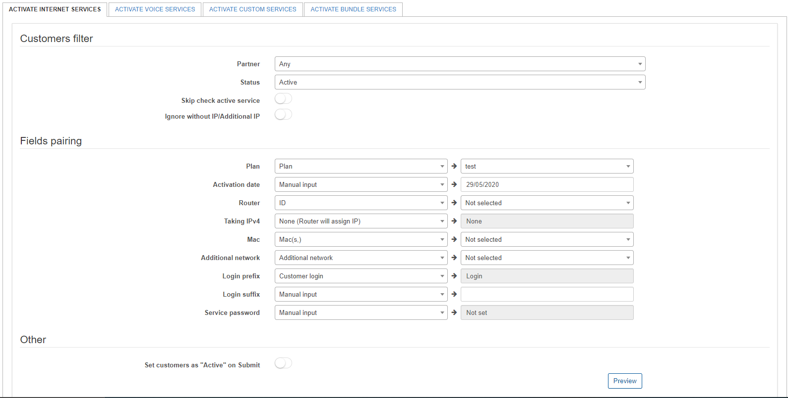

Activate Services
===============

This is a Splynx tool commonly used in the initial stages of your integration with Splynx.

It allows you to do mass activations of services for customers after creating or import plans and customers onto your server. Improving efficiency, you can activate large numbers of customers, all at once after migrating your network and services to Splynx.

Below are the descriptions of the parameters that need to be selected when performing an Activation of services with this tool.

***Please be advised this logic can be used for each of the tabs in the Activate Services tool.***

## Customers filter

**Partner** - select the partner of which customers belong to, to operate with.

**Status** - select the status of customers to operate with.

**Skip check active service** - whether you want the system to check if the customer already has active services or not.

**Ignore without IP/Additional IP** - whether you want the system to acknowledge if services are entered with or without an IP/Additional IP

## Fields Pairing

**Plan** -  select which plan/item to add to the customers services.

**Activation date** -  when the system should activate the services for these customers.

**Router** - select which router to add these customers to. (IP, Name or title of the router in Splynx can be used)

**Taking IPv4** - select which type of IPv4 assignment method to use.

**MAC** - select which mac address(es) to apply.

**Additional Network** - which network to use to assign additional IP's.

**Login Prefix** - select the prefix to use to generate logins.

**Login Suffix** - select the suffix to use to generate logins.

**Service password** - select the method to use to generate service passwords.

*If Manual input is selected for any of the fields, please enter the values manually in the provided fields.*

## Other

**Set customers as "Active" on Submit** - select whether or not you wish to make the selected customers as active after submitting the mass action to their services.
