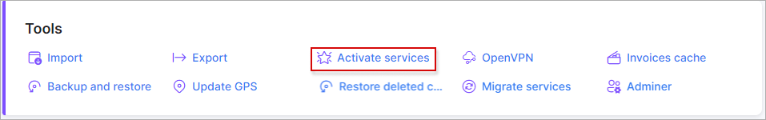
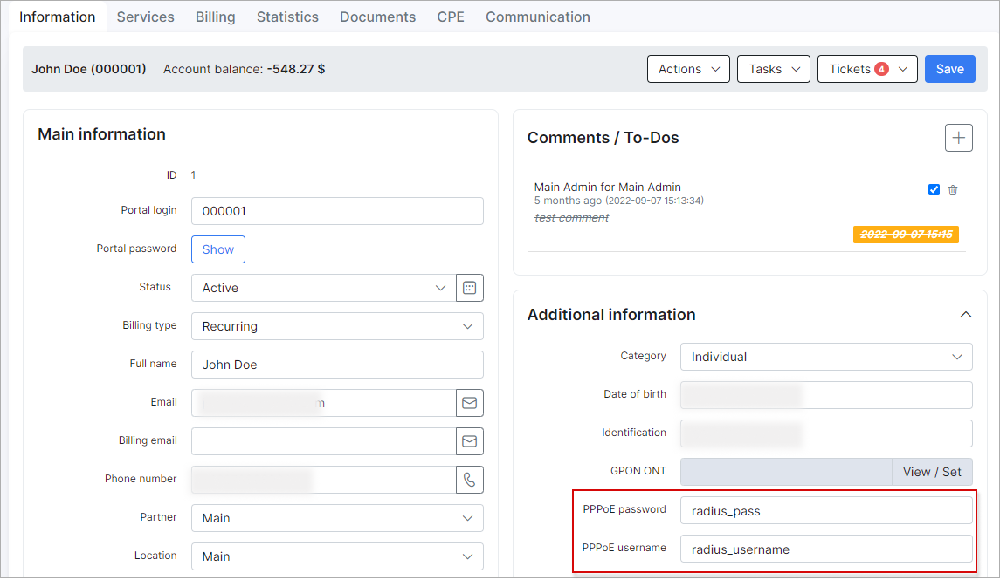

Activate services
===

With the use of this tool, services can be created in a bulk mode.

For example we have a few "New" customers from partner "PR". All these customers need the  internet plan "Fibre 50Mbps",  with a start date: 2020-07-01 and an IP will be assigned for the service from an IP pool, and login's and password's will be generated. Using the  following settings, our objective can be achieved.

Another example of using this tool:

We have imported customers with RADIUS login's and password's as depicted below:

So to create services with imported login's and password's, we can use the following setup:

Click on "Preview", to check the result of the setup:

Then, when we click on "Submit" the services will be created.

**Parameter descriptions**:

## Customers filter

**Partner** - select the partner of which customers belong to, to operate with.

**Status** - select the status of customers to operate with.

**Skip check active service** - whether you want the system to check if the customer already has active services or not.

**Ignore without IP/Additional IP** - whether you want the system to acknowledge if services are entered with or without an IP/Additional IP

## Fields Pairing

**Plan** -  select which plan/item to add to the customers services.

**Activation date** -  when the system should activate the services for these customers.

**Router** - select which router to add these customers to. (IP, Name or title of the router in Splynx can be used)

**Taking IPv4** - select which type of IPv4 assignment method to use.

**MAC** - select which mac address(es) to apply.

**Additional Network** - which network to use to assign additional IP's.

**Login Prefix** - select the prefix to use to generate logins.

**Login Suffix** - select the suffix to use to generate logins.

**Service password** - select the method to use to generate service passwords.

*If Manual input is selected for any of the fields, please enter the values manually in the provided fields.*

## Other

**Set customers as "Active" on Submit** - select whether or not you wish to make the selected customers as active after submitting the mass action to their services.
