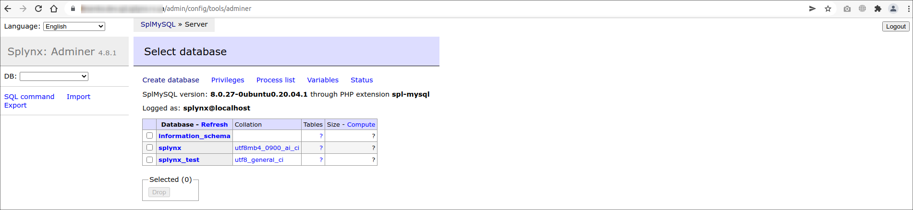

Adminer
============

This is the Splynx tool to access your Splynx server database.

All the data of your server can be accessed and operated with, using this tool. It is our method of accessing your database to troubleshoot any changes/errors that may have occurred that is inexplicable from the information provided on the GUI of your Splynx server.

## Important

We strongly advise against using this tool for our customers, as changes made in here are permanent and can cause damage to your system if anything is done incorrectly. Loss of data can occur if anything is deleted while using this tool and database corruption may easily occur if sensitive data is changed. If any issues occur from customers making any changes to the database, we cannot take any responsibility for this.

Therefore, please do not use this tool.

This is our management tool for your database.

