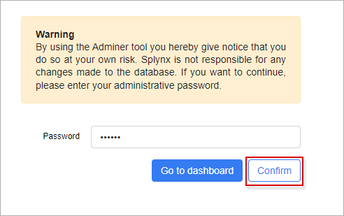

Adminer
============

<icon class="image-icon"></icon> **Important:**

<icon class="image-icon"></icon> **We strongly advise against using *Adminer* on your own because the changes made in this tool are permanent and can damage your system if something is done incorrectly.**

<icon class="image-icon"></icon> **The data can be lost if anything is deleted while using this tool and changes to sensitive data can corrupt the database completely.**

<icon class="image-icon"></icon> **The Splynx team is not responsible for any changes you make to the database using this tool.**

------------

**Adminer** - is a full-featured database management tool used to access your Splynx server database. We use the [fork](https://github.com/splynx/adminer) of the official tool which is adopted to the Splynx requirements.

All data on your server can be accessed and operated with *Adminer*. This is our method of accessing your database to resolve any changes/errors that may occur or may be inexplicable from the information displayed in the GUI of your Splynx server.

**Step 1**

**Adminer** is integrated into Splynx as the add-on, to install it open `Config → Integrations → Add-ons`, find `splynx-adminer` item and click on <icon class="image-icon"></icon> (Install) icon.

**Step 2**

Navigate to `Config → Tools` and click on **Adminer** button, the tool GUI will be opened in a new tab of your browser with the request to enter your administrative password:

**Step 3**

Type your password and press **Confirm** button. After that you can start work with the tool:

**NOTE:**

- **Do not try to drop the database** which contains the word `splynx`, the attempt will be blocked. **In most cases, it's your production database and you can lose all your data**;

- The actions that have been performed in **Adminer** are logged in `Administration → Logs → Operations`

Related links:

- The main **features** of *Adminer* tool are listed [here](https://www.adminer.org/en/#features) (not all features can be supported in Splynx);
- [Why is Adminer better than phpMyAdmin?](https://www.adminer.org/en/phpmyadmin/);
- The **online demo** of the official *Adminer* tool is available [here](https://demo.adminer.org/adminer.php?username=).

