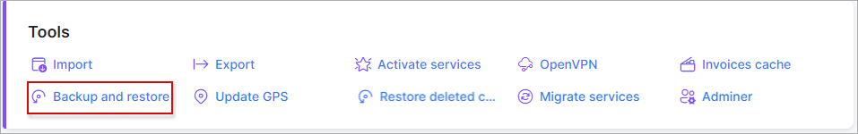

Backup and restore
====

With the use of this tool, backups can be done directly from a web page and also, backups can be restored from a web page using the same tool.

This tool can be really useful if you are planning a mass update of Splynx settings and you are afraid of making any errors - simply make a backup and start applying changes, in case of any failures, you can easily restore the previous state of Splynx.

To make a backup click on "Create" or if you already have a backup(previously done using this tool), it can be uploaded by clicking on "Upload":

To create a backup, in step 1 selected items which will be included in the backup should be selected:

**Database critical** - will be included automatically, contains all main info of Splynx(config, finances, services, networking, customers etc);

**Database full** -  entire database with structure of tables, critical info and customer's statistics and logs;

**RRD** - statistic graphs(ping, customer statistic graphs etc);

**Addons and handlers** - addons folder + folder with handlers(voice, finance etc);

**Template** - all templates;

**Public uploads** - documents, photos which were uploaded into Splynx.

In step 2, create a password for this backup, confirm it and in step 3 click on "Create".

Once backup is ready there 3 actions: restore, download and delete.

**To download the backup** click on the "Download" button in the *Actions* column and provide the backup password:

**To restore a backup** click on "Restore" in the *Actions* column:

Here you have to provide the backup password + the admin password. Then you will have to confirm the restore once more by providing the backup + admin passwords:

Then you will see the process of the restoration:

#### during the restore process an error can occur on the current tab - in this case just re-login to the Splynx web page.

After a backup restore we will have a  Splynx state with no backup(as it was before making the first backup).

### Recommendation: do not store tons of unnecessary and old backups, simply for the purpose of saving disk space. 
