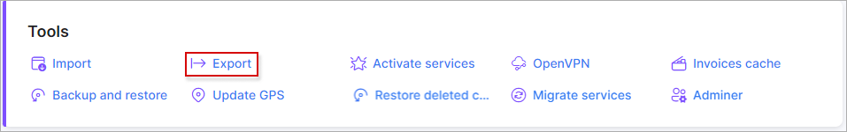
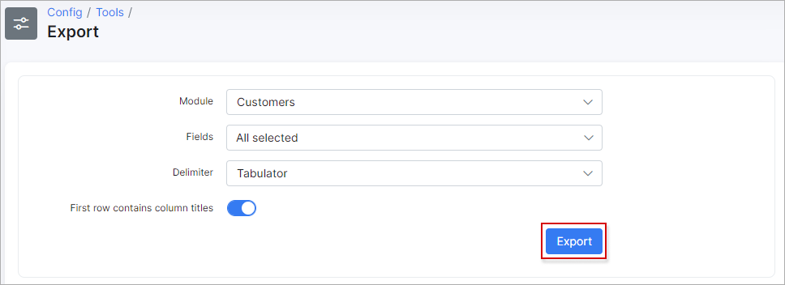

Export
======

This tool can be used to export data from all the available modules in the system.

If we need to export our customers, let’s use other feature, called “Export”. Choose your delimiter and click on `Export` button:

Customers with all the data will be saved in a CSV file.

How to export and update your Customer Database can be viewed in our video tutorial:
<iframe frameborder=0 height=270 width=350 allowfullscreen src="https://www.youtube.com/embed/LbDj8zmeF-Y?wmode=opaque">Video on youtube</iframe>

How to export customers from your MikroTik can be viewed in the following video:
<iframe frameborder=0 height=270 width=350 allowfullscreen src="https://www.youtube.com/embed/FzOZnqhPt8E?wmode=opaque">Video on youtube</iframe>
