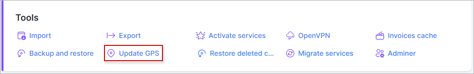

Update GPS coordinates
====

This feature can be helpful when a lot of customers have street addresses and cities recorded in their information but GPS coordinates are not populated. You can populate GPS coordinates for these customers with this feature. We can use the following situation as an example:

Geo data can be specified manually for one customer, but what if you have 1000+ customers with no updated GPS coordinates?

Firstly, navigate to `Config -> Tools -> Update GPS coordinates`:

If some customers already have GPS coordinates and they shouldn't be overwritten, select "No" in the "Rewrite existing coordinates" parameter.

Next, click on the "update GPS coordinates" button:

Once completed, you will see a list of customers with updated coordinates:

 let's take a look at the customer account "Andrew":

As you can see, the GPS coordinates were updated for this customer. 
