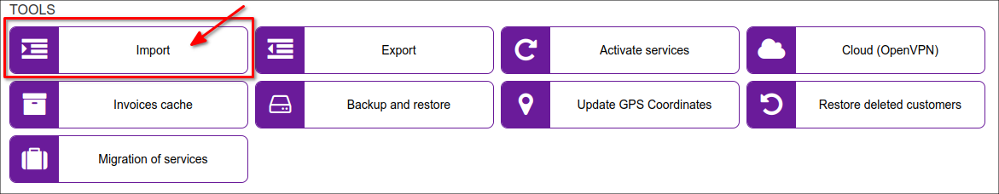
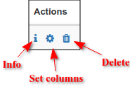
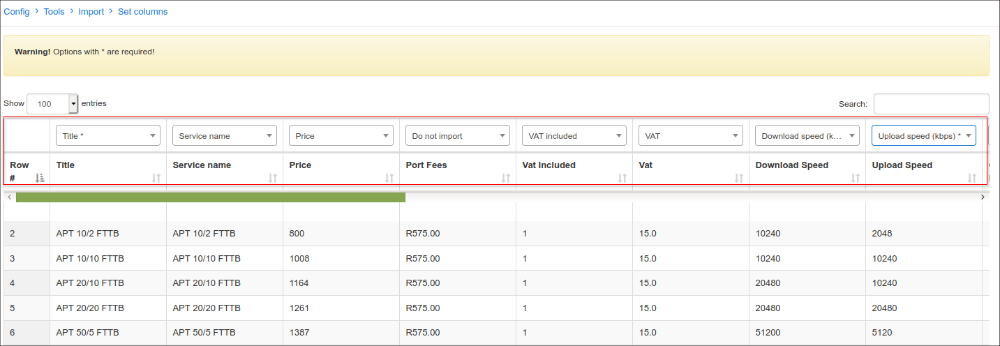

Import
======

When you are migrating to Splynx, importing your customer database is probably needed. We've provided the service to Import, as a part of support for paid licenses, but you can also check how the Import is implemented in our system. Upload a csv/excel file, define columns as fields in the system and click upload, that’s all!

The import to the following modules in Splynx is supported:

- *Partners*
- *Locations*
- *Administrators*
- *Customers*
- *Leads*
- *Internet plans*
- *Recurring tariffs*
- *Routers*
- *Monitoring*
- *IPv4 Networks*
- *IPv4 Address*
- *Prepaid vouchers*
- *Refill Cards*
- *Inventory product*
- *Inventory items*
- *Inventory vendor*
- *Inventory Supplier*
- *Services (Internet)*
- *Services (Custom)*
- *IPv6 Networks*
- *IPv6 Networks (Addresses)*
- *Voice plans*
- *Voice devices*
- *Customer rates*
- *Provider rates*
- *Voice Prefixes*
- *Voice categories*
- *Services (Voice)*

After submitting the file, in *Actions* column the three buttons are available

Using *Set columns* button we have to correspond, with fields' names, to its data and press *Submit* at the bottom of the page to start import.

How to import Customer Databases is also shown in our video tutorial:  

<iframe frameborder=0 height=270 width=350 allowfullscreen src="https://www.youtube.com/embed/pJJHfAv8bPo?wmode=opaque">Video on youtube</iframe>

For the mass activation of customer services after the Import, please follow the following guide:  
<iframe frameborder=0 height=270 width=350 allowfullscreen src="https://www.youtube.com/embed/9bQL6EyV230?wmode=opaque">Video on youtube</iframe>
