Import
======

When you are migrating to Splynx it is needed to import existing customers from your previous system into a new one. Manual import will take a lot of time and we have a tool to save this time.
Using the import tool you can import your data (customers, tariff plans, routers, leads, administrators, services, inventory items and products, etc) into Splynx in a few clicks. All what you need is a CSV file with your data.

### Customers import

To open this tool navigate to `Config → Tools → Import`:

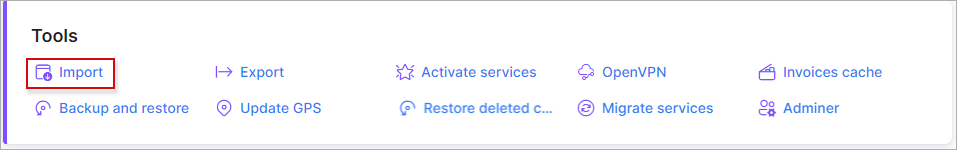

We have a CSV file with the following structure:

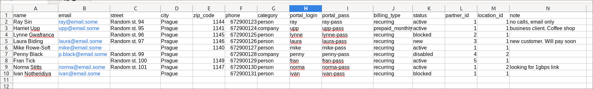

Let's import it:

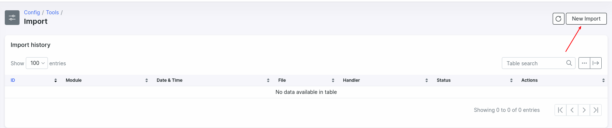

select the **Customers** module and upload your file:

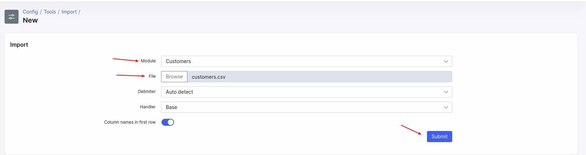

once file is loaded you need to define columns for import:

here you need to select appropriate column according to the columns of the file:

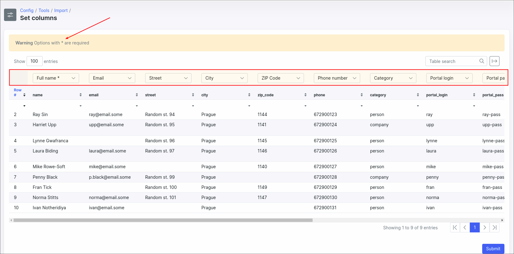

<icon class="image-icon"></icon> **Tips for importing CUSTOMERS:**

* Fields with `*` sign are required. For the **Customers** module, the only required field is **Full name**;
* Email must be valid: e.g. `email@some.email` (invalid), `william.rieth@gmail.com` (valid);
* For the **Category** column there are only 2 available options: `person` or `company`. Strictly in lower case;
* For the **Location** and **Partner** columns **use only locations and partners IDs from Splynx, not names**;
* It's **not required** to import all columns from the file. You can select the `Do not import` option for a column and it will be ignored:

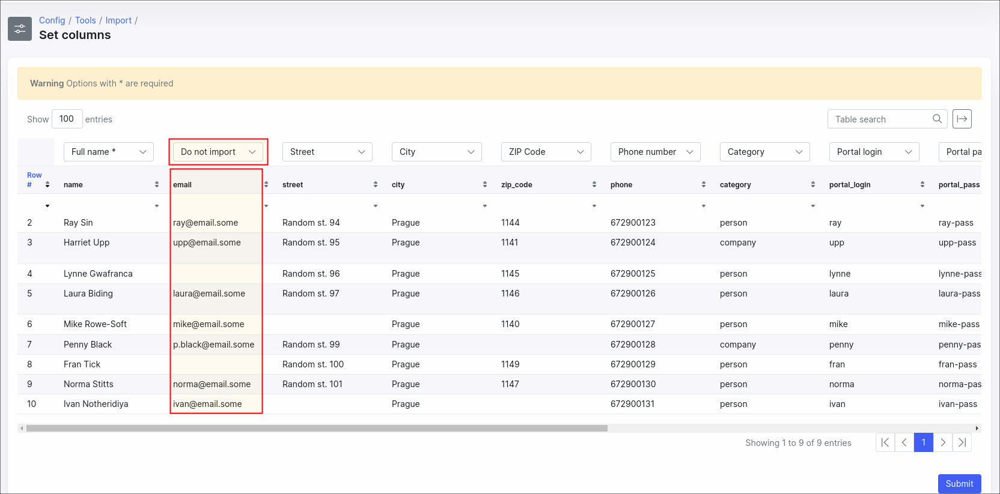

Once columns are defined, click on the **Submit** button at the bottom of this page. This will generate a preview for import. Click on the **Show preview and confirm** button to check the preview and confirm:

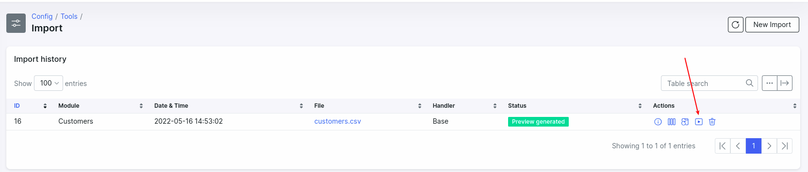

If there are no rows with errors you can click on the **Confirm import** button and the import process will start in the background but when you have some errors and do not want to start the import again you can enable the **Ignore rows with errors** option at the bottom of this page and such errors will be ignored during the import and you'll be able to download the file with the elements where the errors occurred in order to reprocess them later.

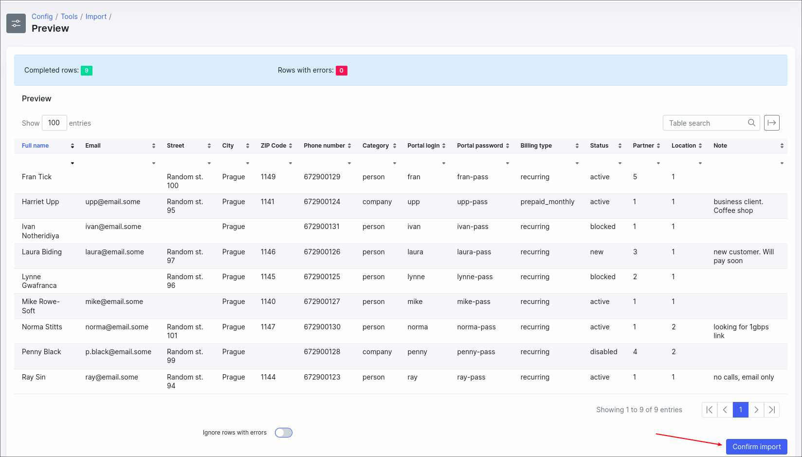

Here is the result of a successful import:

Under **Actions** you can check the import summary and download this record from the list.

### Internet services import

Once customers are imported and internet plans are created we can import internet services for these customers. The flow is the same - select appropriate module, upload a CSV file, define columns, import.

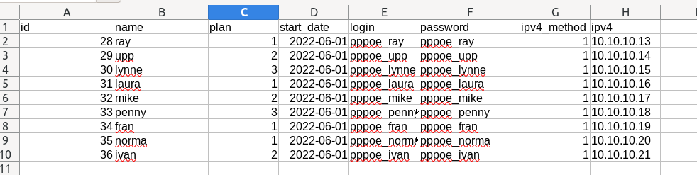

In this file, the values in the **id** column will be ignored and in the **name** column we have customers' login values. To match records from the file with existing customers in Splynx you can use the email address, customer login or customer ID (the columns names are: **Customer email**, **Customer login** and **Customer** respectively).

<icon class="image-icon"></icon> The required fields for services import are: **login**, **plan (tariff ID or name)** and **start date**.

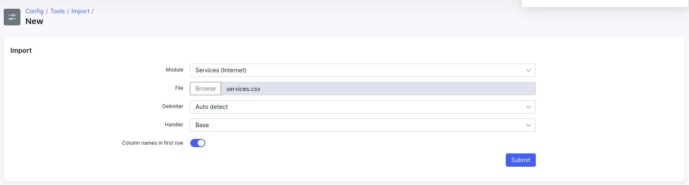

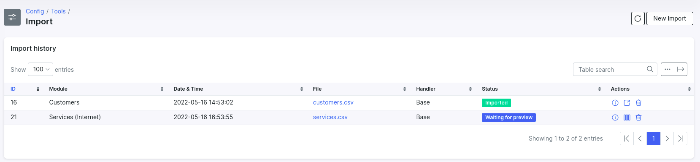

We will match customers by login so instead of the **Customer*** field we will use the **Customer login** field:

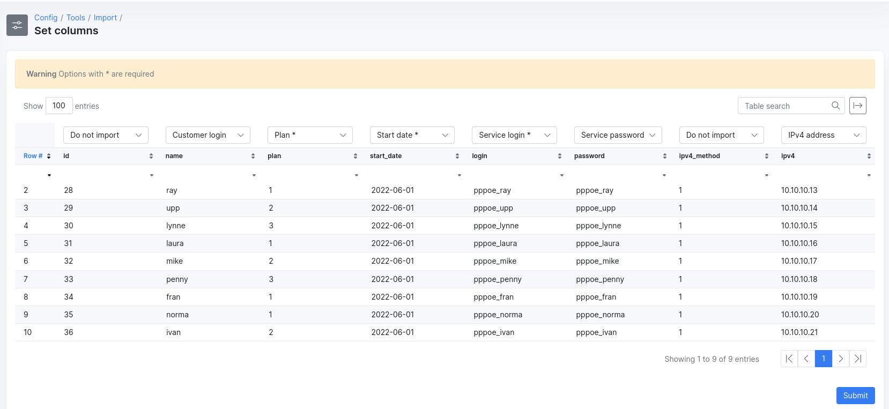

<icon class="image-icon"></icon> **Tips for importing SERVICES:**

* For the **Plan** column use the tariff plan ID or plan name;
* **Start/end date** should be in the following format - `YYYY-MM-DD`;
* **Service login** is unique value;
* **IPv4 addresses** pool must be created before the import with IPs in `Networking → IPv4 networks`.

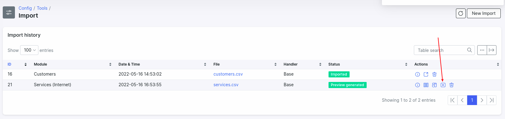

We have 1 error in services, because the customer is inactive:

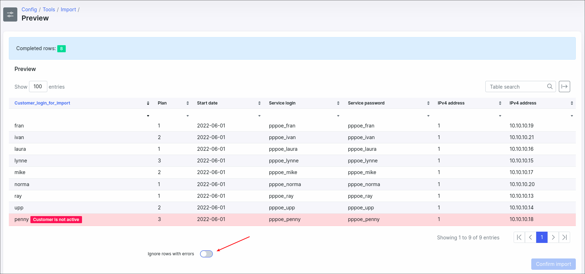

You won't be able to confirm the import without the **Ignore rows with error** option enabled. To continue importing, but without the error in the record, enable the specified option and confirm.

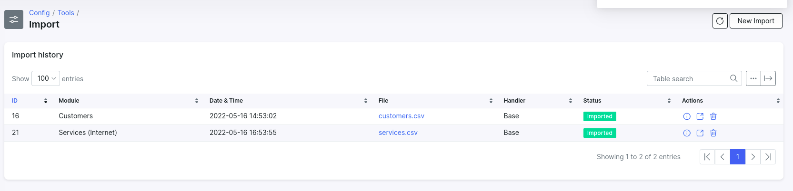
