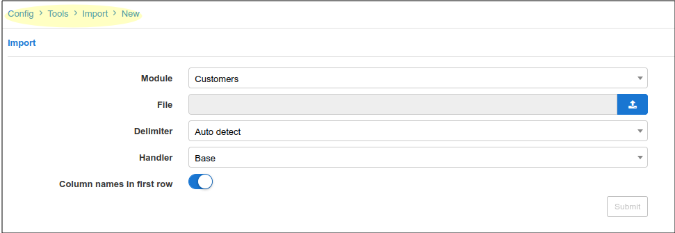
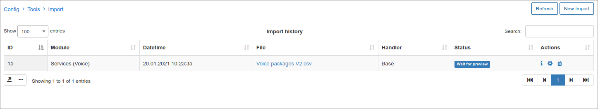

Import
======

When you are migrating to Splynx, Importing your customer database is probably needed. We've provided the service to Import, as a part of support for paid licenses, but you can also check how the Import is implemented in our system. Upload a csv/excel file, define columns as fields in the system and click upload, that’s all!

How to import Customer Databases is also shown in our video tutorial:  

<iframe frameborder=0 height=270 width=350 allowfullscreen src="https://www.youtube.com/embed/pJJHfAv8bPo?wmode=opaque">Video on youtube</iframe>

For the mass activation of customer services after the Import, please follow the following guide:  
<iframe frameborder=0 height=270 width=350 allowfullscreen src="https://www.youtube.com/embed/9bQL6EyV230?wmode=opaque">Video on youtube</iframe>
