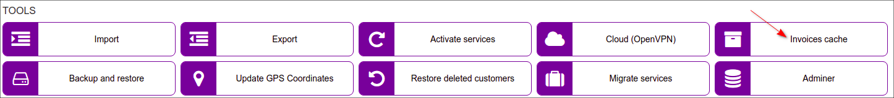

Invoices cache
====

 This section displays the number of cached invoices on the system and an option to clear it.

Splynx can cache invoices for faster generation of invoice PDF documents. Sometimes you need to make some changes in the invoice PDF template and thereafter we recommend clearing the invoice cache using this tool.

Invoice cache can be enabled under `Config → Finance → Settings`:

And invoices cache can be cleared in `Config → Tools → Invoices cache`:

Enter invoice number or its `id` - to clear from cache all versions of specific invoice or leave the field empty - to clear the full cache and after that press `Clear cache` button.

### Note
This tool might be helpful when changes were made in invoice PDF templates but it's not visible on generated PDF's, the reason can be in the invoice cache.

If you are changing your PDF invoice template frequently, don't forget to clear cache here.

<b>Example</b>

In Splynx, the `Invoice cache` option  is enabled and the default invoice [template](configuration/system/company_information/company_information.md) `Invoice A4 Classic` is used. The default template was changed and you want to apply these changes only to one invoice.
To perform this action, enter invoice number e.g. 202101000845 in the field and press `Clear cache`. After that try to view the invoice as PDF to double check the result.

