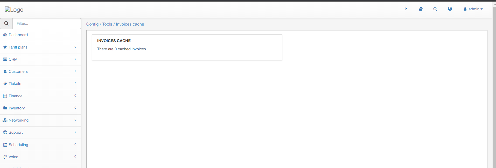
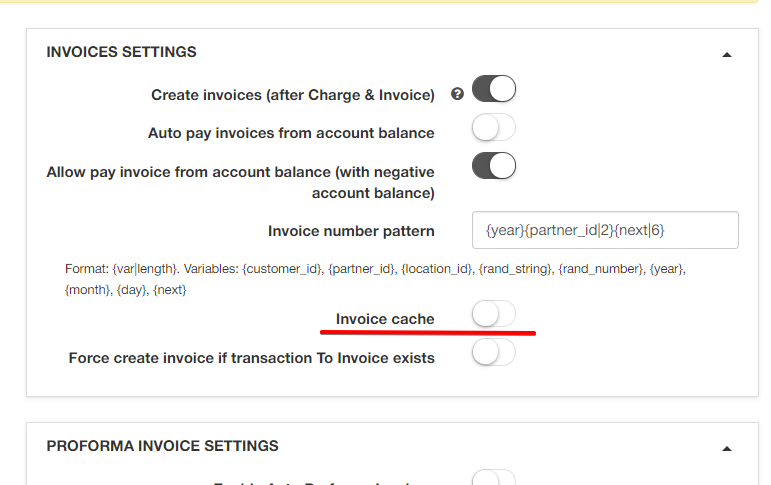

 Invoices cache
 ==========

 This section displays the number of cached invoices on the system.

This section will only populate if invoice cache has been enabled in  `Config / Finance / Settings`

As we are aware of the uses of cache, this can be a handy tool when constantly dealing with invoices for customers, as it will improve the time it takes to interact with invoices and ultimately your response time to customers with regards to invoices.

## Important Note!

We do not recommend the use of invoice cache if you are constantly making changes to invoices, as this impairs the functionality.

When cache is enabled and you make any changes to invoices, the invoices will not update on the customers side until you have cleared the invoice cache.
