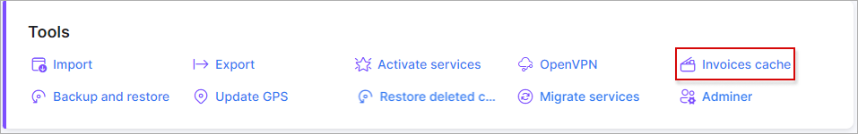
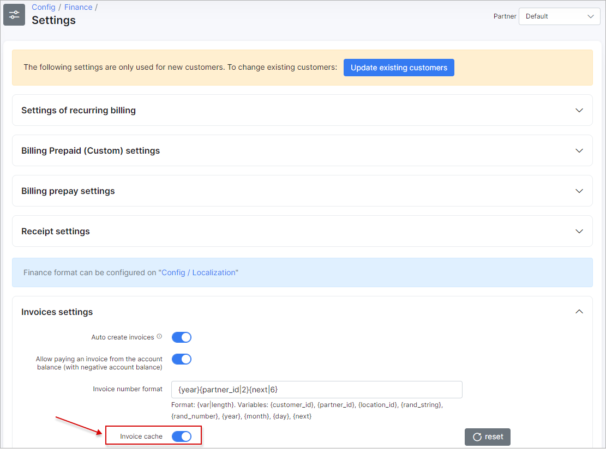

Invoices cache
====

 This section displays the number of cached invoices on the system and an option to clear it.

Splynx caches invoices for faster generation of invoice PDF documents. Sometimes you need to make some changes in the invoice PDF template and thereafter  we recommend clearing the invoice cache using this tool.

Invoice cache can be enabled under Config/Finance/Settings:

And invoices cache can be cleared here:

Simply click on "Clear cache" - that's all.

### Note
This tool might be helpful when changes were made in invoice PDF templates but it's not visible on generated PDF's, the reason can be in the invoice cache.

If you are changing your PDF invoice template frequently, don't forget to clear cache here.
