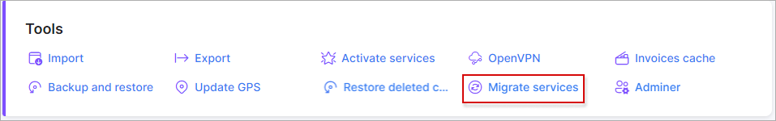
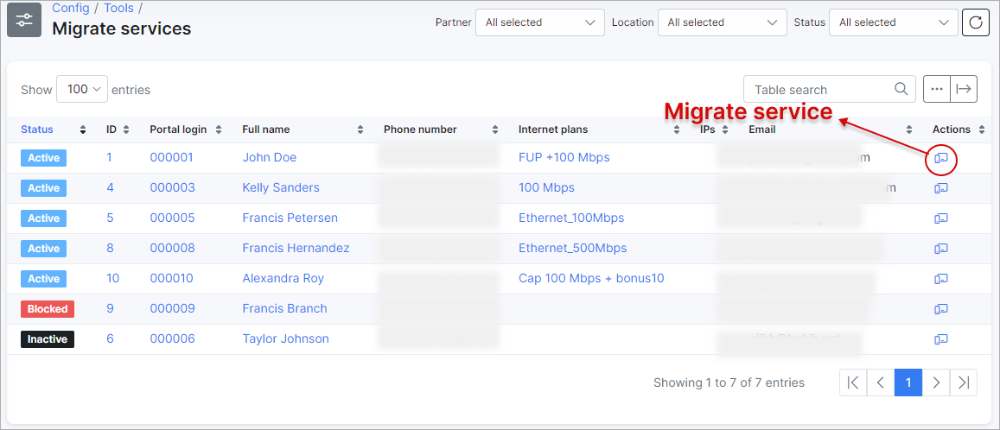
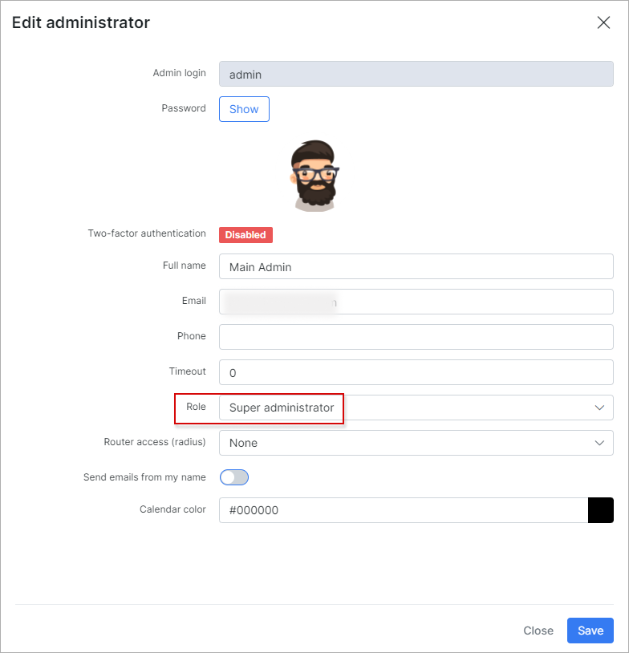
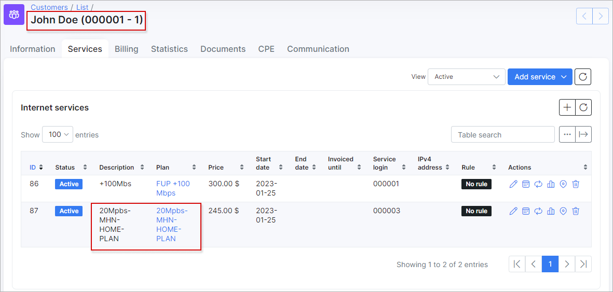

Migrate services
===

With the use of this tool, we can move all services with its statistics from one customer to another.
Service migration feature will come in handy if during customers import there are errors in relation with their services, it's necessary to merge two customers into one, customers move to another location and want to keep their *Tariff plans* etc.

After you click on `Migrate services` in `Config → Tools`, the list with customers and their services will be opened:

You can sort the list by [Partner](administration/main/partners/partners.md), [Location](administration/main/locations/locations.md) and [Status of customers](customer_management/customer_information/customer_information.md). Or use the **Search** field to find customer by *id* or *Full name*.

In *Actions* column click on <icon class="image-icon"></icon> icon to start service (-s) migration.
During *Internet* service (-s) migration will be moved all its statistic, e.g. traffic, IP address, for *Voice* service - all calls, sms, date etc.

**NOTE:** For the process of migration use only administrator account with `super administrator` [role](administration/main/admins_and_permissions/admins_and_permissions.md). Double check if `ID` column is enabled in *Services* tab of customer's profile.

<b>click here to see the screenshots</b>

In the new window, put the check mark near the service you want to migrate and press `Move to customer` button. Then, select the new customer and press `Confirm migration` button

The service you selected will be moved to new customer.

The log about the migration operations can be found in `Administration → Logs → Operations`, in *Actions* column, click on <icon class="image-icon"></icon> icon to check the operation details

The list of customers in `Config → Tools → Migrate services` can be modified to display the necessary fields with <icon class="image-icon"></icon> icon at the bottom of the table or the data can exported in a format of choice with the export <icon class="image-icon"></icon> icon.
