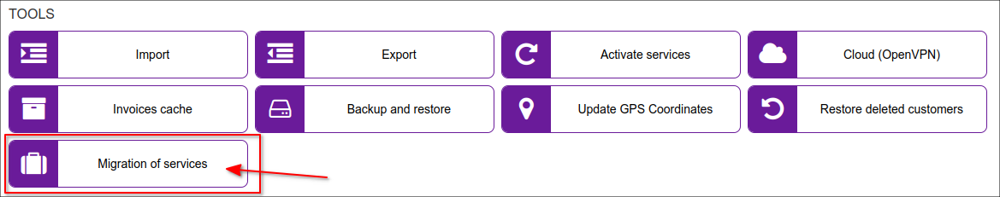
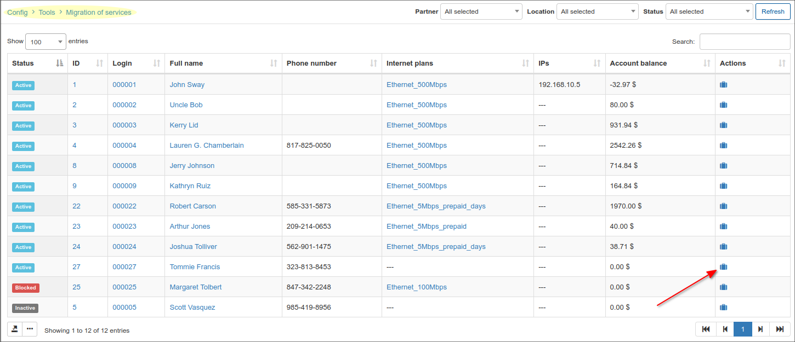
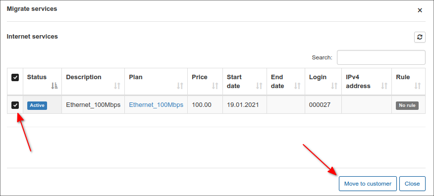
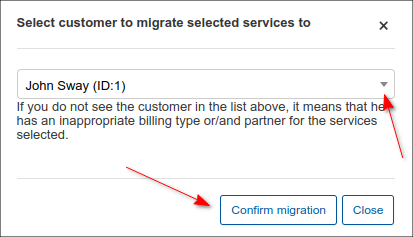
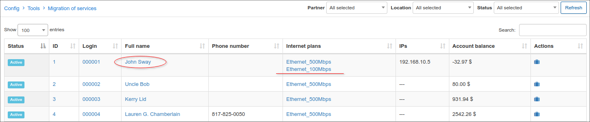
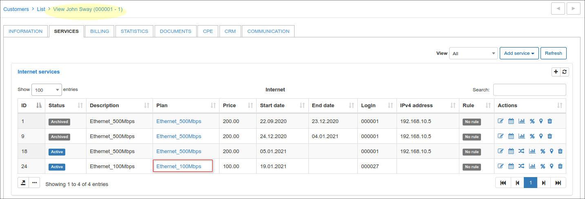

Migration of Services
===

Using this tool we can move any of the available services from one customer to another one. The migration is possible only between customers with the same *billing type* and *partner* relations.

In the table, find the customer from which it's necessary to move the service, in *Actions* column press on <icon class="image-icon"></icon> sign

In a new pop-up window put the check near the service(s) and press *Move to customer* button

Then, from drop down menu select customer to whom the service(s) should be migrated and press *Confirm migration* button

As we can see, the service was move to desired customer

