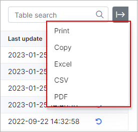

Restore deleted customers
===

With the help of this tool, we can restore the deleted customers with all related data in Splynx system. The search can be performed by customer's **ID**, **login**, **full name** or **phone**.

**NOTE:** **the leads restore is not supported yet**.

After you click on `Restore deleted customers` item in `Config → Tools`, the new page with the search field  will be opened to enter the necessary parameter:

After the **Restore** button is pressed, the customer's **finance documents** and **service (-s)** will be recovered as well. The status of the restored customer will be `Incactive (Doesn't use services)`.

If during the restore process there is the existing customer/lead with the same **login** or **email** in Splynx system, you will be **requested to change this data**. It depends on what type of data is used in **Authentication field** to login on customer's portal. This setting is located in `Config → Main → Portal`.

**NOTE:**

- **double check all restored customer's data after the process is finished**, e.g. the integrity of invoices (its inside items and values), if the payments match with the customer's invoices, the services/transactions accuracy, the relations of payments with proforma invoices etc;

- the **log of customers restore activity** can be found in `Administration → Logs → Operations`.

The **multiple customers can be restored** one by one as well, just enter the **similar parameter** for all accounts to search:

The list of found customers in `Config → Tools → Restore deleted customers` can be printed or exported in a format of choice with the export <icon class="image-icon"></icon> icon at the top right corner of the table.

