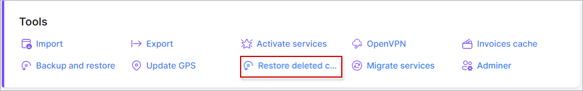
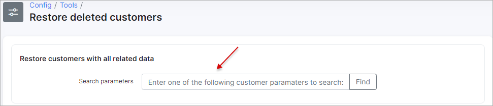

Restore deleted customers
===

With the help of this tool, we can restore the deleted customers with all related data in Splynx system. The search can be performed by customer's *ID, login, full name* or *phone*.

**NOTE:** the leads recovery is not supported yet.

After you click on `Restore deleted customers` item in `Config → Tools`, the new page with the search field  will be opened to enter the necessary parameters:

After **restore** button is pressed, customer's billing data and service (-s) will be recovered as well.

If during the restore process there is the existing customer/lead with the same login or email in Splynx system, you will be requested to change this data. It depends on what type of data is used in **Authentication field** to login on customer's portal. This setting is located in `Config → Main → Portal`.

**NOTE:** please, double check all restored customer's date after the process is finished, e.g. if payments match with the customer's invoices, services/transactions accuracy, relations of payments with proforma invoices etc.

The multiple customers can be restored one by one as well, just enter the similar parameter for all accounts to search:

The list of found customers in `Config → Tools → Restore deleted customers`can exported in a format of choice with the export <icon class="image-icon"></icon> icon at the bottom of the page.
