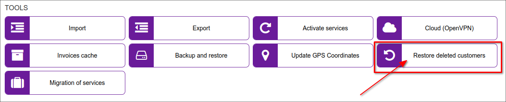
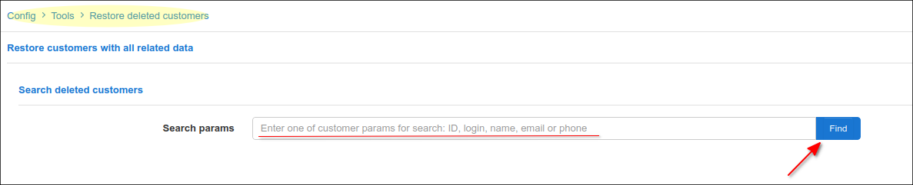
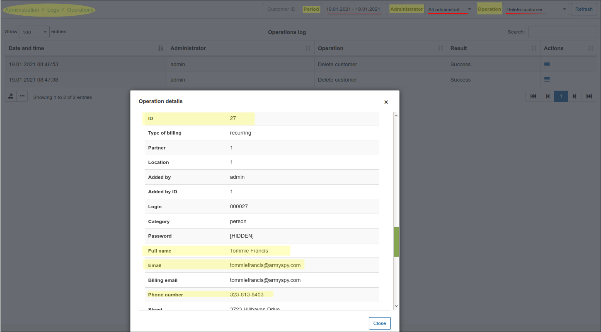
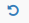
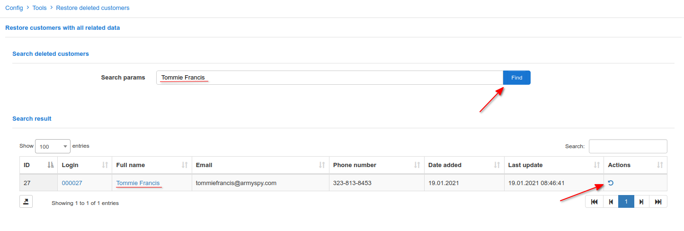
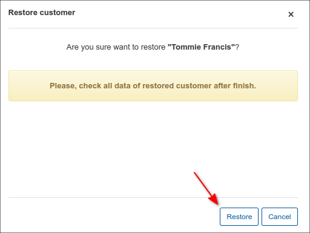
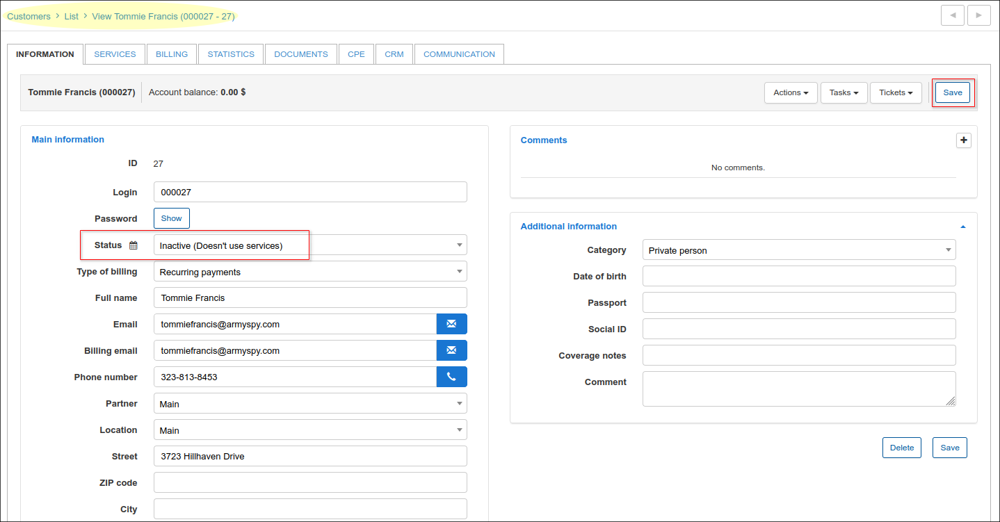

Restored Deleted Customers
===

Using this tool, we can find and restored deleted customers in Splynx.

It's assumed that the customers were deleted in `Customers → List` and we know such information as customer's *id*, *login*, *name*, *email*, *phone* to start the search. In case we cannot recall the information about the removed customers we can double check the log to find it out, open `Administration → Logs → Operations`, choose the necessary *Period*, *Administrator*, who remove customer (can be selected *All administrators* option as well) and *Operation* - *Delete customer*, then click on *Details* in *Action* column. In the new pop-up window *"Operation details"* we will find all that we need.

To restore the customer, type one of a search parameter and press *Find*, then, in *Action* column press restore <icon class="image-icon"></icon> sign

In *"Restore customer"* confirmation window press *Restore* button

The restored customer profile will be opened in a new browser's tab, the customer's status will be as *Inactive (Doesn't use services)*, change it to a necessary one and press *Save* button

