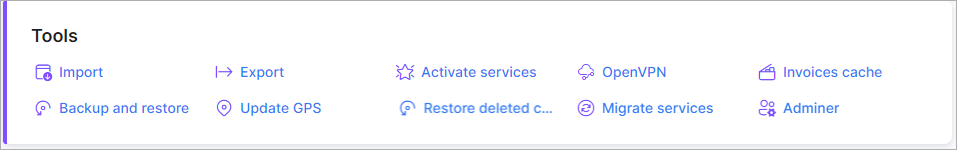

Tools
=====

* [Activate services](configuration/tools/activate_services/activate_services.md)

* [Adminer](configuration/tools/adminer/adminer.md)

* [Backup and restore](configuration/tools/backup_restore/backup_restore.md)

* [Export](configuration/tools/export/export.md)

* [Import](configuration/tools/import/import.md)

* [Invoices cache](configuration/tools/invoices_cache/invoices_cache.md)

* [Migrate services](configuration/tools/migrate_services/migrate_services.md)

* [OpenVPN](configuration/tools/openvpn/openvpn.md)
  * [→ Cloud](configuration/tools/openvpn/cloud/routes/routes.md)

* [Restore deleted customers](configuration/tools/restore_deleted_customers/restore_deleted_customers.md)

* [Update GPS coordinates](configuration/tools/gps/gps.md)
