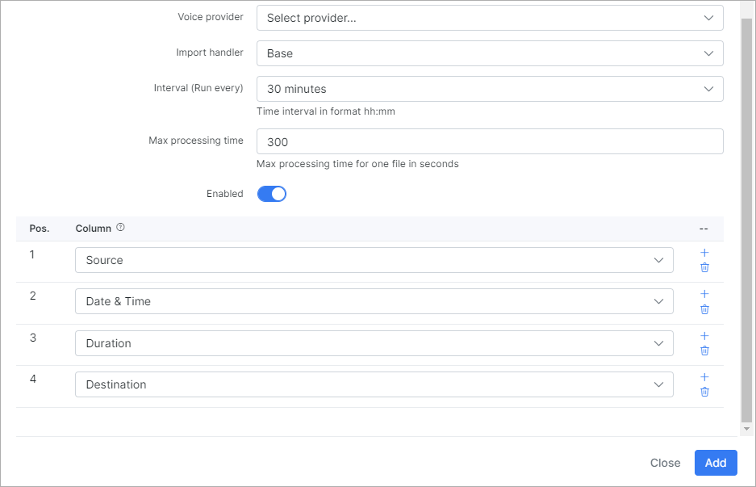
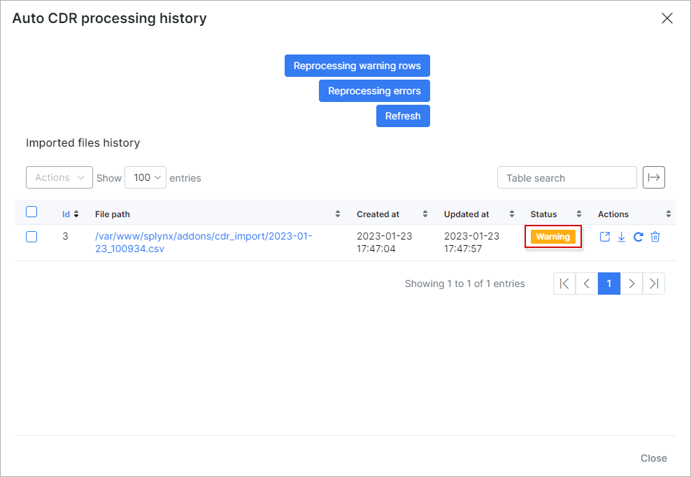
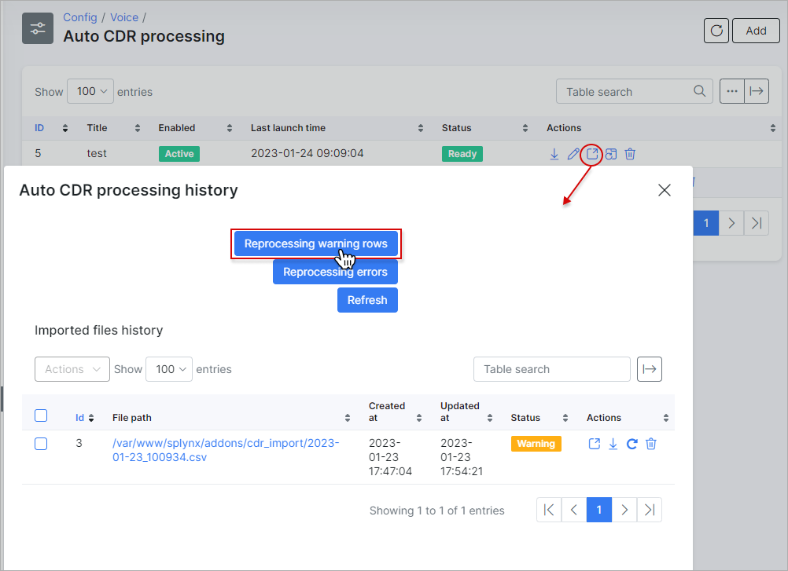
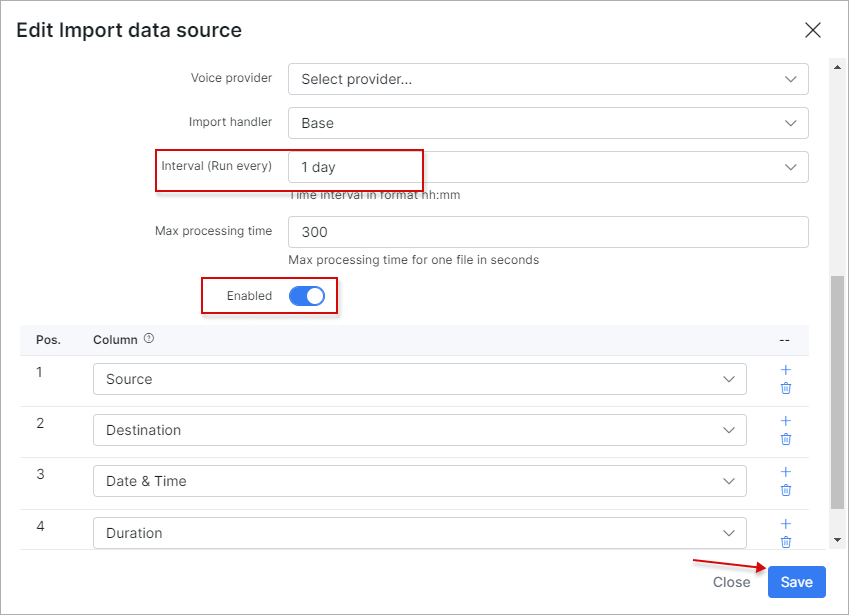

Auto CDR processing
==========

The Voice auto CDR processing is managed here.

The process is similar to the [Voice → Processing → CDR import](voice/processing/processing.md), but here we can import multiple CDRs together, automatically.

<icon class="image-icon"></icon> In order to create an *Auto CDR Processing* entry, it is necessary to create an **Import data source location** first. This can be done in `Config → Voice → Import data source`. More information you can find in the [Import Data Source](configuration/voice/import_data_source/import_data_source.md) guide.

Once we have added a data source, then we can proceed with creating an **Auto processing entry**.

Let's **create an auto processing entry** by clicking on the `Add` button located at the top right corner of the table:

The **data source parameters**:

  * **Title** - provide a relevant name for the entry;

  * **Import data source** - select a data source from the drop-down list (in our case we used the local storage);

  * **File name format** - Regex for filtering file names (uses pcre syntax):
    this will process all the files that have pattern entrances in the file name.
    Check the [Examples](voice/auto_cdr_processing/examples/examples.md). We have all the CDR file names starting with `test-cdr-` (e.g. *test-cdr-2021-11-01.csv*);

  * **Import from file modification date** - specify the file modification date in `Y-m-d H:m:s` format for the initial import. Clear the field value to process all files which do not exist in the system, with any `Last Modification Time`.
  Also, pay attention that **the CDR files must have unique names as Splynx checks files by their names and if a file with a particular name has been imported into Splynx and the same file has since been modified, Splynx will not re-load the modified file as that file has already been imported**.

  * **First row contains column titles** - enable this option if the first row in your CDRs contains the columns names;

  * **Delimiter** - select a *delimiter* character (*Tabulator*, *Comma*, *Semicolon*) that marks the beginning or end of a unit of data from the drop-down list;

  * **Type** - select a type (*Call*, *Message*, *Data*, *Mixed*) from the drop-down list, relevant to the data you would import. In our case it's only calls;

  * **Voice provider** - select the necessary voice provider;

  * **Import handler** - select your handler from the drop-down list;

  * **Interval (Run every)** - how often the auto processing will be executed;

  * **Max processing time** - max time in seconds that Splynx will spend to process one file. If processing of the file takes more than the specified value, it will be ignored;

  * **Enabled** - when the toggle is enabled, an auto processing unit will be executed every time `Interval` value, and if the toggle is  disabled, you will have to run it manually;

**Position** and **Column** values should be specified according to your file. If you are using an external handler - the columns configuration can be ignored because a handler was designed, taking into account the particularities of the fields.

<icon class="image-icon"></icon> The `Mixed` type cannot be used with `Base` handler during data import.

For the `Call` type, the **CSV file must contain such required columns** as `Source`, `Datetime` (or separated `Date`, `Time` columns), `Duration`, `Destination` and `Type` (_Call_). The columns quantity and columns order (`Pos.`) should be the same as in the file for import.

For `Data` type the required fields are the following:  `Source`, `Datetime`, `Amount` and `Type` (_Data_)

But **it never hurts to include the final price of each call, message or data into the CSV file. It means that you should upload CDR files that have been already rated.**

After Auto CDR processing entries have been added, you can run import manually (in order to test it's functionality, after successful test results, the auto import can be enabled to execute all the processing actions automatically), in `Config → Voice → Auto CDR processing`, simply click on the <icon class="image-icon"></icon> (Run import) button. Before running an import, we recommend to check the files preview that will be imported:

If the files to be imported are correct, we can press <icon class="image-icon"></icon> icon to start the import.

After the import has been completed, we can check the results by clicking on the "History" button:

In the current case, the file was fully processed. If a file was completed with warnings, simply place the mouse cursor on the `Warning` status message of the file to see the number of *processed/unprocessed* rows:

Close the *Auto CDR processing history* window and click on the <icon class="image-icon"></icon> (Show warning rows) icon to view more information about the warnings:

As we can see, the call can't be placed to the correct service with the source number = `380974324350`. To fix this, we should choose the required customer and add the voice service, after that add to the service the phone number = `380974324350` and specify its direction as `outgoing`.

 Let's reprocess the warnings:

After reprocessing, we have successfully imported all files. Now we can enable the auto processing to grab new files from the data source location, once a day. So Splynx will automatically grab and import files with calls:

