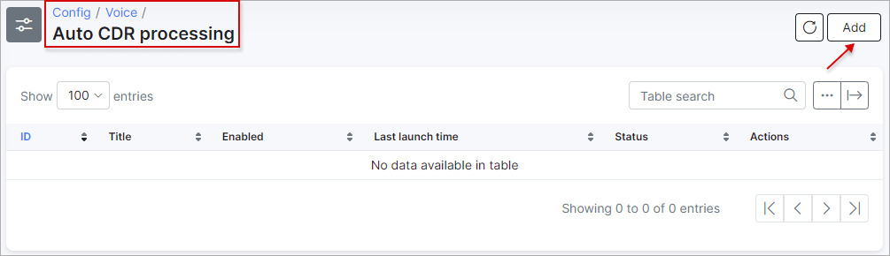
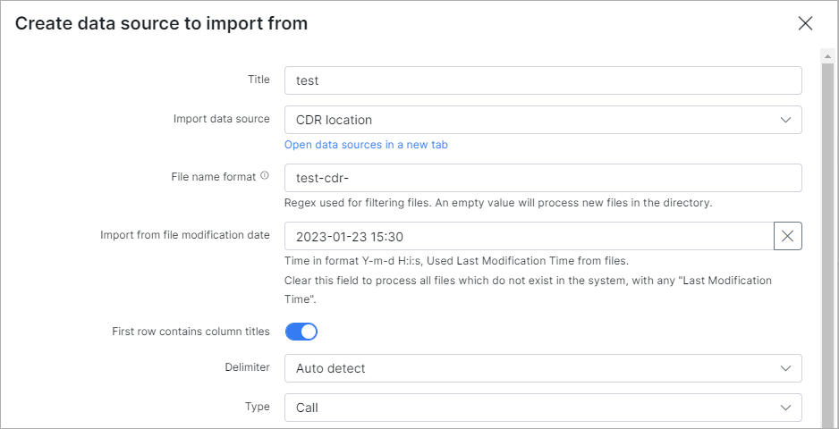

Auto CDR processing
==========

The Voice auto CDR processing is managed here.

The process is similar to the [Voice -> Processing -> CDR import](voice/processing/processing.md), but here we can import multiple CDR's together, automatically.

***Please note!, in order to create an Auto CDR Processing entry, it is necessary to create an "Import data source location" first. This can be done in `Config/Voice/Import data source`.***

*For more information on creating an import data source location please follow the link below:* 
[Import Data Source](configuration/voice/import_data_source/import_data_source.md)

Once we have added a data source, we can then proceed to creating an auto processing entry:

Let's create an auto processing entry by clicking on the *Add* button located at the top right of the table:

The following parameters need to be specified here:

  * **Title** - provide a relevant name for the entry;

  * **Import data source** - select a data source from the drop-down menu(in our case we used the local storage which was previously created);

  * **File name pattern** - Regex for filtering file names (uses pcre syntax):
    This will process all the files that have pattern entrances in the file name. [Examples](voice/auto_cdr_processing/examples/examples.md). We have all the CDR file names starting with "test-cdr"(eg. test-cdr-2020-08-01.csv);

  * **Import from file modification date** - specify the file modification date for the import. In our example, to import only files for August 2020, we've specified 2020-08-01 00:00:00, but if the file with calls for July was created on 2020-08-01 00:00:01, it will be also imported;

  * **First row contains column names** - enable this option, if the first row in your CDR's contains the columns names;

  * **Delimiter** - select a delimeter from the drop-down menu;

  * **Type** - select a type from the drop-down menu, relevant to the data you would import. In our case it's only calls;

  * **Voice provider** - select the necessary voice provider;

  * **Import handler** - select your handler from the drop-down menu;

  * **Launch time interval** - How often the auto processing will executed;

  * **Max processing time** - max time that Splynx will spend to process one file. If processing of the file takes more than the specified value - it will be ignored;

  * **Enable** - when enabled, an auto processing unit will be executed every 'Launch time' interval, and if disabled - you will have to run it manually;

As we have a strict and simple format of files, we have specified columns regarding to our file format. If you are using a handler - columns configuration can be ignored.

After Auto CDR processing entries have been added, you can run it manually (to test it's functionality, after successful test results, the auto import can be enabled to execute all the processing actions automatically), from **Config -> Voice -> Auto CDR processing**, simply click on the "Run import" button. Before running an import, we recommend checking the preview of files that will be imported:

We have 4 files to be imported and all is correct, so we can start the import:

After the import has completed, we can check the results by clicking on the "History" button:

In our case, the first file was fully processed and all the rest completed with warnings. Simply place the mouse cursor on the "Warning" message under each file to see the number of processed/unprocessed rows:

We can click on the "Show warning rows" button, to view more information about the warnings:

As we can see, some calls can't be placed to the correct service with the source number = 28449988. To fix this, we have added a voice service for the customer with the number = 28449988 and direction = outgoing. Let's reprocess the warnings:

After reprocessing, we have successfully imported all files. Now we can enable the auto processing to grab new files from the data source, once a day. So Splynx will automatically grab and import files with calls:

