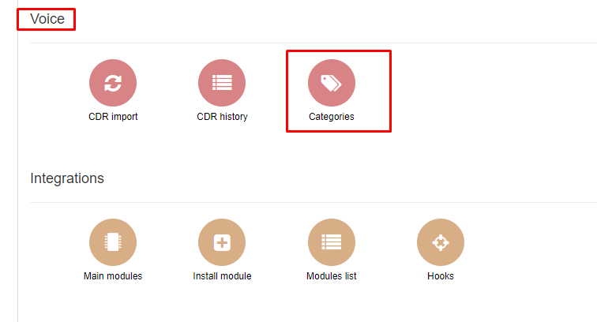
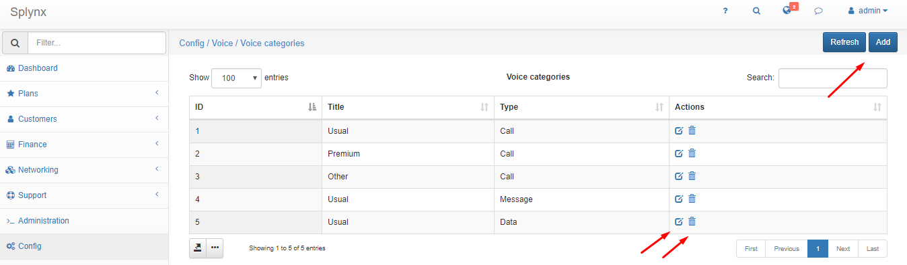
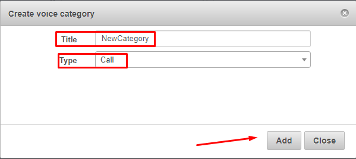
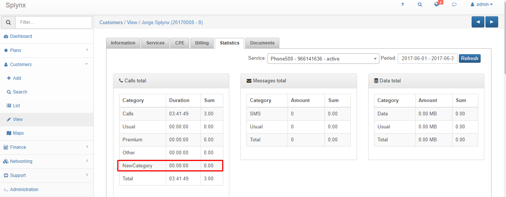

Categories
==========

It is possible to edit Splynx Categories making them customizable.

For that, go to menu Config and in the Voice box, click on Categories.

You will see there default categories which you can edit, delete or add a new category.

You can check new category in the transactions of customers.

