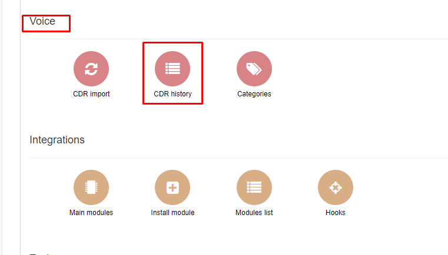
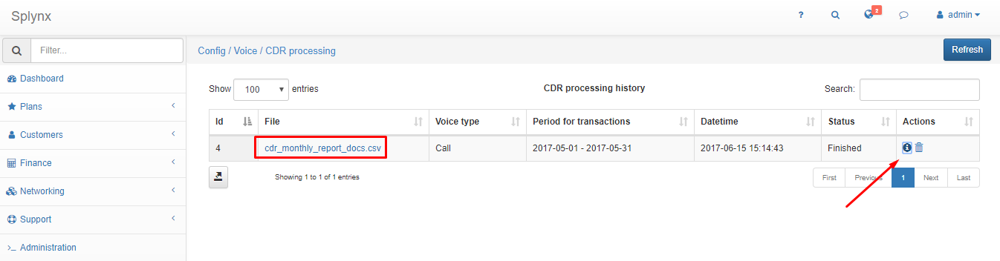
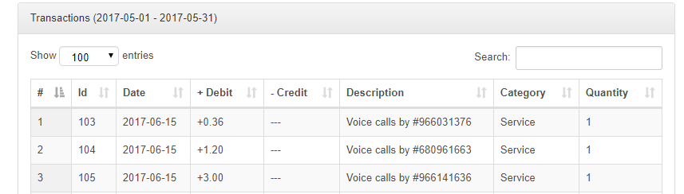
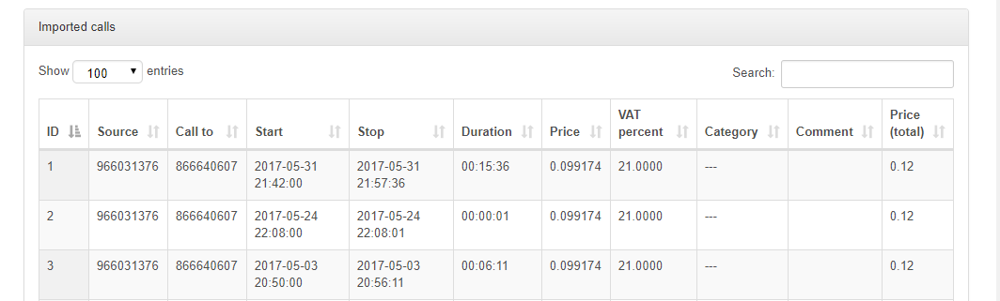

CDR History
===========

In CDR history you can see different CDR processes.

Go to Config menu and click on CDR History.

There is a list of CDR processes here. By clicking on file you will dowload it. You can also get the information on transactions and imported calls here or delete it.

