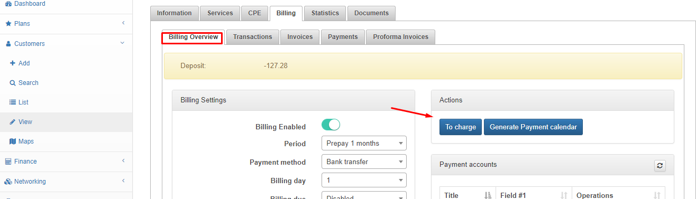
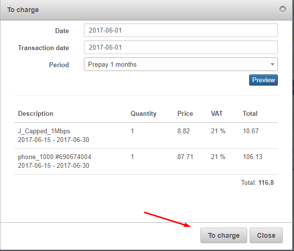
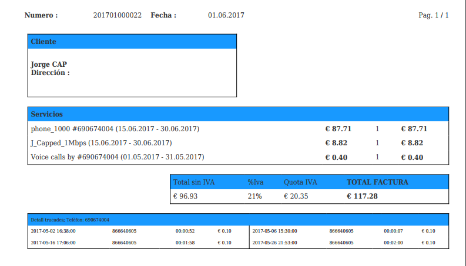
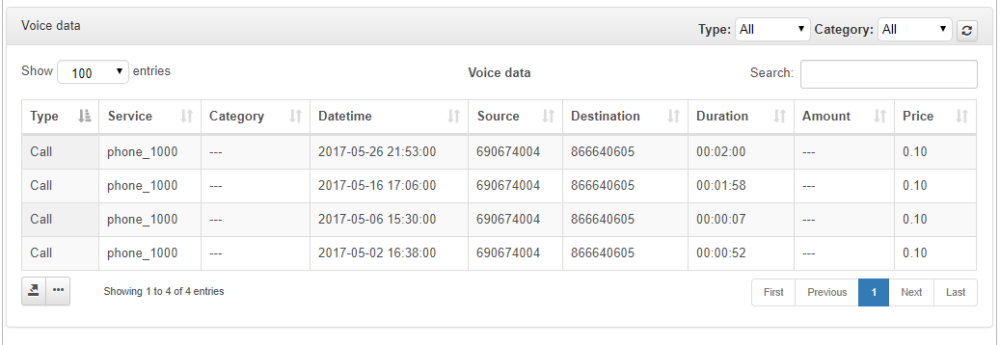

CDR Import
==========

You can import CDR from your bank to create transactions on customers. You should make the import from administrator portal. At first, you must have voice plans or [create it](configuring_tariff_plans/voice_plans/voice_plans.md), an then add them to customers. To import CDR click on Config and in the box Voice click on CDR import.

* **File** - Select the CDR.csv
* **Delimiter** - Select if you want to delimite the data with Tabulator, Comma, Semicolon or Auto detect
First row contains names - Enable if your CDR contains row names
* **Voice Type** - Select Data, Message or Mixed
* **Handler** - You can use the Base handler or an other personalized for your services.
* **Period for transactions**

You can see the loaded data with calls and their information. Select fields to correct and make sure that they correspond with data below them.

After that you can preview the Import.

Check it and then click on Import.

Now you can check generated transaction.

Also you can charge the transaction and generate the invoice.

Select the period to preview and click on To charge.

After charging the invoice is available and you can download it as PDF.

In the window statistics you can see information about the service.

