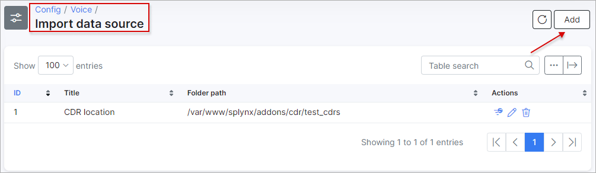
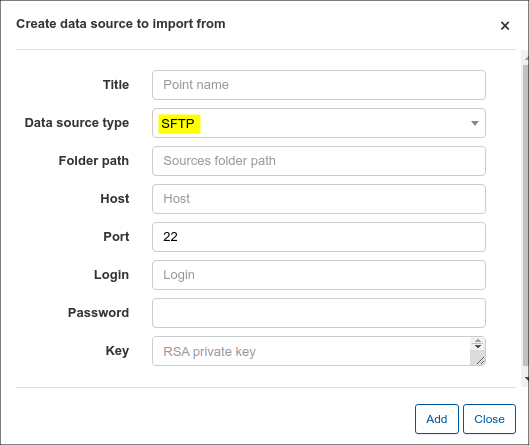
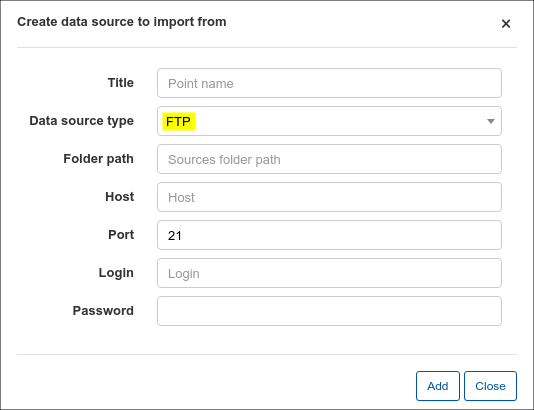
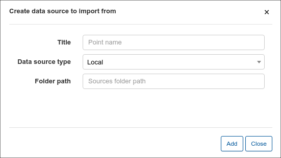
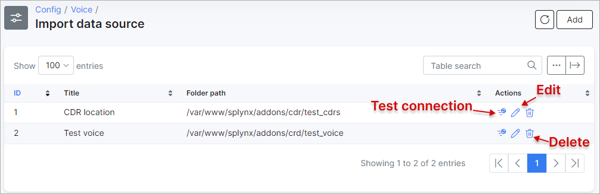

Import Data source
=============

We can import CDR's to charge customers and print their register of calls on their invoices.

In this section, we can create "Import data source locations", used in the configuration of [Auto CDR Processing](configuration/voice/auto_cdr_processing/auto_cdr_processing.md), to import CDR files from a location specified/configured by you.

 To create Import data source locations, navigate to `Config -> Voice -> Import data source`

 

 Simply click on the *Add* button located at the top right of the table:

 

 The following types of data location types can be used:

 * **SFTP**
 * **FTP**
 * **Local**

 Adding an SFTP data source:

 

 Adding an FTP data source:

 

 Adding a local data source:

 

 We will use a local storage/data source as an example.

 The following parameters need to be configured to add data sources:

   * **Title** - provide a relevant name for the data source location;

   * **Data source type** - select a type from the drop-down menu:

     * SFTP - if you select "SFTP" then you will need to enter a RSA private key. CDR files are located on a FTP server;

     * FTP - if you select "FTP" then you will need to set the same parameters as for "SFTP" but without a RSA key. CDR files are also located on a FTP server;

     * Local - if you select "Local" then you only need to set the Title and Folder path. CDR files are located on the Splynx server;

   * **Folder path** - set your path to the folder with the CDR files;

   * **Host** - set your host IP address;

   * **Port** - if the data source type selected is FTP or SFTP - specify the port to connect to FTP here;

   * **Login** - if the data source type selected is FTP or SFTP - specify the login to connect to FTP here;

   * **Password** - if the data source type selected is FTP or SFTP - specify the password to connect to FTP here.

 Once the data source is added, you can test the connection (if FTP or SFTP is configured), edit the data source or delete it using the buttons provided in the *Actions* column as depicted below:

 

 **When using a FTP server as a CDR data source - make sure that connection is successful.**

 **In case of using a local storage/data source (on Splynx server), make sure that the folder with the files has the correct permissions and "splynx" is the owner**

 We have added local storage of CDRs named "Local storage test CDRs" and we will use it in a auto CDR processing configuration.

 We will use the following format of CDR files(it is a very simple format so we can not use custom handlers to parse files):

 

 **Very important note to take is that each file must have a unique name, because Splynx checks the name of the file and if the file with the same name is imported to Splynx, after that file was updated - Splynx will not re-load the updated file, as the file with this name was already imported.**
