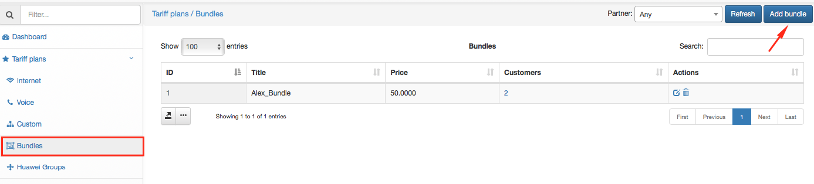
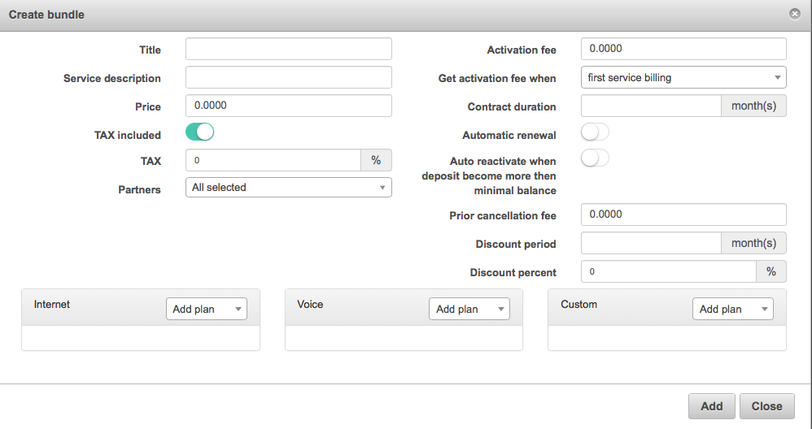
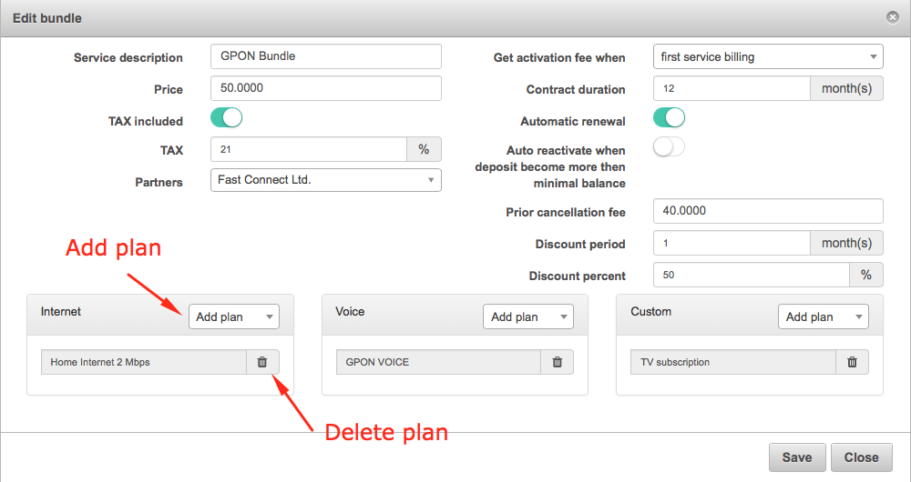
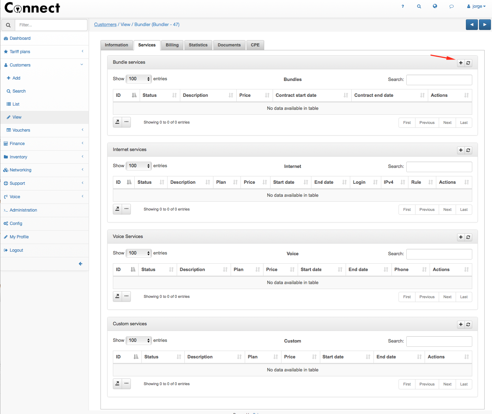
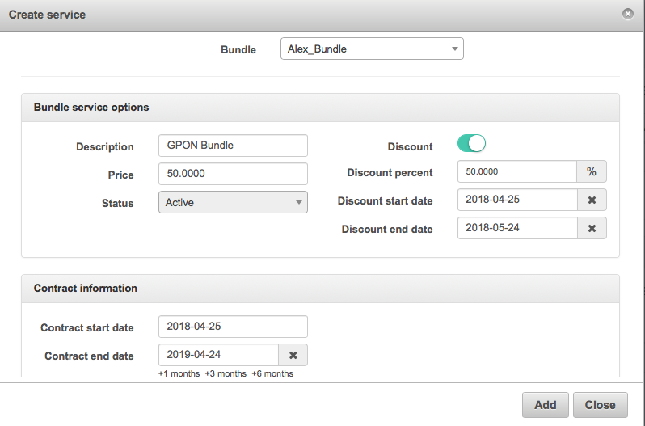
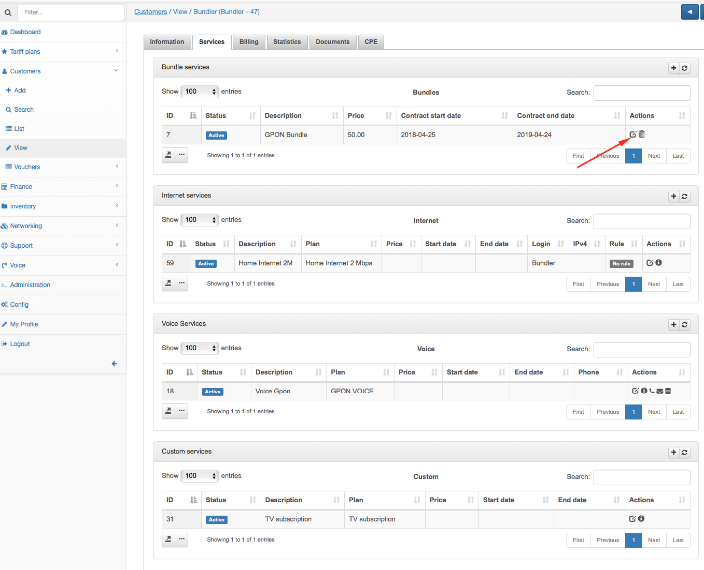
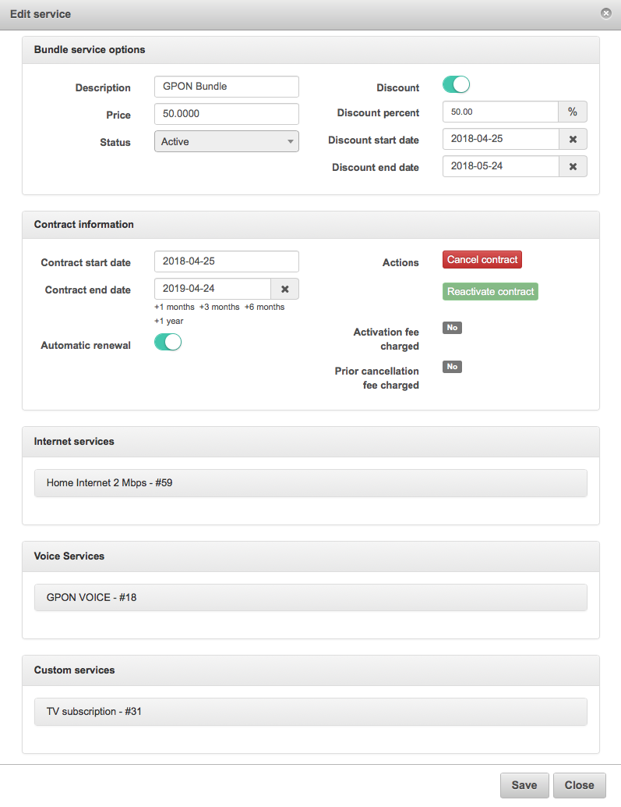
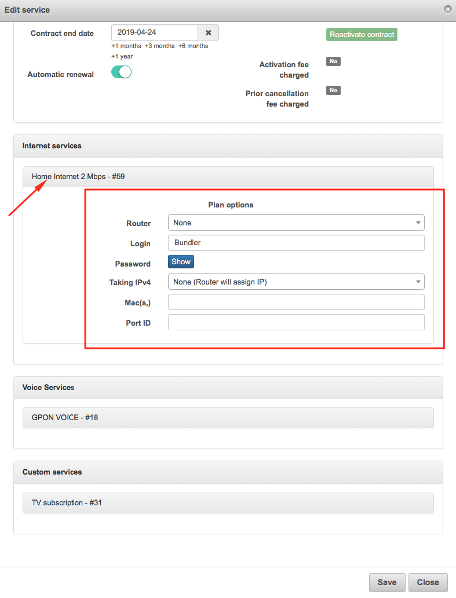

Bundle Plans
============

Bundle Plan is a new kind of plan from version 2.1 that allows to group internet, voice and custom services in only one, so with that is possible to set a one common price for the services group. It also improves the service management when a customer has more than one service.

To define a new Bundle plan, go to Tariff Plans → Bundles

And click on Add bundle.

In addition to the current tarif fields, we have add some other information related to an activation/cancellation fees and contract duration.

**Activation fee** → Price for the service activation.

**Get activation fee when →** Select between first service billing/create service.

**Contract duration</label> month(s) →** Set number of months

**Automatic renewal →** Enable automatic contract renewal.

**Auto reactivate when deposit become more then minimal balance →** Enable reactivate customer after recharge deposit automatically.

**Prior cancellation fee** → Price of prior cancellation of contract.

**Discount period month(s) →** Set number of months.

**Discount percent →** Percentage of the discount.

Here you can see an example already created. We could add more than 1 internet, voice or custom plan in the same bundle.

After we add a bundle plan, it will also create each plan in the correct box, if you delete or the bundle, it will affect to all plans inside it.

After add the plan, we can edit it and cancell/renew the contract or edit some fields.

Also inside of each service you can config it individually.

