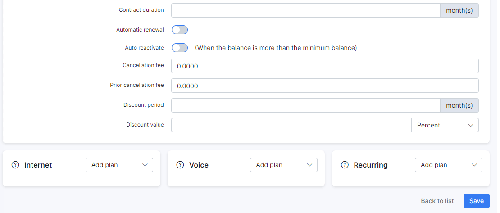
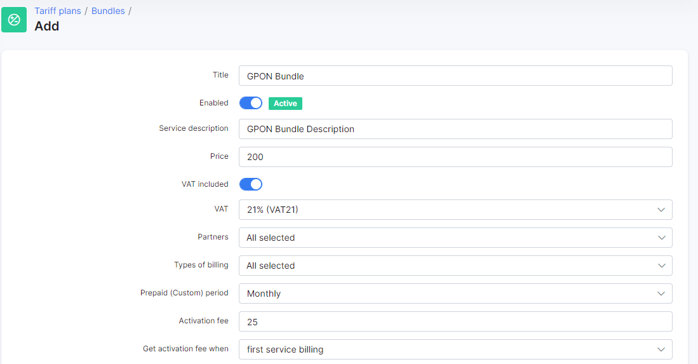
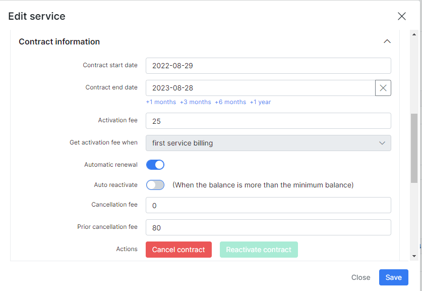
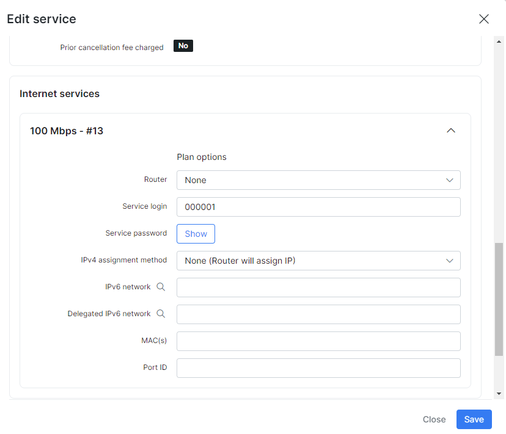

Bundle Plans
============

Bundle plans are used to group internet, voice and custom services so that is possible to set one common price for the services as a group. It also improves the service management when a customer has more than one service. This allows you as an ISP to create "Packages" of combined services to your liking which you can offer to customers instead of individual services. For instance, supplying a customer with VOIP services, instead of selling each of the related services as individual services, you can sell a package that includes: monthly connectivity, monthly account rental + monthly rental of equipment, as an example.

To create a new Bundle plan, navigate to _Tariff Plans → Bundles_ and click on the "Add plan" button at the top right of the page.

A new window will open where you can specify details for the future bundle:

**Title** → the title name of this package/bundle.

**Enabled** → enables/disables the active status of the bundle. If the toggle is disabled, the bundle will be archived. You can always access your archived bundles in _Visible_ drop-down menu at the top right of the bundle list and restore them if necessary:

**Service description** → a brief description of the bundle.

**Price** → the price for this bundle service.

**VAT included** → whether _Value Added Tax_ is included or not in the price for this bundle service.

**VAT** → VAT percentage. The percentage set by default is 0.00%.

<icon class="image-icon"></icon>
To be able to set your VAT percentage amount, you need first to add it in _Config → Finance → Taxes_. Then you can select it in _VAT_ field. For more information see [Taxes](configuration/finance/taxes/taxes.md).

**Partners** → a service provider(s) or any sub-provider(s) of your service.

**Types of billing** → recurring and/or prepaid (custom). For more information see [Recurring Billing](finance/billing_engine/recurring_billing/recurring_billing.md) and [Prepaid Billing](finance/billing_engine/prepaid_billing/prepaid_billing.md).

**Prepaid (Custom) period** → you can select _Monthly_ or _Amount of days_ and enter the desired amount in the field below.

**Activation fee** → the price for service activation of this bundle.

**Get activation fee when** → select when to collect payments for the activation. The options are _first service billing_/_Create service_.

**Contract duration** → the duration of this contract in months.

**Automatic renewal** → enables/disables automatic renewal of the contract.

**Auto reactivate (when the balance is more than the minimum balance)** → enables/disables reactivation of customer services if customers' account balance is more than the minimum set in their billing settings and sufficient to pay for the services.

**Cancellation fee** → price for cancellation of the contract.

**Prior cancellation fee** → price for prior cancellation of the contract.

**Discount period** → period of validity of the discount in months if any is applied.

**Discount value** → price to be discounted as percentage or a fixed sum.

****************************************************************

<b>Example</b>

Here is an example of a basic bundle plan. Please note that there are no limitations, it's merely an example illustrated:

After adding a bundle plan to customer's services, each plan will appear in the corresponding section of the customer's services.

<icon class="image-icon"></icon>
After that, you won't be able to delete any service pertaining to the bundle in the list of plans (e.g. _Voice plans_). To delete the service, delete it first in the bundle (see above) and then go to the list of plans.

After adding the plan, you can edit it: cancel/renew the contract as well as edit selected fields.

It is also possible to edit each service individually, but if it's a part of a bundle it will be indicated in the fashion of the window for the bundle services.

