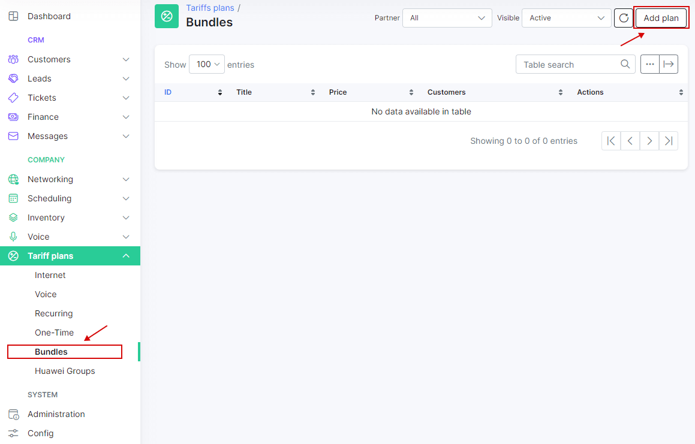
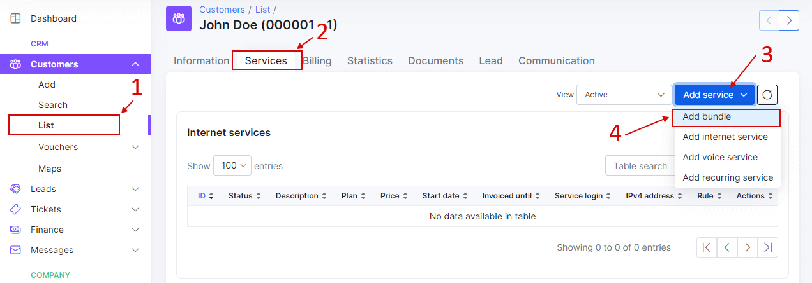
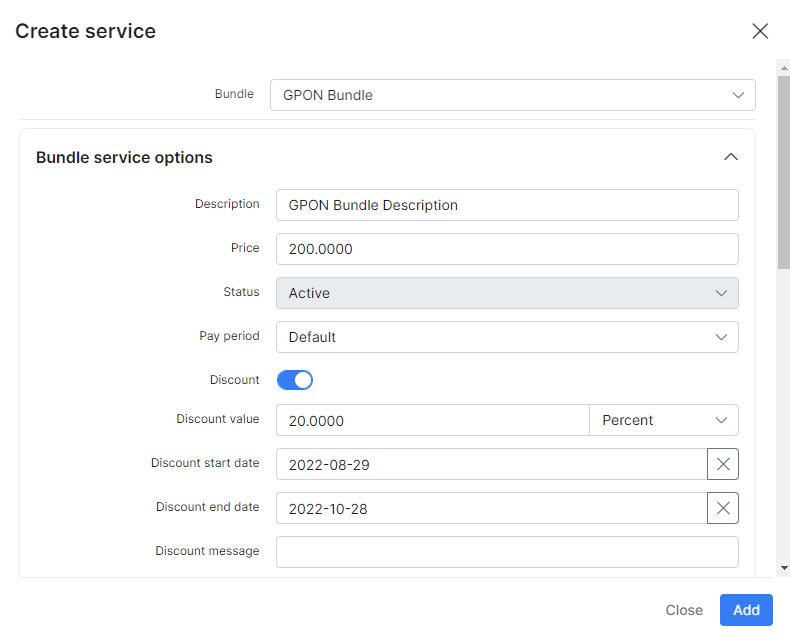

Bundle Plans
============

Bundle plans are used to group internet, voice and custom services so that is possible to set one common price for the services as a group. It also improves the service management when a customer has more than one service. This allows you as an ISP to create "Packages" of combined services to your liking which you can offer to customers instead of individual services. For instance, supplying a customer with VOIP services, instead of selling each of the related services as individual services, you can sell a package that includes; monthly connectivity, monthly account rental + monthly rental of equipment, as an example.

To create a new Bundle plan, navigate to _Tariff Plans → Bundles_ and click on the "Add bundle" button on the top right of the page.

In addition to the current tariff fields, we have added some other information fields related to activation/cancellation fees and contract duration.

**Activation fee** → the price for service activation of this package/bundle.

**Get activation fee when** → Select when to collect payments for activation, options are first service billing/create service.

**Contract duration</label> month(s)** → the duration of this contract in months

**Automatic renewal** → enables/disables automatic renewal of the contract.

**Auto reactivate when deposit become more then minimal balance** → enables/disables reactivation of customer services if customers account balance is more than the minimal set in their billing settings and sufficient to pay for the services

**Prior cancellation fee** → price of prior cancellation of the contract.

**Discount period month(s)** → the period of validity of the discount if any is applied.

**Discount percent** → percentage of the price to be discounted.

Here is an example of a basic bundle plan, please note that these are not limitations but merely an example illustrated:

After adding a bundle plan to customer services, it will also create each plan in the corresponding section of the customer's services, please note if you delete any service pertaining to the bundle, it will affect to all plans associated.

After adding the plan, we can edit it and cancel/renew the contract as well as edit selected fields.

It is, however, possible to edit each service individually, but if it is part of a bundle it will be indicated in the fashion of the window for the bundle services.

