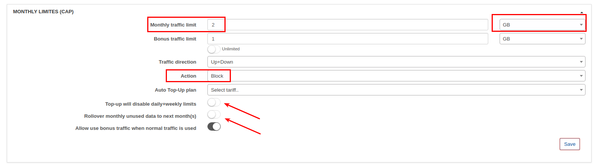
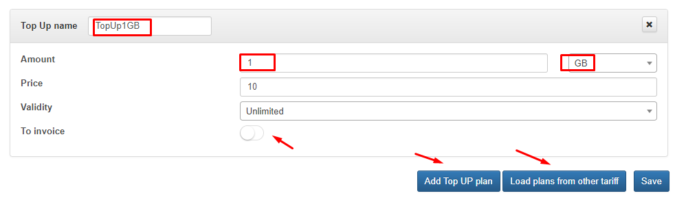
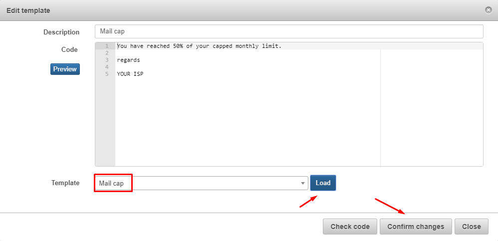
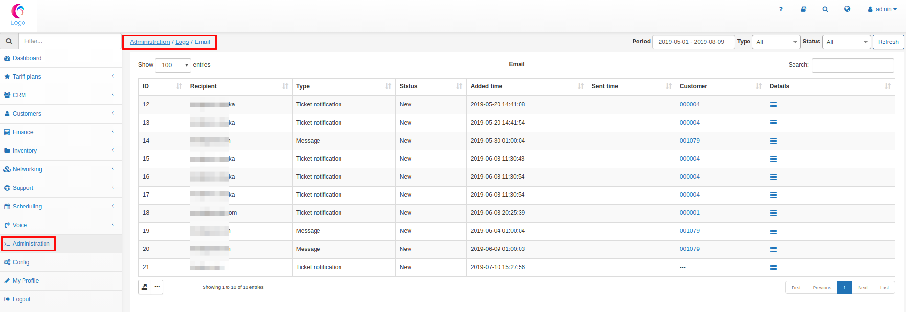

Capped plans and Top-Ups
========================

CAP is a feature that allows ISP to provide Internet services with monthly limitation of data and charge customers for additional data.

The advantage is that customer can pay more to extend his CAP using the tool Top Up. Administrator designs Top Up plans that are avaliable for customers in addition to their regular Internet plans.

First of all, you should enable the CAP module in _Config → Integrations _→ Main Modules.__

**1. CAP configuration**

To configure CAP policies go to _Tariffs → Internet_, and then choose selected plan and click on FUP button. A new tab will appear there called CAP.

There are 3 configuration boxes in CAP: _Monthly limits (CAP), Top Up Plans_ and _Notifications._

In first box (_Monthly limits (CAP))_ we can set how much data (in KB, MB, GB or TB) customer is able to consume in Internet plan. It can be dowload, upload or bidirectional usage. When the CAP monthly data are used, Splynx automatically blocks user or reduce his speed according to the configured percentage level.

Also, you can disable daily or weekly limits set on FUP or enable the _Rollover mode_. Rollover means that unused monthly data of the CAP will be moved to the next month.

At last you can set limits for non accounting traffic via the bonus traffic limits.

In the second box you can find the _Top Up Plans configuration_. These plans are for the usage when monthly data of CAP is fully used. Customer pays for a Top Up and then he received more data to use.

You can set validity of Top Up data. It can be unlimited or set to several months. Also, there is an option A_dd Top Up_ to the customer invoice.

Very useful option is to _Load plans from other tariffs,_ meansyou can configure Top Up plans once and then just copy the settings to all your tariffs.

The third is the _Notification box_, which inform customer by email or SMS about monthly usage, Top Up data usage or Top Up actions.

Also, it is possible to load notifications that we have created in other plan.

* _Source_ means the counter or action that we want to notify our customer about.
* _Monthly limit_ - the data included in CAP,
* _Top Up usage_ - notify customer when certain % of his the top-up is spent
* _Top Up action_ - notify when top-up was added to customer's account
* _Auto Top Up_ - send a notification when customer's account data were automatically added by Splynx.

You have to write a subject and customize the message clicking on _Edit message_. There you can also load a template you have created in section _Splynx → Config → Tempates_.

To check, if the email or notification is working correctly, you can view the email log clicking on _Administration → Logs → Email._

The same verification is available for SMS messages in _Splynx → Administration → Logs → SMS._

**2. Top-Up**

Splynx works with 3 types of Top-up:

A. Administrative top-up

B. Customer portal top-up

C. Auto top-up

**A. Administrative Top-up**

In first case, go to _Customers → List_ and choose the customer you want to add the Top Up. There is a CAP Top-Up section at the bottom right corner of the Information window. By clicking on _Top-Up_ button below the section a new window "_Add CAP to Customer"_ will be open that is asking for a service and Top up plan. Administrators can have rights to add custom top-up, it means they can define the Data to top up and the price of singe top-up.

When we create a Top-Up for 1 GB we can see that 1GB of data were added to customer's account. The transaction is on the list and we can proceed charging for generating the invoice.

As we have enabled the option "_To invoice_" in the Top Up transaction, the Top-up appears on invoice PDF:

**B. Customer portal Top-up**

In second case customer can order a top-up on a portal. The administrator configure in Splynx the permissions and options customers will have. This configuration is on _Config → Main _→__ _Portal_. There are two boxes with some options for customer's Top Up:

1. You can enable _Top-Up_ and _edit Auto Top-Up_ settings. Auto top-up permissions shows if client can enable/disable auto top-up and if he can choose from top-up plans. Also there is an option to allow the customer to change the maximum amount of auto top-ups per month.

2. To enable _Manual Top-up_ from portal, select which type of document will be created when customer tops up from the portal. _Pay before_ means that customer will not get the top-up data until he pays the invoice.

When customer enters Portal, he clicks on _Services → Top Up_ where will be top-up options _for automatic and/or manuall top up_.

_In Manual Top-up_ customer should choose the plan and add a top-up.

Then in Statistics customer can see the amount of traffic in the bar. Also his actual top-up data is displayed.

In case if administrator sets the option _Pay Before Top-Up,_ the data will be available after customer pays for it.

So, the invoice is paid and additional 1GB data is added now.

**C. Auto Top-up**

Inside the CAP window in customer information we can enable auto top-up.

Then we define the auto top-up plan and number of top-ups per month.

_Transfer usage to new service_ means that Splynx will transfer unused data between plans in case when customer changes his plan.

**3. Bonus traffic limits**

Splynx allow to set limits for non accounting traffic via the bonus traffic limits. By default all non accounting traffic is unlimited:

but possible to set limits on that traffic:

The main logic is - when customer used all bonus traffic, system will start to use the monthly traffic. _Allow use bonus traffic when normal traffic is used_ toggle will block customers if they used all monthly traffic and the toggle is disabled, in another case - system will use bonus traffic. 

When we turn on a Bonus traffic limit we can see that on customer's service:

Admins can Top-Ups bonus traffic for each customer:

and check it from the service:

