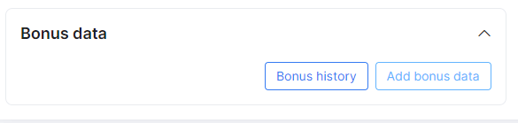

Capped plans and Top-Ups
========================

CAP is a concept used by ISP's to provide internet services with monthly data limits and an option for customers to purchase additional data once their allocated limit has been reached.

The advantage is that customers can pay more to extend their CAP limits using a Top Up tool/function. Administrators design Top Up plans that are available to customers in addition to their regular internet/tariff plans.

Firstly, to make use of this feature, it is necessary to enable the CAP module in _Config → Integrations _→ Main Modules.__

A new tab will appear in the FUP page called CAP.

**1. CAP configuration**

To configure CAP policies navigate to _Tariffs → Internet_, then select a plan you wish to apply the CAP feature to by clicking on the FUP button in the Actions column of the specific plan. Then click on the cap Tab:

There are three sections in the configuration of CAP: _Monthly limits (CAP), Top Up Plans_ and _Notifications._

## Monthly Limits (CAP)

In monthly limits, we can set how much data (in KB, MB, GB or TB) customers are allowed to consume relevant to the internet plan. It can be configured based on download, upload or bidirectional usage. When the monthly data CAP has been reached, Splynx automatically blocks the customer or reduces speeds according to the configured action or percentage. We can choose to enable the "_Rollover unused data_" function which means, unused monthly data of the CAP will be added to the data limits of the next month. When this feature is enabled, weekly and daily limits configured in the FUP settings are no longer applied.

**Parameter descriptions**:

_Monthly traffic limit_ - the total amount of traffic allowed for the tariff (in KB, MB, GB or TB) 
_Bonus traffic limit_ - the amount of non-accounting traffic allowed for the tariff(in KB, MB, GB or TB) 
_Traffic direction_ - the direction of traffic to account for the monthly limit. 
_Action_ - actions to execute once the monthly limit is reached.  
_Auto Top-Up plan_ - tariff to use if a customer has auto top-up's enabled. 
_Top-up will disable daily & weekly limits_ - whether top-up data should be included in FUP rules or not. 
_Rollover unused data (monthly)_ - transfer unused data of cap to the next month's limits. (when enabled, daily and weekly limits set in FUP are disabled) 
_Allow the usage of bonus traffic when normal CAP is finished_ - enables/disables bonus data for customers.

**Bonus traffic limits**
Data used in the period that traffic is not accounted for is referred to as non accounting traffic.

Splynx allows configuring limits for non accounting traffic via the bonus traffic limits. By default, all non accounting traffic is unlimited:

but it is possible to set limits on that traffic:

The main logic is - when a customer used all bonus traffic, the system will start to use the monthly traffic.

 The "_Allow use bonus traffic when normal Cap is finished_" toggle will cause the system to block customers if they've used all their monthly traffic and the toggle is disabled. If it is enabled, the system will allow the use of bonus traffic.

When we enable Bonus traffic limits, we can see statistics for that on the customer's services and a new section is added to the customer information page:

Administrators can Top-Ups bonus traffic for each customer when bonus traffic limits are enabled and set:

This can also be viewed in the service statistics of the customer:

## Top-up Plans

 These plans are used when monthly data CAP's are reached and the customer wishes to extend their services. Customers pay for Top-Ups in order to regain access according to the data limits of the Top-up plan.

 Top-up plans are beneficial to you as an ISP as this creates an additional source of income with existing customers using a capped service.

Splynx has simplified the top-up concept for anyone to use appropriately, with just 5 parameters to be set to create a top-up plan or simply loading a preexisting top-up plan.

**Parameter descriptions**:
_Top-up Name_ - the name of the top-up plan. 
_Amount_ - data allocation of top-up plan (in MB or GB). 
_Price_ - the price of the top-up plan charged to the customer. 
_Validity_ - top-up plan's validity period. 
_Add to invoice_ - whether the charge of this invoice should be added to the customers monthly invoice or a separate invoice to be generated. 

Once these fields have been completed, you finish the process by clicking save. The top-up will then be listed in top up plans and customers using this tariff will be able to select it for a top-up purchase. All top-ups created can be loaded to other tariffs with the *Load plans from other tariff* button.

The validity of Top Up data can be set to unlimited or a fixed period in months. Also, there is an option to add the applied Top Up within a month, to the customer invoice at the end of the month.

Another very useful option is to _Load plans from other tariffs,_ meaning, you can configure Top Up plans once and then just copy the settings to all your tariffs. Top-up plans configured in one tariff can simply be loaded onto the current plan.

**Parameter descriptions**:

_From plan_ - which tariff to load top-up plans from. 
_Count plans_ - number of top-up plans available to load from the selected plan 
_Clear existing plans_ - choose whether or not to remove existing plans after loading plans from the selected tariff 

Simply complete the fields as desired and click load. The top-up plans loaded from the tariff will then be listed under the list of top-up plans in the current tariff and will be available for customers subscribed to this tariff.

When applying top-ups, there are different scenarios and/or reasons for top-ups and therefore there are different methods of applying them. Here are the different methods of applying top-ups.

` Splynx uses 3 methods of Top-up's`:

 Administrative top-up

 Customer portal top-up

 Auto top-up

**Administrative Top-up**

This method is applied within the administrative portal and applied by an assigned admin. To apply a Top-up administratively, navigate to  _Customers → List_ and select the customer you wish to add the Top Up to. There will be a CAP section in the main information page of the customer.

These are the configurations necessary for customizing the top-up window in the customer portal.

**Parameter descriptions**:

_Auto Top-ups_ - this enables/disables automatic top-ups for the customer. 
_Auto top-up plans_ - these are the top-up plans that will be applied according to the customers tariff(s), if the customer has more than one capped service an option to select a top-up plan will appear for each capped plan. 
_Limitation type_ - this control permissions to either grant customer ability to do top-ups, grant access for automatic top-ups or both. 
 _Max number of top-up per month_ - limit of top-ups a customer is allowed for a month. 
 _Transfer usage to new service_ - this will transfer unused data between plans in a case that a customer changes his plan.
_History_ - displays the history of top-ups and actions done for/by the customer for each tariff. 
_Remove_ - removes the top-up data applied to the customer's CAP, specific amounts of data can be removed. 
_Top-up_ - add an administrative top-up to the customers CAP. 

To add an administrative top-up click on the "Top-up" button in the CAP section of the customers' information page. This will open a new window *Add CAP to customer*, here administrator has the privilege of adding custom amounts of data with custom prices or simply selecting a top-up plan from the list.

In the image above,  a Top-Up for 1 GB was selected and we can see that 1GB of data is added to the customer's account on the image below. The transaction is added to the list of transactions since the toggle to add transaction to invoice is disabled and the amount will be debited to the customer's account. If this toggle is enabled the transaction will be added to the customers' invoice as shown in the pictures below.

**Customer portal Top-up**

This is the method whereby the customer chooses to apply a top-up within the portal. For this option to be available, permissions in the portal should be granted for customers to have access to this feature. To grant access, navigate to  _Config → Main _→ _Portal_. There are two sections to grant access for customers to perform top-ups:

1. Top-up settings
 Permissions regarding auto top-up plans made available to the customer tariffs and how they can interact with these fields

* Enable - allow/deny the ability to perform auto top-ups.
* Auto Top-up - select level of access/ability to Auto top-up feature (View, Edit, All selected)
* Auto top-up plans - select level of access/ability to plans(View, Edit, All selected)
* Limitation type - select level of access/ability to limitations(View, Edit, All selected)
* Max number of top-up per month - select the level of access/ability to the maximum allowed top-ups per month(View, Edit, All selected)

2. Manual Top-up settings
These are permissions and actions for customers to create top-ups manually
and how they can interact

* Enable - allow/deny the ability to make manual top-ups
* Crate finance document - which type of documents to create for the applied/requested top-up.
* Pay before top-up -  select whether the customer has to pay for the top-up before the data can be used or not.

When customers access their portal, top-up options can be accessed by clicking on _Services → Top Up_, where options _for automatic and/or manual top up_ will be available.

In _Manual Top-up's_ customers simply choose a plan and add a top-up.

The Statistics of the customer will then display the amount of traffic in the bar as well as his actual top-up data.

 If an administrator enables the option _Pay Before Top-Up_ under the _Manual Top-up Setting_ in _Config / Main / Portal_, the data only will be available after the customer pays for it.

Once the invoice is paid an additional 1GB of data is now added.

**Auto Top-up**
This is the automatic method of applying top-ups for a customer, this option requires prior agreements made between the customer and the service provider.

 To apply auto top-ups:

 Navigate to the respective customer then, within the CAP section on the customer information page, we enable auto top-ups for a customer.

We then simply define the auto top-up plan and the number of top-ups per month.

_Transfer usage to new service_ means that Splynx will transfer unused data between plans in the case when a customer changes his plan.

## Notifications

In this section, we configure notifications that inform customers utilizing email or SMS about their monthly usage, Top Up data usage or Top Up actions.

Like top-up plans, it is also possible to load notifications that we have created in another plan.

**Parameters descriptions**:

_Type_ - method to send notification (email or SMS) 
_Source_ - the counter, statistic or action that we want to notify our customer on. 
_Trigger limit_ - when this percentage of data is used, this will trigger the notifications to be sent to the customer. 
_Subject_ - the subject of the notification sent to the customer. 

After completing these fields it is then necessary to edit the message sent to the customer to select what content is provided in the notification.

Here you can choose to manually type a message to use when notifying customers about their usage or you can choose a preconfigured template from your list of templates to load. Templates can be created and customized in _Config / System / Templates / Email or SMS CAP_

Once your message fields have been populated either manually or using a template you can then confirm changes and save the notification. The new notification will be listed in the notification section and will be used to notify customers using this tariff.
