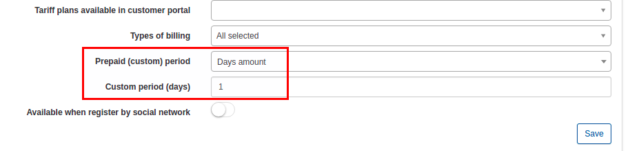

Custom plans
============

**When use custom plans?**

For example, ISP provides public IP service to users; Rental of equipment; Hosting or IPTV services.

To configure the Custom plan, click on the _Tariff plans → Custom_ and click on Add plan.

You will redirect to add plan page and be possible to create a plan.

* Title - the name that describe the tariff in the Custom Tariffs table
* Service name - the service used
* Price - the price for the service
* Partners - select the partner 's name
* VAT Included - select it on or off
* VAT - the percentage of the VAT
* Tariff plans available in customer portal - the list of tariffs allowed for changing from current tariff on customer's portal
* Types of billing - the types of billing for which allowed current tariff
* Prepaid (custom) period - by default it's monthly and customers will charges for whole month, but you can select "Days amount"
* _Custom period (days)_* - appears only when selected "Days amount" (from previous step) and allow to set custom pedion in days (7 days (week), 10 days, etc up to 365 days)

* Available when register by social network - using from social/self registration addon and allow to select current tariff during registration

It is possible to edit or delete the tariff with the icons <icon class="image-icon"></icon> or <icon class="image-icon"></icon> in the column Actions.

There are two symbols <icon class="image-icon"></icon> on the bottom left of the table. First icon <icon class="image-icon"></icon> is used to copy, print the table and to export it in different formats: Excel, CSV, PDF. The second one icon <icon class="image-icon"></icon> is used to modify the view of the table.

After the creation of Custom plan, it is possible to associate the service to a customer. Click on _Customer → List_, select the customer, click on the tab _Services_ and select _Add voice service_ from the _Add service_ menu.

A window will pop up to create the service.

It is possible to see the new service in the Services table.
 

