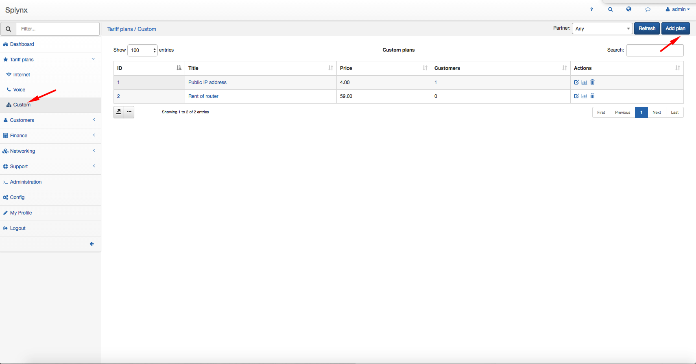
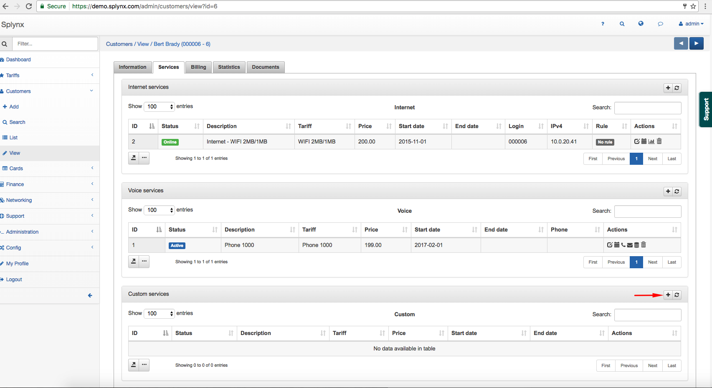
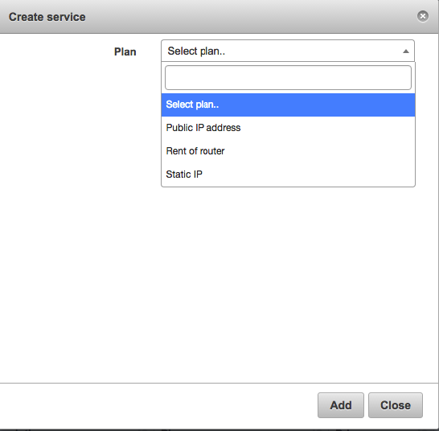
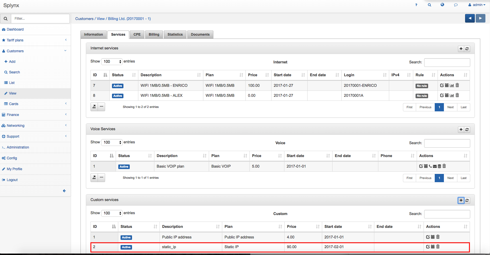

Custom plans
============

**When use custom plans?**

For example, ISP provides public IP service to users; Rental of equipment; Hosting or IPTV services.

To configure the Custom plan, click on the T_ariffs plans → Custom_ and click on Add plan.

A Create plan window will pop up and it will be possible to create a plan.

* Title - the name that describe the tariff in the Custom Tariffs table
* Service name - the service used
* Price - the price for the service
* Partners - select the partner 's name
* VAT Included - select it on or off
* VAT - the percentage of the VAT

It is possible to edit or delete the tariff with the icons  or  in the column Actions.

There are two symbols  on the bottom left of the table. First icon  is used to copy, print the table and to export it in different formats: Excel, CSV, PDF. The second one icon  is used to modify the view of the table.

After the creation of Custom plan, it is possible to associate the service to a customer. Click on _Customer → List_, select the customer, click on the tab _Services_ and on the +.

A window will pop up to create the service.

It is possible to see the new service in the Services table.

